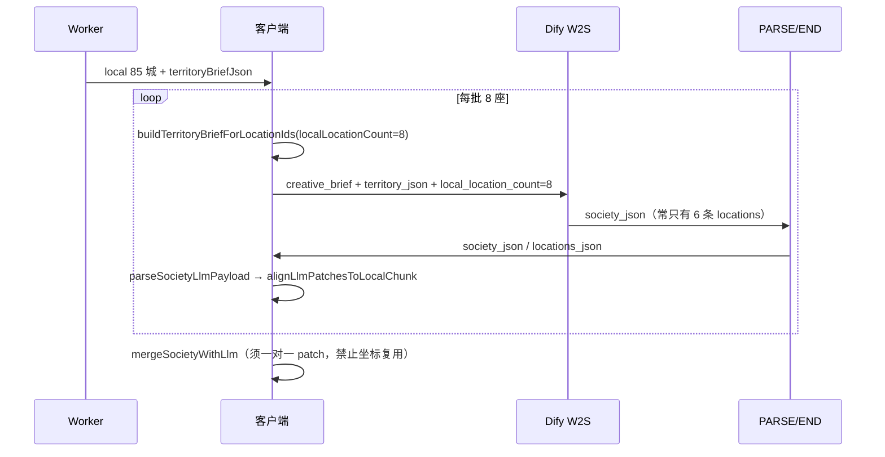

# 社会层全流程模拟结论（85 城 · Dify 每批只回 6 条）

运行：`npm run test:society-flow`

## 链路

## 根因 A（已修）：合并时一条 patch 匹配多城

旧 `findLlmPatchForLocal` 对每座城遍历全部 patch 做坐标吸附（≤5 单位），6 条带相似坐标的 Dify 结果可覆盖 85 城 → UI 显示「有文案」虚高（模拟：**85/85**）。

修复：`buildLlmPatchMapForLocals` + `alignLlmPatchesToLocalChunk`，每 patch 最多对应一座城。

## 根因 B（Dify 侧）：每批条数不足

- `creative_brief` / USER prompt 要求 `locations.length === local_location_count`。
- 样例 END（`w2s-end-user-sample.json`）与 good.example 只有 **6 城**，模型易照抄。
- 模拟：每批应 8 座、Dify 只回 6 → 11 批累计 **65/85** 对齐（与「返回 6 条」一致）。

### Dify 必查

1. **W2S LLM**：`max_tokens` 足够（建议 ≥8192）；结构化输出 schema 无 `maxItems` 限制。
2. **USER 模板**：同步 `dify/world/prompts/w2s-user.jinja.md`（含「禁止只输出 6 条」）。
3. **END**：绑定 PARSE 输出，勿用 6 城占位符。
4. **试运行**：看 W2S 原始 JSON 中 `locations` 条数是否等于本批 `local_location_count`。

## 客户端改动摘要

| 项 | 值 |
|----|-----|
| 每批上限 | 24 → **8** |
| UI 诊断 | `Dify 缺条：第1批6/8、…` |
| 统计 | 合并后真实改写数 + 对齐条数 |
