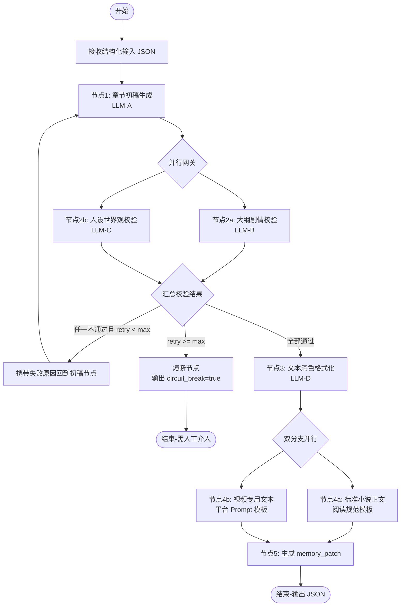

# NovelsCreator — 开发文档

> 类 IDEA 风格桌面端长篇小说创作工具  
> 技术栈：Electron + Vue 3 · AI 编排：Dify 工作流 · 开发工具：Cursor

---

## 文档体系

| 文档 | 说明 |
|------|------|
| **本文档** | 架构、技术选型、数据模型、Dify 协议、开发规划 |
| **[MODULES.md](./MODULES.md)** | **12 个功能模块拆分 + 每模块流程实现（时序图 / 伪代码 / IPC）** |
| **[UI-NAVIGATION.md](./UI-NAVIGATION.md)** | **客户端页面布局、IDE 分区、路由与跳转流程（Welcome / Workspace / 标签 / 面板）** |
| **[GENERATION-WIZARD.md](../chapter/GENERATION-WIZARD.md)** | **三要素生成选择页、统一 generation_prompt 格式与 Dify 对接** |
| **[PROMPT-DESIGN.md](../chapter/PROMPT-DESIGN.md)** | **完整 Prompt 体系：客户端渲染、Dify 全节点模板、JSON 输出、重试与示例** |
| **[DIFY-WORKFLOW-DESIGN.md](../chapter/DIFY-WORKFLOW-DESIGN.md)** | **Dify 工作流设计：拓扑、节点规格、MCP Tool/Resource 映射（JSON Schema 2020-12）** |
| **[DIFY-WORKFLOW-IMPLEMENTATION.md](../chapter/DIFY-WORKFLOW-IMPLEMENTATION.md)** | **Dify 工作流实现：画布搭建、Code 粘贴、发布联调、MCP Server 桥接** |
| **[DIFY-WORKFLOW-MODULES-AND-PROCESS.md](../chapter/DIFY-WORKFLOW-MODULES-AND-PROCESS.md)** | **工作流 12 模块划分 + 端到端流程 + 从 Chatflow 迁移指南** |
| **[DIFY-WORKFLOW-NODES-AND-FLOW.md](../chapter/DIFY-WORKFLOW-NODES-AND-FLOW.md)** | **工作流节点设计表 + 连线 + 主/重试/熔断流程（画布对照）** |

## 功能模块速览

| ID | 模块 | 核心流程 |
|----|------|----------|
| M01 | 应用启动与壳层 | F-M01-01 冷启动 |
| M02 | 项目管理 | F-M02-01 新建 / F-M02-02 打开 / F-M02-03 关闭 |
| M03 | 静态知识库 | F-M03-01 加载 / F-M03-02 自动保存 / F-M03-03 快照 |
| M04 | 三级剧情大纲 | F-M04-01~03 树编辑与生成准备 |
| M05 | 动态剧情记忆库 | F-M05-02 patch merge / F-M05-04 构建入参 |
| M06 | IDE 布局与多标签编辑 | F-M06-01~05 布局 / 标签 / 保存 |
| M07 | 章节内容管理 | F-M07-01 预览 / F-M07-02 AI 落盘 |
| M08 | AI 生成编排（客户端） | F-M08-01 主流程 / F-M08-02 熔断重试 |
| M09 | Dify 工作流（服务端） | F-M09-01~03 节点流水线 |
| M10 | 导出 | F-M10-01 单章 / F-M10-02 全本 |
| M11 | 备份与恢复 | F-M11-01~03 手动 / 自动 / 恢复 |
| M12 | 配置与安全 | F-M12-01 API Key / F-M12-02 连接测试 |

> 各模块详细流程见 [MODULES.md](./MODULES.md)。

## 目录

1. [项目概述](#1-项目概述)
2. [系统架构](#2-系统架构)
3. [技术选型](#3-技术选型)
4. [项目目录结构](#4-项目目录结构)
5. [项目空间与数据模型](#5-项目空间与数据模型)
6. [客户端 UI 与交互设计](#6-客户端-ui-与交互设计)
7. [Dify AI 工作流设计](#7-dify-ai-工作流设计)
8. [客户端与 Dify 对接协议](#8-客户端与-dify-对接协议)
9. [核心业务流程](#9-核心业务流程)
10. [文件导出与备份](#10-文件导出与备份)
11. [配置与安全](#11-配置与安全)
12. [已实现里程碑](#12-已实现里程碑)
13. [测试策略](#13-测试策略)
14. [扩展与演进](#14-扩展与演进)

---

## 1. 项目概述

### 1.1 产品定位

NovelsCreator 是一款面向长篇网络小说 / 剧本创作者的专业桌面工具。借鉴 JetBrains IDEA 的布局与交互范式，提供多项目隔离、结构化设定管理、三级剧情大纲编辑、章节预览与导出等能力；AI 生成能力通过 **Dify 可视化工作流** 实现，客户端仅负责业务编排与结果落地，**不手写多模型调度代码**。

### 1.2 核心目标

| 目标 | 说明 |
|------|------|
| **长篇稳定性** | 静态知识库 + 动态剧情记忆库，保障跨章节人设、世界观与剧情连贯 |
| **客户端 / AI 解耦** | 客户端通过 HTTP 调用 Dify；模型切换、Prompt 迭代在 Dify 侧完成 |
| **IDE 式体验** | 可拖拽停靠面板、多标签页、深色主题、快捷键 |
| **双产物输出** | 每次生成同时产出「标准小说正文」与「AI 视频脚本」两个 UTF-8 文件 |
| **可扩展对接** | 视频脚本按平台专属 Prompt 模板生成，便于后续对接 AI 视频平台 |

### 1.3 非目标（当前版本）

- 不在客户端内实现 LLM 直连、模型路由、Token 计费
- 不内置 AI 视频生成（仅输出视频专用文本）
- 不做多人协作 / 云同步（可后续扩展）

---

## 2. 系统架构

### 2.1 总体架构图

```
┌─────────────────────────────────────────────────────────────────┐
│                     NovelsCreator 客户端                         │
│  ┌──────────────┐  ┌──────────────┐  ┌──────────────────────┐ │
│  │  Electron    │  │  Vue 3 UI    │  │  本地项目文件系统     │ │
│  │  Main Process│◄─┤  Renderer    │◄─┤  (JSON / Markdown)   │ │
│  └──────┬───────┘  └──────┬───────┘  └──────────────────────┘ │
│         │ IPC              │ HTTP (axios)                        │
└─────────┼──────────────────┼───────────────────────────────────┘
          │                  │
          ▼                  ▼
┌─────────────────┐  ┌─────────────────────────────────────────────┐
│  系统能力        │  │              Dify 平台                       │
│  文件对话框      │  │  ┌─────────────────────────────────────┐   │
│  自动保存        │  │  │  小说章节生成工作流 (Workflow)        │   │
│  导出 / 备份     │  │  │  初稿 → 并行校验 → 润色 → 双分支输出  │   │
└─────────────────┘  │  └─────────────────────────────────────┘   │
                     │         │ LLM A  │ LLM B  │ LLM C ...      │
                     └─────────────────────────────────────────────┘
                                          │
                                          ▼
                              ┌───────────────────────┐
                              │  AI 视频生成平台 (后续) │
                              │  消费 video_script     │
                              └───────────────────────┘
```

### 2.2 分层职责

| 层级 | 职责 |
|------|------|
| **Electron Main** | 窗口管理、原生对话框、文件读写、自动保存、备份压缩、安全存储 API Key |
| **Electron Preload** | 暴露受限 IPC API，禁止 Renderer 直接访问 Node |
| **Vue Renderer** | IDE 布局、编辑器、项目管理、调用 Dify、展示多标签结果 |
| **Dify Workflow** | 多模型串联/并行、校验重试、熔断、Prompt 模板、输出结构化 JSON |
| **本地项目目录** | 单一数据源（Source of Truth），支持 Git 版本管理 |

### 2.3 设计原则

1. **本地优先**：所有创作数据落盘，Dify 仅接收生成所需上下文，不回写业务库
2. **工作流即配置**：Prompt、模型、重试策略在 Dify 可视化维护
3. **结构化 IO**：Dify 输入/输出均为 JSON，便于客户端解析与存档
4. **失败可恢复**：校验熔断后保留中间产物，支持人工修改后重跑

---

## 3. 技术选型

### 3.1 客户端

| 类别 | 选型 | 理由 |
|------|------|------|
| 桌面框架 | **Electron 33+** | 跨平台、成熟生态、适合复杂 IDE UI |
| 前端框架 | **Vue 3 + TypeScript** | 组合式 API、类型安全、与 Cursor 协作友好 |
| 构建工具 | **Vite + electron-vite** | 快速 HMR、清晰 Main/Renderer 分离 |
| 状态管理 | **Pinia** | 轻量、模块化 store |
| 路由 | **Vue Router**（Hash） | Electron 内嵌页友好 |
| UI 组件 | **Naive UI** 或 **Element Plus**（深色主题） | 表格、树、抽屉、消息通知 |
| 布局 / 停靠 | **自定义 DockLayout** 或基于 **splitpanes** + 拖拽库 | 模拟 IDE 面板停靠 |
| 编辑器 | **Monaco Editor**（正文/视频稿） | Markdown / 纯文本、语法高亮 |
| HTTP | **axios** | 调用 Dify Workflow API |
| 本地存储 | **fs-extra**（Main）+ JSON Schema 校验（**ajv**） | 结构化读写与校验 |
| 打包 | **electron-builder** | Windows / macOS / Linux 安装包 |

### 3.2 AI 编排

| 类别 | 选型 |
|------|------|
| 工作流平台 | **Dify**（自托管或 Cloud） |
| 对接方式 | Workflow Run API（阻塞 / 流式可选） |
| 模型 | 在 Dify 应用内配置（GPT、Claude、DeepSeek 等），客户端无感知 |

### 3.3 开发工具链

- **Cursor**：AI 辅助编码、Refactor、文档生成
- **ESLint + Prettier**：代码规范
- **Vitest**：单元测试
- **Playwright**（可选）：E2E

---

## 4. 项目目录结构

### 4.1 代码仓库结构

```
NovelsCreator/
├── docs/
│   ├── DEVELOPMENT.md          # 架构与总览
│   ├── MODULES.md              # 功能模块与流程实现
│   ├── UI-NAVIGATION.md        # 页面布局与跳转流程
│   ├── GENERATION-WIZARD.md    # 三要素生成向导与 Prompt 格式
│   ├── PROMPT-DESIGN.md        # 完整 Prompt 设计文档
│   ├── DIFY-WORKFLOW-DESIGN.md # Dify 工作流设计（MCP 对齐）
│   ├── DIFY-WORKFLOW-MODULES-AND-PROCESS.md
│   └── DIFY-WORKFLOW-IMPLEMENTATION.md
├── electron/
│   ├── main/
│   │   ├── index.ts            # 主进程入口
│   │   ├── ipc/                # IPC 处理器
│   │   ├── services/
│   │   │   ├── project.service.ts
│   │   │   ├── file.service.ts
│   │   │   ├── export.service.ts
│   │   │   └── backup.service.ts
│   │   └── window.ts
│   └── preload/
│       └── index.ts            # contextBridge API
├── src/
│   ├── main.ts
│   ├── App.vue
│   ├── router/
│   ├── stores/                 # Pinia
│   │   ├── project.store.ts
│   │   ├── layout.store.ts
│   │   ├── editor.store.ts
│   │   └── dify.store.ts
│   ├── views/
│   │   ├── WelcomeView.vue     # 项目选择 / 新建
│   │   └── WorkspaceView.vue   # 主工作区
│   ├── components/
│   │   ├── layout/             # DockPanel, TabBar, ActivityBar, StatusBar
│   │   ├── project/
│   │   ├── knowledge/          # 世界观、人物、势力、道具
│   │   ├── outline/            # 三级大纲树
│   │   ├── memory/             # 剧情记忆库
│   │   ├── chapter/            # 章节预览与生成
│   │   └── settings/
│   ├── composables/
│   │   ├── useDifyWorkflow.ts
│   │   └── useAutoSave.ts
│   ├── types/                  # 共享 TypeScript 类型
│   └── assets/
│       └── themes/
│           └── dark.css        # IDEA 风格深色变量
├── schemas/                    # JSON Schema 定义
│   ├── project.schema.json
│   ├── knowledge.schema.json
│   ├── outline.schema.json
│   └── memory.schema.json
├── dify/                       # Dify 工作流 + MCP 契约资产
│   ├── code/                   # Code 节点 Python
│   ├── prompts/                # LLM Prompt 模板
│   ├── mcp/                    # MCP tools/schemas/resources
│   └── fixtures/               # 联调样例
├── package.json
├── electron.vite.config.ts
└── tsconfig.json
```

### 4.2 用户项目工作目录结构

每个小说项目为独立文件夹，默认位于用户文档目录下的 `NovelsCreator/Projects/`：

```
<MyNovel>/
├── project.json                # 项目元数据（名称、创建时间、Dify 配置引用等）
├── knowledge/                  # 静态知识库
│   ├── world.json              # 世界观
│   ├── characters.json         # 人物
│   ├── factions.json           # 势力
│   └── items.json              # 道具
├── outline/
│   └── outline.json            # 三级剧情大纲树
├── memory/
│   └── plot-memory.json        # 动态剧情记忆库（随章节更新）
├── chapters/
│   ├── vol-01/
│   │   ├── ch-001/
│   │   │   ├── novel.txt       # 标准小说正文（UTF-8）
│   │   │   ├── video-script.txt# AI 视频脚本（UTF-8）
│   │   │   └── meta.json       # 生成元数据（时间、Dify run id、校验次数）
│   │   └── ch-002/
│   └── ...
├── exports/                    # 用户主动导出的合集
└── backups/                    # 自动 / 手动备份 zip
```

---

## 5. 项目空间与数据模型

### 5.1 项目元数据 `project.json`

```json
{
  "id": "uuid",
  "name": "书名",
  "author": "作者",
  "createdAt": "2026-06-01T00:00:00.000Z",
  "updatedAt": "2026-06-01T00:00:00.000Z",
  "rootPath": "绝对路径",
  "settings": {
    "defaultExportEncoding": "utf-8",
    "videoPlatformTemplate": "generic-v1",
    "dify": {
      "baseUrl": "https://api.dify.ai/v1",
      "workflowId": "novel-chapter-v1",
      "apiKeyRef": "secure:dify-api-key"
    }
  }
}
```

### 5.2 静态知识库

| 实体 | 主要字段 | 说明 |
|------|----------|------|
| **世界观** `world` | `title`, `era`, `geography`, `rules`, `history`, `tags` | 世界规则、时代背景 |
| **人物** `characters[]` | `id`, `name`, `aliases`, `factionId`, `traits`, `arc`, `relationships` | 人设与关系网 |
| **势力** `factions[]` | `id`, `name`, `leader`, `goals`, `territory`, `relations` | 组织与阵营 |
| **道具** `items[]` | `id`, `name`, `type`, `ownerId`, `abilities`, `lore` | 关键物品设定 |

静态库在章节生成前整体或按需摘要注入 Dify 输入；编辑后立即落盘。

### 5.3 三级剧情大纲 `outline.json`

```json
{
  "volumes": [
    {
      "id": "vol-01",
      "title": "第一卷 · 起源",
      "chapters": [
        {
          "id": "ch-001",
          "title": "第一章",
          "summary": "本章剧情摘要（二级）",
          "beats": [
            { "id": "beat-1", "text": "节拍描述（三级）", "order": 1 }
          ],
          "status": "draft | generated | validated | published"
        }
      ]
    }
  ]
}
```

- **一级**：卷（Volume）
- **二级**：章（Chapter）+ 章摘要
- **三级**：节拍 / 场景（Beat）

### 5.4 动态剧情记忆库 `plot-memory.json`

随每章生成成功后自动更新，供后续章节生成引用：

```json
{
  "version": 1,
  "globalSummary": "截至最新章的全书摘要（滚动更新）",
  "chapterSummaries": [
    {
      "chapterId": "ch-001",
      "title": "第一章",
      "summary": "本章发生了什么",
      "keyEvents": ["事件 A", "事件 B"],
      "characterStates": [
        { "characterId": "char-001", "state": "受伤 / 获得道具 X" }
      ],
      "openThreads": ["未解伏笔 1"],
      "updatedAt": "ISO8601"
    }
  ],
  "foreshadowing": [
    { "id": "fs-1", "plantedIn": "ch-001", "description": "...", "resolved": false }
  ]
}
```

**更新策略**：Dify 工作流最后一环输出 `memory_patch` JSON；客户端 merge 写入 `plot-memory.json`（非整文件覆盖，保留历史章节摘要）。

---

## 6. 客户端 UI 与交互设计

> **页面布局、路由跳转、Activity / 标签 / 面板切换的完整流程** 见专项文档 **[UI-NAVIGATION.md](./UI-NAVIGATION.md)**。本节保留 IDE 布局概览摘要。

### 6.1 布局概览（IDEA 风格）

```
┌──────────────────────────────────────────────────────────────────┐
│ MenuBar   文件  编辑  视图  项目  生成  导出  帮助                    │
├────┬─────────────────────────────────────────────────────────────┤
│    │  Tab: 大纲 | 设定-人物 | ch-001-正文 | ch-001-视频脚本 | ...   │
│ A  ├─────────────────────────────────────────────────────────────┤
│ c  │                                                             │
│ t  │              主编辑 / 预览区域                                │
│ i  │                                                             │
│ v  │                                                             │
│ i  ├──────────────────────────┬──────────────────────────────────┤
│ t  │   可选底部面板            │  可选右侧停靠面板                  │
│ y  │   (终端日志 / 生成进度)   │  (大纲树 / 记忆库 / 校验报告)       │
│    ├──────────────────────────┴──────────────────────────────────┤
│ B  │ StatusBar: 项目名 | 保存状态 | Dify 连接 | 光标位置            │
└────┴─────────────────────────────────────────────────────────────┘
```

### 6.2 面板与停靠

| 面板 | 默认位置 | 功能 |
|------|----------|------|
| **Activity Bar** | 左侧窄条 | 切换：项目浏览器 / 大纲 / 知识库 / 记忆库 / 设置 |
| **Project Explorer** | 左侧 | 卷章树、文件节点 |
| **Editor Area** | 中央 | 多标签编辑（Markdown / 纯文本） |
| **Outline Tree** | 可停靠 | 三级大纲 CRUD、拖拽排序 |
| **Knowledge Panel** | 可停靠 | 分 Tab 编辑世界观 / 人物 / 势力 / 道具 |
| **Memory Panel** | 可停靠 | 只读 + 手动修正入口 |
| **Generation Console** | 底部 | Dify 调用日志、校验重试、熔断提示 |
| **Status Bar** | 底部 | 自动保存状态、当前章节 |

**交互要求**：

- 面板支持拖拽至左 / 右 / 底停靠或浮动
- 布局状态序列化至 `~/.novelscreator/layout.json` 或项目级 override
- 深色主题为默认；CSS 变量参考 IDEA Darcula 色系

### 6.3 多标签页规则

| 标签类型 | 来源 | 关闭行为 |
|----------|------|----------|
| 设定编辑 | 用户打开 | 脏数据提示保存 |
| 大纲节点 | 点击树节点 | 同上 |
| **生成结果** | AI 生成完成自动打开 | 只读或可编辑；保存写入对应 `novel.txt` / `video-script.txt` |
| 章节预览 | 双击章节 | 加载本地已有文件 |

同一章节正文与视频脚本各占独立标签，标题规范：`[章号] 正文` / `[章号] 视频脚本`。

### 6.4 快捷键（建议）

| 快捷键 | 动作 |
|--------|------|
| `Ctrl+S` | 保存当前标签 |
| `Ctrl+Shift+S` | 保存全部 |
| `Ctrl+Enter` | 打开三要素生成向导 |
| `Shift+Ctrl+Enter` | 快速生成（GenerateDialog） |
| `Ctrl+W` | 关闭当前标签 |
| `Ctrl+Tab` | 切换标签 |

---

## 7. Dify AI 工作流设计

### 7.1 工作流名称

**`novel-chapter-generation-v1`** — 单章完整生产流水线

### 7.2 流程图



### 7.3 节点说明

| 节点 | 类型 | 输入 | 输出 |
|------|------|------|------|
| **初稿生成** | LLM | 大纲 beats、知识库摘要、plot-memory | `draft_text`, `draft_meta` |
| **大纲校验** | LLM | `draft_text` + 本章 beats | `outline_valid`, `outline_issues[]` |
| **人设校验** | LLM | `draft_text` + characters/world 摘要 | `lore_valid`, `lore_issues[]` |
| **重试控制** | Code / IF | 校验结果 + `retry_count` | 路由回初稿或继续 |
| **熔断** | Template | 累计 issues | `circuit_break`, `human_action_required` |
| **润色** | LLM | 通过校验的 draft + issues 修复说明 | `polished_text` |
| **小说正文** | LLM + 模板 | `polished_text` | `novel_body`（分段、对话规范） |
| **视频脚本** | LLM + 模板 | `polished_text` + `videoPlatformTemplate` | `video_script` |
| **记忆更新** | LLM | 本章 final 文本 + 旧 memory | `memory_patch` |

### 7.4 重试与熔断参数（Dify 变量）

```yaml
max_retry: 3          # 校验失败后最大重试次数
retry_count: 0        # 工作流内循环递增
circuit_break: false  # 达到上限后 true
```

熔断时工作流仍返回完整 JSON（含已生成的 draft、issues），客户端弹窗提示人工介入，并支持「编辑后重新生成」。

### 7.5 视频平台 Prompt 模板

在 Dify 内以**条件分支**或**模板变量**支持多平台：

| 模板 ID | 用途 |
|---------|------|
| `generic-v1` | 通用分镜 + 旁白 + 画面描述 |
| `platform-x-v1` | 对接指定 AI 视频平台的字段结构（后续扩展） |

客户端通过 `project.settings.videoPlatformTemplate` 传入，无需改代码。

---

## 8. 客户端与 Dify 对接协议

### 8.1 请求：Workflow Run

**Endpoint**：`POST {baseUrl}/workflows/run`

**Headers**：

```
Authorization: Bearer {apiKey}
Content-Type: application/json
```

**Body（inputs）**：

```json
{
  "inputs": {
    "project_id": "uuid",
    "chapter_id": "ch-001",
    "chapter_title": "第一章",
    "outline_beats": "[{ \"order\": 1, \"text\": \"...\" }]",
    "knowledge_snapshot": "{ \"world\": {}, \"characters\": [], ... }",
    "plot_memory": "{ ... plot-memory.json 摘要或全文 ... }",
    "video_platform_template": "generic-v1",
    "max_retry": 3,
    "previous_chapter_summary": "可选，上一章摘要",
    "generation_prompt": "{ ... 三要素向导 JSON v1.0，快速生成可传空 }",
    "generation_prompt_text": "## 创作任务：...（人类可读自然语言）"
  },
  "response_mode": "blocking",
  "user": "novelscreator-{project_id}-{chapter_id}"
}
```

> 复杂对象建议 JSON 字符串传入，在 Dify Code 节点内 `JSON.parse`；或使用 Dify 文件类型（长篇 memory 超 Token 时需摘要节点预处理）。  
> **三要素向导**生成的统一 Prompt 见 [GENERATION-WIZARD.md](../chapter/GENERATION-WIZARD.md)。  
> **各节点 System/User Prompt 全文**见 [PROMPT-DESIGN.md](../chapter/PROMPT-DESIGN.md) 与 [`dify/chapter/prompts/`](../../dify/chapter/prompts/)。

### 8.2 响应：结构化 outputs

**成功（校验通过）**：

```json
{
  "data": {
    "status": "succeeded",
    "outputs": {
      "status": "success",
      "circuit_break": false,
      "retry_count": 1,
      "novel_body": "标准小说正文全文...",
      "video_script": "视频脚本全文...",
      "memory_patch": {
        "chapterSummary": { "chapterId": "ch-001", "summary": "...", "keyEvents": [] },
        "globalSummaryDelta": "追加摘要片段",
        "foreshadowingUpdates": []
      },
      "validation_report": {
        "outline_valid": true,
        "lore_valid": true,
        "issues": []
      }
    }
  }
}
```

**熔断（需人工介入）**：

```json
{
  "data": {
    "status": "succeeded",
    "outputs": {
      "status": "circuit_break",
      "circuit_break": true,
      "retry_count": 3,
      "human_action_required": true,
      "draft_text": "最后一次初稿...",
      "validation_report": {
        "outline_valid": false,
        "lore_valid": true,
        "issues": ["偏离大纲节拍 2", "出现未设定势力"]
      }
    }
  }
}
```

### 8.3 客户端 `useDifyWorkflow` 职责

1. 组装 inputs（从 Pinia store 读取项目数据）
2. 发起 HTTP 请求，展示 loading / 进度（可选 streaming）
3. 解析 outputs，区分 success / circuit_break / error
4. 成功时：
   - 打开双标签页展示 `novel_body`、`video_script`
   - 写入 `chapters/.../novel.txt` 与 `video-script.txt`
   - 写入 `meta.json`（Dify run id、时间戳、retry_count）
   - merge `memory_patch` → `plot-memory.json`
   - 更新大纲章节 `status`
5. 熔断时：打开 Generation Console 展示 issues，不覆盖已有正文文件

### 8.4 错误处理

| 场景 | 客户端行为 |
|------|------------|
| 网络超时 | 可重试，不写入文件 |
| Dify 5xx | 提示稍后重试 |
| 响应 JSON 缺字段 | 记录日志，提示联系管理员检查工作流 |
| 磁盘写入失败 | 回滚内存状态，保留 Dify 结果供用户手动复制 |

---

## 9. 核心业务流程

### 9.1 新建项目

```
用户填写书名 → 选择目录 → Main 创建项目文件夹结构
→ 初始化 JSON 模板 → 打开 WorkspaceView → 写入最近项目列表
```

### 9.2 编辑设定 / 大纲

```
UI 编辑 → 防抖自动保存（500ms）→ Main fs 写入
→ 可选 JSON Schema 校验 → StatusBar 显示「已保存」
```

### 9.3 章节 AI 生成（主流程）

```
1. 用户在大纲树选中章节，点击「生成本章」
2. 客户端校验：beats 非空、知识库最低完整度
3. 弹出确认框（显示预估 Token 提示，可选）
4. 调用 Dify Workflow（blocking）
5. 若 success：
   - 自动保存双文件 + 更新 memory + 打开标签页
6. 若 circuit_break：
   - Modal 展示 validation_report
   - 用户可修改大纲/设定/记忆库后再次生成
7. Generation Console 记录完整请求/响应摘要（不含 API Key）
```

### 9.4 剧情记忆库更新算法（客户端）

```
function applyMemoryPatch(memory, patch):
  upsert chapterSummaries by chapterId
  append or replace globalSummary 按 patch.globalSummaryDelta 策略
  merge foreshadowing 数组（id 去重）
  bump version, updatedAt
  原子写入：先写 .tmp 再 rename
```

---

## 10. 文件导出与备份

### 10.1 单章导出

| 格式 | 内容 |
|------|------|
| `.txt` | 单章 `novel.txt` 或 `video-script.txt` |
| `.md` | 带标题 front matter 的 Markdown |

用户选择路径，Main 进程 `dialog.showSaveDialog` 复制或转换输出。

### 10.2 全本导出

- **小说合集**：按卷章顺序合并所有 `novel.txt` → 单一 UTF-8 文件
- **视频脚本合集**：合并所有 `video-script.txt`
- **结构化导出**（可选）：ZIP 含 JSON 知识库 + 大纲 + 全部章节

### 10.3 项目备份

| 类型 | 触发 | 内容 |
|------|------|------|
| 手动备份 | 菜单「项目 → 备份」 | 整个项目目录 zip |
| 自动备份 | 每日首次启动 / 生成成功 N 次后 | `backups/{timestamp}.zip`，保留最近 7 份 |

备份不含 Dify API Key（Key 存系统凭据库或用户配置目录）。

---

## 11. 配置与安全

### 11.1 应用级配置

路径：`~/.novelscreator/config.json`

```json
{
  "recentProjects": ["path1", "path2"],
  "theme": "darcula",
  "autoSaveIntervalMs": 500,
  "difyDefaultBaseUrl": "https://api.dify.ai/v1"
}
```

### 11.2 API Key 存储

- 使用 **Electron safeStorage**（OS Keychain）加密存储
- Renderer 仅通过 IPC `getDifyApiKey` / `setDifyApiKey` 间接访问
- 禁止写入项目目录或日志

### 11.3 CSP 与网络安全

- Renderer 启用严格 CSP
- 仅允许连接用户配置的 Dify `baseUrl`
- 禁用 Node Integration，`contextIsolation: true`

---

## 12. 已实现里程碑

| 阶段 | 内容 | 状态 |
|------|------|------|
| 脚手架 | electron-vite + Vue3 + IPC 骨架 | ✅ |
| 项目管理 | 新建/打开/最近、JSON Schema、资源树 | ✅ |
| 编辑器 | 多标签、侧栏 CRUD、Monaco 正文/视频稿 | ✅ |
| IDE 布局 | ActivityBar、侧栏宽/折叠、布局持久化 | ✅ |
| Dify 集成 | 章节/大纲/知识库/社会层四路 + 控制台 + 熔断 | ✅ |
| 世界观 | WorldEngine 地图 + 社会层 Dify + 地图编辑 | ✅ |
| 导出与备份 | 单章/全本导出、ZIP 备份与恢复 | ✅ |

后续迭代见根目录 [README.md](../../README.md)「测试」与各模块文档。

---

## 13. 测试策略

| 层级 | 范围 |
|------|------|
| **单元测试** | memory merge、outline 树操作、JSON Schema 校验 |
| **集成测试** | IPC 文件读写、导出合并逻辑 |
| **客户端脚本** | `test:outline-client` · `test:knowledge-client` · `test:chapter-client` |
| **Mock Dify** | MSW / 本地 fixture 模拟 success 与 circuit_break 响应 |
| **E2E** | 新建项目 → 编辑设定 → Mock 生成 → 验证文件落盘 |
| **手工** | 真实 Dify 工作流联调、长篇 memory 超 Token 摘要策略 |

---

## 14. 扩展与演进

| 方向 | 说明 |
|------|------|
| **新视频平台** | Dify 增加模板分支 + 项目 settings 枚举 |
| **流式生成** | `response_mode: streaming`，Renderer 逐段 append |
| **Git 集成** | 项目目录即仓库，Main 调用 simple-git |
| **插件系统** | 预留 `plugins/` 加载自定义导出器 |
| **多语言 UI** | vue-i18n |
| **云同步** | 独立同步服务，不改变本地优先架构 |

---

## 附录 A：IDEA 风格深色主题 CSS 变量（示例）

```css
:root[data-theme="darcula"] {
  --nc-bg-base: #2b2b2b;
  --nc-bg-panel: #3c3f41;
  --nc-bg-editor: #1e1f22;
  --nc-border: #515658;
  --nc-text-primary: #bbbbbb;
  --nc-text-secondary: #808080;
  --nc-accent: #3574f0;
  --nc-accent-hover: #4874cb;
  --nc-success: #6aab73;
  --nc-warning: #cf8e6d;
  --nc-error: #f75464;
  --nc-tab-active: #1e1f22;
  --nc-tab-inactive: #2b2b2b;
}
```

---

## 附录 B：Dify 工作流检查清单

- [ ] 所有 LLM 节点输出强制 JSON（JSON Mode / 输出解析器）
- [ ] 并行校验节点互不依赖，合并节点等待全部完成
- [ ] 重试循环有硬上限，防止无限 Token 消耗
- [ ] 熔断分支仍返回 `draft_text` 与 `issues`
- [ ] `memory_patch` 体积可控（单章摘要 < 2000 字建议）
- [ ] 工作流版本号与客户端 `workflowId` 对齐并写进 changelog

---

## 附录 C：相关链接

- [Electron 文档](https://www.electronjs.org/docs/latest/)
- [Vue 3 文档](https://vuejs.org/)
- [Dify API — Workflow](https://docs.dify.ai/guides/workflow/README)
- [electron-vite](https://electron-vite.org/)

---

*文档版本：v1.1 · 最后更新：2026-06-01 · 模块文档见 [MODULES.md](./MODULES.md)*
