# NovelsCreator — 功能模块与流程实现

> 本文档将系统拆分为 **12 个功能模块**，每个模块包含：职责边界、代码映射、数据契约、对外接口及**可落地的流程实现**（时序图 + 步骤伪代码）。  
> 总览文档见 [DEVELOPMENT.md](./DEVELOPMENT.md)。

---

## 目录

1. [模块总览与依赖关系](#1-模块总览与依赖关系)
2. [M01 应用启动与壳层](#m01-应用启动与壳层)
3. [M02 项目管理](#m02-项目管理)
4. [M03 静态知识库](#m03-静态知识库)
5. [M04 三级剧情大纲](#m04-三级剧情大纲)
6. [M05 动态剧情记忆库](#m05-动态剧情记忆库)
7. [M06 IDE 布局与多标签编辑](#m06-ide-布局与多标签编辑)
8. [M07 章节内容管理](#m07-章节内容管理)
9. [M08 AI 生成编排（客户端）](#m08-ai-生成编排客户端)
10. [M09 Dify 工作流（服务端）](#m09-dify-工作流服务端)
11. [M10 导出](#m10-导出)
12. [M11 备份与恢复](#m11-备份与恢复)
13. [M12 配置与安全](#m12-配置与安全)
14. [跨模块协作场景](#14-跨模块协作场景)

---

## 1. 模块总览与依赖关系

### 1.1 模块清单

| 模块 ID | 名称 | 层级 | 核心产出 |
|---------|------|------|----------|
| **M01** | 应用启动与壳层 | Main + Renderer | 窗口、路由、全局主题 |
| **M02** | 项目管理 | Main + Renderer | 独立项目空间、卷章目录 |
| **M03** | 静态知识库 | Renderer + Main IO | `knowledge/*.json` |
| **M04** | 三级剧情大纲 | Renderer + Main IO | `outline/outline.json` |
| **M05** | 动态剧情记忆库 | Renderer + Main IO | `memory/plot-memory.json` |
| **M06** | IDE 布局与多标签编辑 | Renderer | 停靠面板、编辑器、标签页 |
| **M07** | 章节内容管理 | Renderer + Main IO | `chapters/**/{novel,video-script,meta}.json` |
| **M08** | AI 生成编排（客户端） | Renderer + HTTP | 调用 Dify、结果分发落盘 |
| **M09** | Dify 工作流（服务端） | Dify 平台 | 结构化 JSON 输出 |
| **M10** | 导出 | Main | 单章 / 全本文件 |
| **M11** | 备份与恢复 | Main | `backups/*.zip` |
| **M12** | 配置与安全 | Main + Renderer | 全局配置、API Key |

### 1.2 模块依赖图

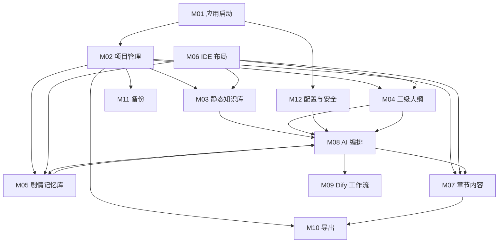

### 1.3 统一流程描述约定

每个模块的流程实现包含：

| 要素 | 说明 |
|------|------|
| **触发条件** | 用户操作 / 系统事件 / 上游模块回调 |
| **前置校验** | 失败则中断并提示 |
| **主流程** | 有序步骤（含 Main / Renderer / 外部系统分工） |
| **后置动作** | 状态更新、UI 反馈、事件广播 |
| **异常分支** | 错误码与用户可见行为 |
| **伪代码** | 贴近实现的 TypeScript 伪代码 |

---

## M01 应用启动与壳层

### 职责

应用生命周期管理：Electron 主进程初始化、创建主窗口、加载 Vue 应用、应用全局深色主题、路由至欢迎页或工作区。

### 代码映射

| 层级 | 路径 |
|------|------|
| Main | `electron/main/index.ts`, `electron/main/window.ts` |
| Renderer | `src/main.ts`, `src/App.vue`, `src/router/index.ts` |
| 主题 | `src/assets/themes/dark.css` |

### 对外接口

| 接口 | 类型 | 说明 |
|------|------|------|
| `app:ready` | 内部事件 | Main 进程就绪 |
| `window:created` | 内部事件 | 主窗口创建完成 |
| 路由 `/` | Vue Router | WelcomeView |
| 路由 `/workspace` | Vue Router | WorkspaceView（需已打开项目） |

### 流程 F-M01-01：应用冷启动

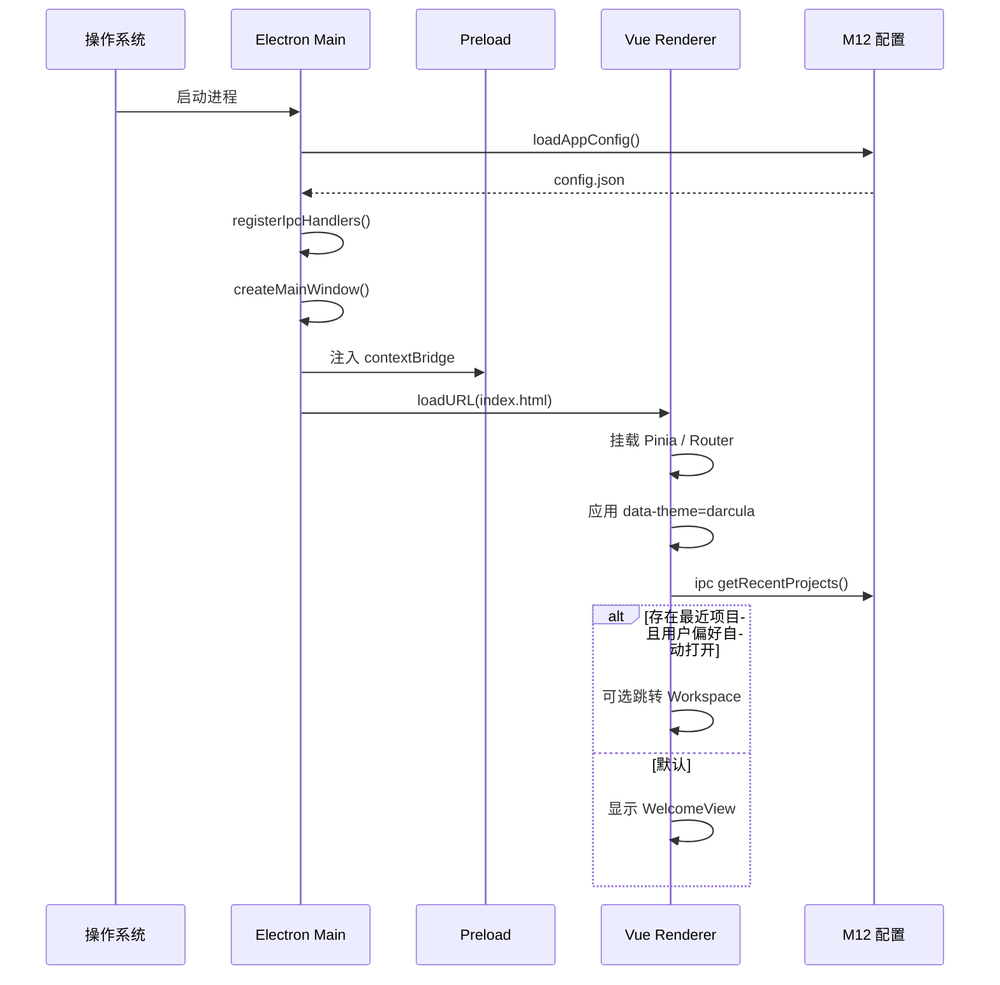

**步骤实现：**

```
1. Main: app.whenReady()
2. Main: 读取 ~/.novelscreator/config.json（不存在则写默认）
3. Main: 注册全部 IPC channel（project / file / export / backup / secure）
4. Main: BrowserWindow { contextIsolation: true, preload }
5. Renderer: createApp → pinia → router → mount('#app')
6. Renderer: document.documentElement.dataset.theme = config.theme
7. Renderer: router.push('/') → WelcomeView
```

**伪代码：**

```typescript
// electron/main/index.ts
app.whenReady().then(async () => {
  await configService.load();
  registerAllIpcHandlers();
  createMainWindow();
});

// src/main.ts
const app = createApp(App);
app.use(createPinia()).use(router);
app.mount('#app');
```

### 异常分支

| 错误 | 处理 |
|------|------|
| 配置文件损坏 | 备份旧文件，写入默认配置，Toast 警告 |
| 窗口创建失败 | 写日志，dialog 提示退出 |

---

## M02 项目管理

### 职责

多本小说 **独立项目空间** 的创建、打开、关闭；初始化项目目录树；维护最近项目列表；Project Explorer 卷章树数据源。

### 代码映射

| 层级 | 路径 |
|------|------|
| Main Service | `electron/main/services/project.service.ts` |
| IPC | `electron/main/ipc/project.ipc.ts` |
| Store | `src/stores/project.store.ts` |
| UI | `src/views/WelcomeView.vue`, `src/components/project/ProjectExplorer.vue` |

### 数据契约

- 读写：`{projectRoot}/project.json`
- 应用级：`~/.novelscreator/config.json` → `recentProjects[]`

### 对外接口（IPC）

| Channel | 方向 | 参数 → 返回 |
|---------|------|----------------|
| `project:create` | Renderer→Main | `{ name, author, parentDir }` → `{ rootPath, project }` |
| `project:open` | Renderer→Main | `{ rootPath }` → `{ project }` |
| `project:close` | Renderer→Main | `void` → `void` |
| `project:getTree` | Renderer→Main | `{ rootPath }` → `VolumeChapterTree` |
| `project:listRecent` | Renderer→Main | `void` → `string[]` |

### 流程 F-M02-01：新建项目

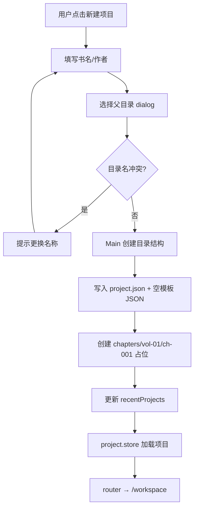

**目录初始化清单（Main 原子执行）：**

```
{ProjectName}/
├── project.json
├── knowledge/world.json, characters.json, factions.json, items.json
├── outline/outline.json          # 含 vol-01 / ch-001 默认节点
├── memory/plot-memory.json       # version=1, 空摘要
├── chapters/vol-01/ch-001/       # 空目录，待生成
├── exports/
└── backups/
```

**伪代码：**

```typescript
async function createProject(input: CreateProjectInput): Promise<Project> {
  const rootPath = path.join(input.parentDir, sanitize(input.name));
  assertNotExists(rootPath);
  await fs.ensureDir(rootPath);
  const project: Project = {
    id: uuid(),
    name: input.name,
    author: input.author,
    createdAt: now(),
    updatedAt: now(),
    rootPath,
    settings: { ...DEFAULT_SETTINGS },
  };
  await writeJson(path.join(rootPath, 'project.json'), project);
  await initKnowledgeTemplates(rootPath);
  await initOutlineTemplate(rootPath);
  await initMemoryTemplate(rootPath);
  await configService.pushRecent(rootPath);
  return project;
}
```

### 流程 F-M02-02：打开项目

```
1. 用户从 Welcome 选最近项目 / 「打开」选文件夹
2. Main: 校验 project.json 存在且 Schema 合法
3. Main: 返回 Project 元数据 + getTree() 卷章树
4. project.store.open(project) — 加载 rootPath、settings
5. 并行 IPC 加载 knowledge / outline / memory 至各 store
6. router.push('/workspace')
7. M06 恢复布局；M06 打开默认面板（Project Explorer）
```

### 流程 F-M02-03：关闭项目

```
1. 菜单「关闭项目」或打开另一项目前
2. M06: 检查 editor.store 脏标签 → 提示保存
3. 各 store reset()
4. router.push('/')
```

### 异常分支

| 错误码 | 场景 | UI |
|--------|------|-----|
| `PROJECT_NOT_FOUND` | project.json 缺失 | 无法打开 |
| `PROJECT_INVALID_SCHEMA` | JSON 校验失败 | 提供修复 / 恢复备份入口（M11） |

---

## M03 静态知识库

### 职责

编辑与管理 **世界观、人物、势力、道具** 四类设定；表单 / 表格 CRUD；编辑后自动持久化；为 M08 组装 `knowledge_snapshot`。

### 代码映射

| 层级 | 路径 |
|------|------|
| Store | `src/stores/knowledge.store.ts` |
| UI | `src/components/knowledge/KnowledgePanel.vue`, `GenerateKnowledgeDialog.vue` |
| Schema | `schemas/knowledge.schema.json` |
| Main IO | `electron/main/services/file.service.ts` |

### 数据文件

| 文件 | 实体 |
|------|------|
| `knowledge/world.json` | 单对象 |
| `knowledge/characters.json` | `{ characters: [] }` |
| `knowledge/factions.json` | `{ factions: [] }` |
| `knowledge/items.json` | `{ items: [] }` |

### 对外接口

| 接口 | 说明 |
|------|------|
| `knowledge.load(rootPath)` | IPC 批量加载四文件 |
| `knowledge.save(entityType)` | 防抖保存单实体文件 |
| `knowledge.buildSnapshot(options?)` | 内存中生成 Dify 入参摘要 |

### 流程 F-M03-01：加载知识库

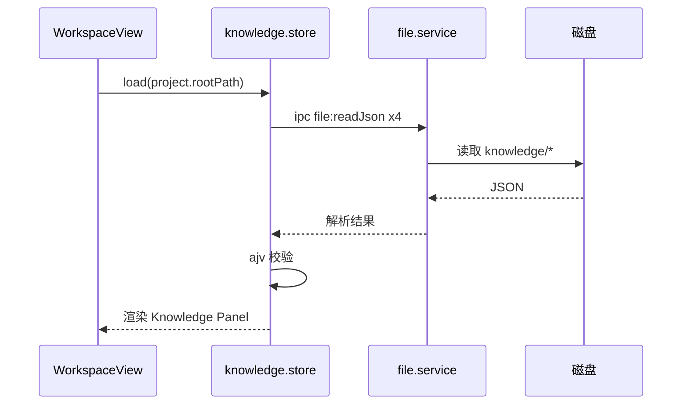

### 流程 F-M03-02：编辑并自动保存

```
1. 用户在 Knowledge Panel 修改字段（如人物 traits）
2. knowledge.store 标记 entity 为 dirty
3. useAutoSave 防抖 500ms
4. IPC file:writeJson（Main 原子写：tmp → rename）
5. ajv 校验失败 → 回滚内存，StatusBar 错误
6. 成功 → StatusBar「已保存」；清除 dirty
```

**伪代码：**

```typescript
const saveCharacters = useDebouncedFn(async () => {
  const data = { characters: store.characters };
  const valid = validateKnowledge('characters', data);
  if (!valid) throw new ValidationError();
  await window.api.file.writeJson(
    join(rootPath, 'knowledge/characters.json'),
    data
  );
  store.markClean('characters');
}, 500);
```

### 流程 F-M03-03：生成 AI 上下文快照

```
输入: chapterId（可选，用于筛选相关人物）
1. 读取 world 全文（或截断至 maxTokens 预算）
2. characters: 筛选与本章 beats 提及的角色 + 主角团默认包含
3. factions / items: 关联 factionId / ownerId 过滤
4. 输出 JSON 字符串 → 交给 M08 inputs.knowledge_snapshot
```

### 流程 F-M03-04：AI 生成知识库（Dify）

```
触发: 菜单「AI 生成知识库」或设定侧栏入口
1. knowledge.loadIfEmpty()
2. buildKnowledgeBriefForm(doc, mode) 预填结构化表单
3. 用户补全空白字段 → composeKnowledgeBrief() 合成 brief
4. IPC dify:generateKnowledge → knowledge-generation.service
5. mergeKnowledgeDocument + validateMergedKnowledge → saveKnowledge
6. circuit_break → CircuitBreakModal（kind=knowledge）
```

详见 [KNOWLEDGE-BRIEF-GUIDE.md](../knowledge/KNOWLEDGE-BRIEF-GUIDE.md)。

### 前置校验（供 M08 调用）

| 规则 | 说明 |
|------|------|
| `world.title` 非空 | 否则阻止生成 |
| 至少 1 个 character | 否则警告 / 阻止 |
| 本章 beats 涉及未知角色 ID | 警告 |

---

## M04 三级剧情大纲

### 职责

**卷 → 章 → 节拍** 三级树形结构的 CRUD、拖拽排序、章节状态机；为大纲编辑标签页与 AI 生成提供 `outline_beats`。

### 代码映射

| 层级 | 路径 |
|------|------|
| Store | `src/stores/outline.store.ts` |
| UI | `src/components/outline/OutlineTree.vue`, `OutlineEditor.vue` |
| Schema | `schemas/outline.schema.json` |

### 章节状态机

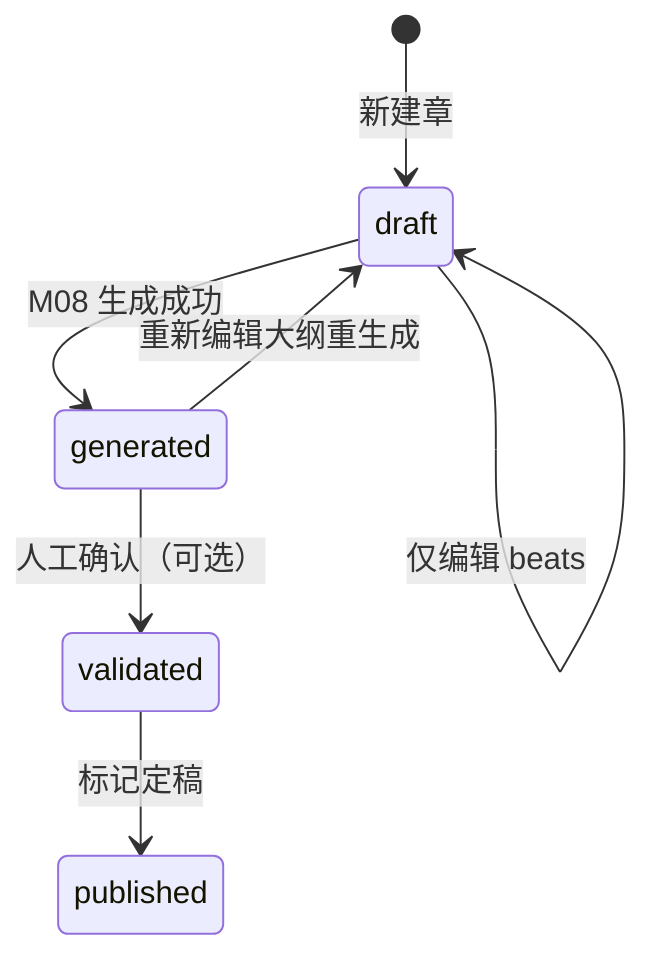

| 状态 | 含义 |
|------|------|
| `draft` | 仅有大纲，未生成或已废弃生成物 |
| `generated` | AI 已成功产出正文 |
| `validated` | 人工审核通过 |
| `published` | 定稿，建议只读 |

### 流程 F-M04-01：大纲树加载与展示

```
1. outline.store.load(rootPath) → 读 outline/outline.json
2. OutlineTree 渲染 volumes → chapters → beats
3. 点击章节点 → M06 打开 OutlineEditor 标签（章摘要 + beats 列表）
```

### 流程 F-M04-02：新增 / 编辑 / 删除节点

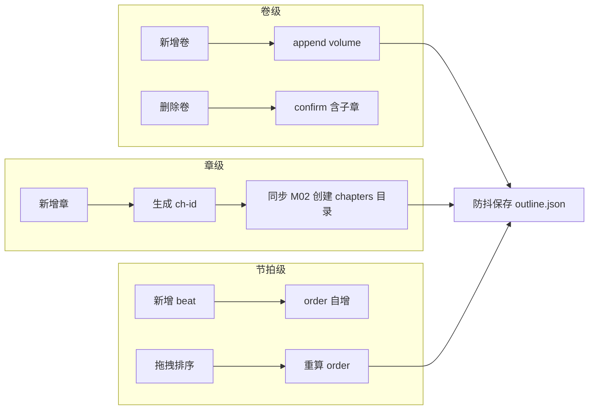

**新增章时联动 M02：**

```typescript
async function addChapter(volumeId: string, title: string) {
  const chapter = { id: genChapterId(), title, summary: '', beats: [], status: 'draft' };
  store.appendChapter(volumeId, chapter);
  await ipc.invoke('project:ensureChapterDir', {
    rootPath,
    volumeId,
    chapterId: chapter.id,
  });
  await outlineService.save(store.outline);
}
```

### 流程 F-M04-03：选中章并准备生成

```
1. 用户在大纲树选中 chapterId
2. outline.store.setActiveChapter(chapterId)
3. 校验 beats.length >= 1
4. 将 beats JSON 序列化 → 传递给 M08
```

---

## M05 动态剧情记忆库

### 职责

维护 **`plot-memory.json`**；展示历史章摘要、伏笔、角色状态；接收 M08 返回的 `memory_patch` 并 merge；支持人工修正。

### 代码映射

| 层级 | 路径 |
|------|------|
| Store | `src/stores/memory.store.ts` |
| UI | `src/components/memory/MemoryPanel.vue` |
| 算法 | `src/utils/memoryMerge.ts` |
| Schema | `schemas/memory.schema.json` |

### 流程 F-M05-01：加载记忆库

```
1. memory.store.load(rootPath)
2. MemoryPanel 分 Tab：全书摘要 / 分章摘要 / 伏笔列表
3. 默认只读；「编辑」开启 manual 模式
```

### 流程 F-M05-02：应用 memory_patch（M08 成功后回调）

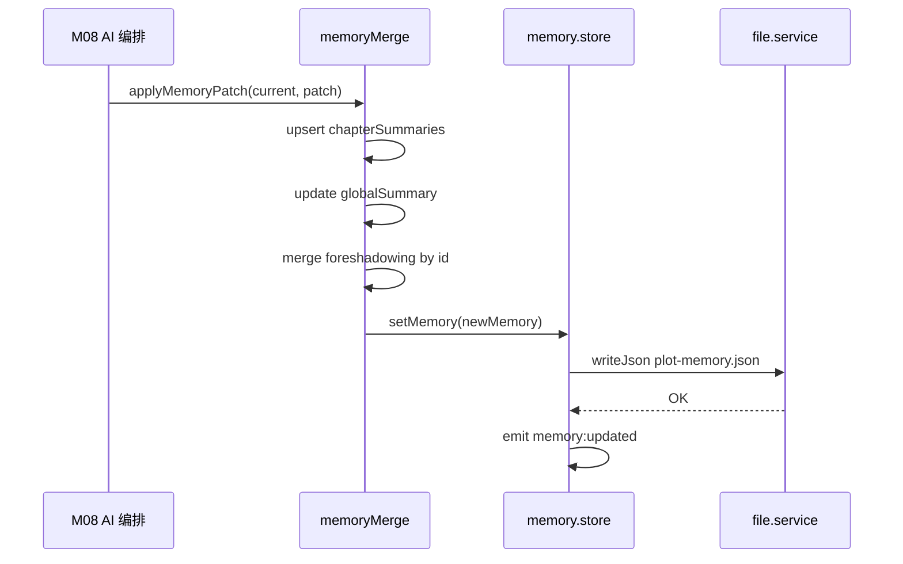

**merge 伪代码（核心实现）：**

```typescript
function applyMemoryPatch(memory: PlotMemory, patch: MemoryPatch): PlotMemory {
  const next = structuredClone(memory);
  const idx = next.chapterSummaries.findIndex(
    (c) => c.chapterId === patch.chapterSummary.chapterId
  );
  if (idx >= 0) next.chapterSummaries[idx] = patch.chapterSummary;
  else next.chapterSummaries.push(patch.chapterSummary);

  if (patch.globalSummaryDelta) {
    next.globalSummary = trimGlobalSummary(
      next.globalSummary + '\n' + patch.globalSummaryDelta
    );
  }
  for (const fs of patch.foreshadowingUpdates ?? []) {
    const i = next.foreshadowing.findIndex((x) => x.id === fs.id);
    if (i >= 0) next.foreshadowing[i] = { ...next.foreshadowing[i], ...fs };
    else next.foreshadowing.push(fs);
  }
  next.version += 1;
  next.updatedAt = new Date().toISOString();
  return next;
}
```

### 流程 F-M05-03：人工修正记忆

```
1. 用户编辑某章 summary → 标记 manualEdited: true
2. 保存 plot-memory.json
3. 下次 M08 生成仍携带全文 memory；Dify Prompt 注明「人工修正条目不可覆盖」
```

### 流程 F-M05-04：构建 Dify 入参 plot_memory

```
1. 若 Token 预算内 → 序列化完整 plot-memory.json
2. 否则 → globalSummary + 最近 N 章 chapterSummaries + 未解伏笔
3. 附加 previous_chapter_summary（上一章单章摘要）
```

---

## M06 IDE 布局与多标签编辑

> **页面线框、路由守卫、Activity 切换、标签打开/关闭、MenuBar 映射等 UI 跳转细节** 见 **[UI-NAVIGATION.md](./UI-NAVIGATION.md)**。

### 职责

类 IDEA **可拖拽停靠面板**、Activity Bar、MenuBar、StatusBar、**多标签页**编辑器；布局持久化；脏数据检测与保存调度。

### 代码映射

| 层级 | 路径 |
|------|------|
| Store | `src/stores/layout.store.ts`, `src/stores/editor.store.ts` |
| UI | `src/components/layout/*` |
| Composable | `src/composables/useAutoSave.ts` |
| 视图 | `src/views/WorkspaceView.vue` |

### 标签页模型

```typescript
interface EditorTab {
  id: string;
  type: 'outline' | 'knowledge' | 'chapter-novel' | 'chapter-video' | 'memory-edit';
  title: string;
  resourceKey: string;      // 如 ch-001:novel
  content: string;
  dirty: boolean;
  readonly: boolean;
}
```

### 流程 F-M06-01：工作区布局初始化

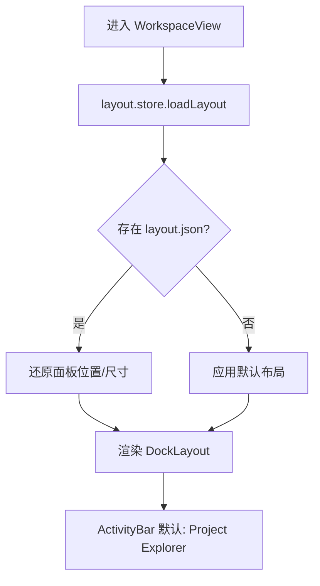

**默认布局：**

| 区域 | 内容 |
|------|------|
| 左 | Activity Bar + Project Explorer（240px） |
| 中 | TabBar + Editor |
| 右 | Outline Tree（可关闭，320px） |
| 底 | Generation Console（折叠，200px） |

### 流程 F-M06-02：打开标签页

```
1. 触发源：点击大纲 / 双击章节 / M08 生成完成
2. editor.store.openTab(tabDescriptor)
3. 若 resourceKey 已打开 → focus 已有标签
4. 否则 load 内容：
   - knowledge / outline → 来自对应 store
   - chapter-novel / chapter-video → IPC 读 txt 或 M08 传入字符串
5. TabBar 追加；Editor 挂载 Monaco（正文/视频稿）
```

### 流程 F-M06-03：保存当前 / 全部标签

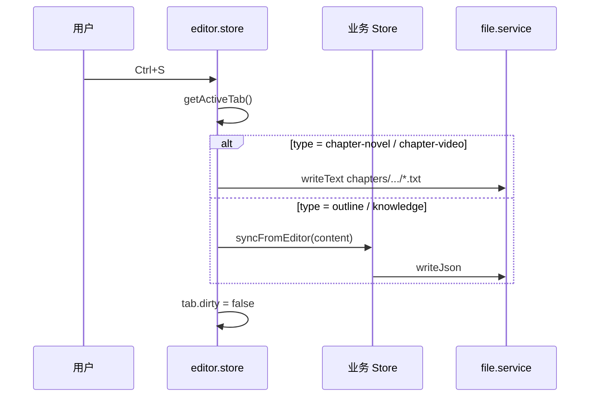

### 流程 F-M06-04：关闭标签（含脏检查）

```
1. Ctrl+W 或点击 × 
2. if tab.dirty → dialog「保存 / 不保存 / 取消」
3. 保存 → 走 F-M06-03
4. 移除标签；若无标签 → 显示 EmptyEditor 占位
```

### 流程 F-M06-05：面板拖拽停靠

```
1. 用户拖拽面板标题栏至左/右/底 drop zone
2. layout.store.movePanel(panelId, zone)
3. 防抖 300ms 写入 ~/.novelscreator/layout.json
```

---

## M07 章节内容管理

### 职责

管理 `chapters/{vol}/{ch}/` 下 **novel.txt、video-script.txt、meta.json** 的读写；章节预览；与大纲 chapterId 对齐。

### 代码映射

| 层级 | 路径 |
|------|------|
| Service | `electron/main/services/file.service.ts` |
| UI | `src/components/chapter/ChapterPreview.vue` |
| Store | `src/stores/chapter.store.ts`（可选，或合入 editor.store） |

### 文件约定

| 文件 | 编码 | 说明 |
|------|------|------|
| `novel.txt` | UTF-8 无 BOM | 标准小说正文 |
| `video-script.txt` | UTF-8 无 BOM | 视频脚本 |
| `meta.json` | JSON | `{ generatedAt, difyRunId, retryCount, status }` |

### 流程 F-M07-01：预览已有章节

```
1. Project Explorer 双击 ch-001
2. 并行读取 novel.txt、video-script.txt（不存在则空串）
3. M06 打开两个标签：[ch-001] 正文 / [ch-001] 视频脚本
4. readonly = false（允许手工润色后保存）
```

### 流程 F-M07-02：写入 AI 生成结果（由 M08 调用）

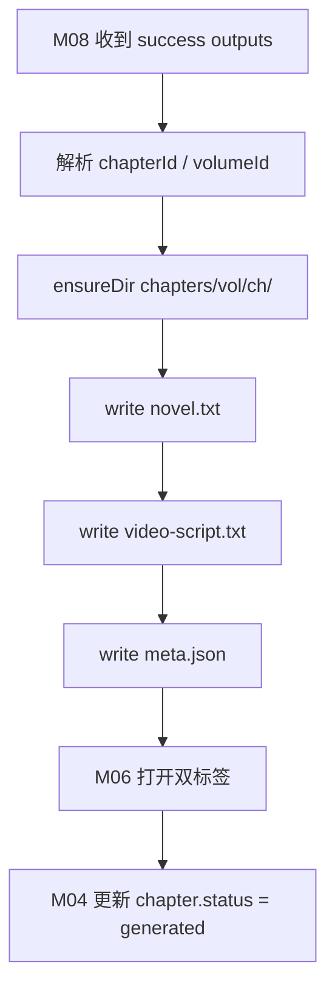

**meta.json 示例：**

```json
{
  "chapterId": "ch-001",
  "generatedAt": "2026-06-01T12:00:00.000Z",
  "difyRunId": "run-xxx",
  "retryCount": 1,
  "workflowVersion": "novel-chapter-generation-v1"
}
```

### 流程 F-M07-03：手工编辑章节保存

```
1. 用户在正文标签修改内容
2. tab.dirty = true
3. Ctrl+S → Main writeText novel.txt（原子写）
4. meta.json 追加 manualEditedAt（可选）
5. 不自动触发 M05 更新（避免与 AI patch 冲突；用户可手动改 memory）
```

### 异常分支

| 场景 | 处理 |
|------|------|
| 写入失败 | 保留 Editor 内容，dialog 提示磁盘错误 |
| 重新生成成功 | **覆盖** novel.txt / video-script.txt；meta 追加 history 数组（可选） |

---

## M08 AI 生成编排（客户端）

### 职责

组装 Dify 入参；HTTP 调用工作流；解析 success / circuit_break / error；协调 M07 落盘、M05 merge、M04 状态、M06 标签与 Generation Console 日志。

### 代码映射

| 层级 | 路径 |
|------|------|
| Composable | `src/composables/useDifyWorkflow.ts` |
| Store | `src/stores/dify.store.ts` |
| UI | `src/components/chapter/GenerateDialog.vue`, GenerationConsole |

### 对外接口

```typescript
interface GenerateChapterOptions {
  chapterId: string;
  force?: boolean;           // 忽略已有生成物警告
}

interface GenerateChapterResult {
  status: 'success' | 'circuit_break' | 'error';
  retryCount?: number;
  issues?: string[];
}
```

### 流程 F-M08-01：章节生成主流程

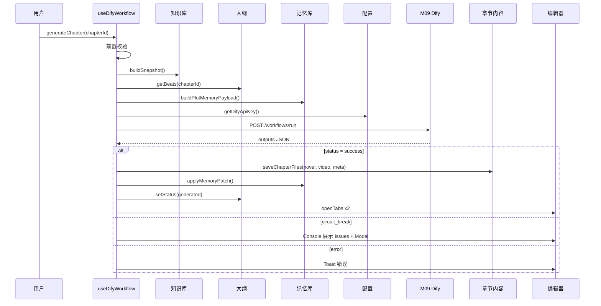

### 步骤实现（详细）

```
Phase A — 前置校验
  1. project 已打开
  2. chapterId 存在于 outline
  3. beats.length >= 1
  4. M03.validateForGeneration() 通过
  5. dify.apiKey 已配置（M12）
  6. 若已有 novel.txt 且 !force → confirm 覆盖

Phase B — 组装 inputs
  7. outline_beats = JSON.stringify(beats)
  8. knowledge_snapshot = M03.buildSnapshot(chapterId)
  9. plot_memory = M05.buildPayload()
  10. video_platform_template = project.settings.videoPlatformTemplate
  11. previous_chapter_summary = M05.getPreviousSummary(chapterId)

Phase C — HTTP 调用
  12. dify.store.setRunning(true)
  13. POST {baseUrl}/workflows/run, response_mode: blocking
  14. 超时 10min（可配置）；Generation Console 记录 requestId

Phase D — 响应分发
  15. parse outputs.status
  16. success → F-M07-02 + F-M05-02 + F-M04 状态 + F-M06-02
  17. circuit_break → 不写 txt；展示 draft_text + validation_report
  18. error → 不修改磁盘

Phase E — 收尾
  19. dify.store.setRunning(false)
  20. Console 写入摘要日志（脱敏 API Key）
```

**伪代码：**

```typescript
async function generateChapter(opts: GenerateChapterOptions): Promise<GenerateChapterResult> {
  const chapter = outlineStore.getChapter(opts.chapterId);
  assert(chapter.beats.length > 0, 'BEATS_EMPTY');
  knowledgeStore.assertReadyForGeneration();

  const inputs = {
    project_id: projectStore.id,
    chapter_id: chapter.id,
    chapter_title: chapter.title,
    outline_beats: JSON.stringify(chapter.beats),
    knowledge_snapshot: JSON.stringify(knowledgeStore.buildSnapshot(opts.chapterId)),
    plot_memory: JSON.stringify(memoryStore.buildPayload()),
    video_platform_template: projectStore.settings.videoPlatformTemplate,
    max_retry: 3,
    previous_chapter_summary: memoryStore.getPreviousSummary(opts.chapterId) ?? '',
  };

  difyStore.logRequest(inputs);
  const res = await axios.post(`${baseUrl}/workflows/run`, {
    inputs,
    response_mode: 'blocking',
    user: `novelscreator-${projectStore.id}-${chapter.id}`,
  }, { headers: { Authorization: `Bearer ${apiKey}` }, timeout: 600_000 });

  const out = res.data.data.outputs;
  if (out.status === 'success') {
    await chapterService.saveGenerated(chapter, out);
    await memoryStore.applyPatch(out.memory_patch);
    outlineStore.setChapterStatus(chapter.id, 'generated');
    editorStore.openGeneratedTabs(chapter.id, out.novel_body, out.video_script);
    return { status: 'success', retryCount: out.retry_count };
  }
  if (out.circuit_break) {
    difyStore.showCircuitBreakModal(out);
    return { status: 'circuit_break', issues: out.validation_report?.issues };
  }
  throw new DifyError(out);
}
```

### 流程 F-M08-02：熔断后人工介入再生成

```
1. 用户阅读 Modal 中的 issues
2. 跳转修改 M04 beats / M03 设定 / M05 记忆
3. 点击「重新生成」→ generateChapter({ force: true })
4. Dify 重新跑完整工作流（retry_count 从 0 开始）
```

### 错误码

| 码 | 含义 | UI |
|----|------|-----|
| `BEATS_EMPTY` | 无节拍 | 阻止，聚焦大纲 |
| `KNOWLEDGE_INCOMPLETE` | 设定不足 | 阻止，打开知识库 |
| `DIFY_NETWORK` | 网络错误 | 可重试 |
| `DIFY_INVALID_RESPONSE` | 缺字段 | Console 详情 |

---

## M09 Dify 工作流（服务端）

### 职责

在 Dify 平台内实现 **多模型流水线**（非客户端代码）：初稿 → 并行校验 → 重试 / 熔断 → 润色 → 双分支输出 → memory_patch。

### 资产路径

- `dify/workflow-novel-chapter.yaml`
- `dify/chapter/prompts/*.md` — 各节点 Prompt 模板，设计说明见 [PROMPT-DESIGN.md](../chapter/PROMPT-DESIGN.md)

### 流程 F-M09-01：工作流内部执行

> 与 [DEVELOPMENT.md §7](./DEVELOPMENT.md#7-dify-ai-工作流设计) 一致，此处从**模块视角**细化节点 I/O 与分支条件。

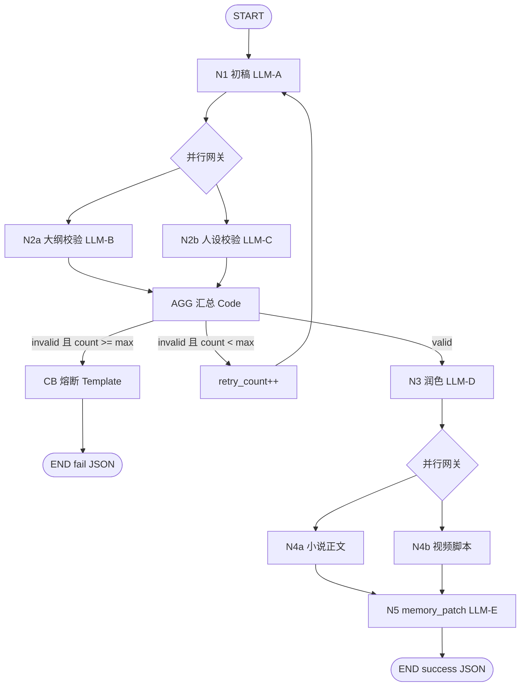

### 节点 I/O 契约

| 节点 | 输入变量 | 输出变量 |
|------|----------|----------|
| N1 | beats, knowledge_snapshot, plot_memory, previous_chapter_summary, retry_issues? | draft_text |
| N2a | draft_text, outline_beats | outline_valid, outline_issues[] |
| N2b | draft_text, knowledge_snapshot | lore_valid, lore_issues[] |
| AGG | 上述 valid / issues, retry_count, max_retry | route, merged_issues[] |
| N3 | draft_text, merged_issues | polished_text |
| N4a | polished_text | novel_body |
| N4b | polished_text, video_platform_template | video_script |
| N5 | novel_body, plot_memory | memory_patch |
| CB | draft_text, merged_issues, retry_count | circuit_break=true, human_action_required=true |

### 流程 F-M09-02：校验失败重试环

```
条件: NOT (outline_valid AND lore_valid) AND retry_count < max_retry
动作:
  1. retry_count += 1
  2. retry_issues = merge(outline_issues, lore_issues)
  3. 回到 N1，Prompt 注入「上次失败原因」+ retry_issues
否则 if retry_count >= max_retry:
  走 CB 熔断分支，输出 END fail JSON
```

### 流程 F-M09-03：双分支并行输出

```
输入: polished_text, video_platform_template
并行:
  分支 A: 应用「标准小说阅读规范」模板 → novel_body
  分支 B: 按 template ID 选择 Prompt → video_script
汇聚: 两者完成后进入 N5 生成 memory_patch（基于 novel_body）
```

---

## M10 导出

### 职责

**单章** / **全本** 内容导出为 `.txt` / `.md`；可选结构化 ZIP；不修改源项目文件。

### 代码映射

| 层级 | 路径 |
|------|------|
| Service | `electron/main/services/export.service.ts` |
| IPC | `electron/main/ipc/export.ipc.ts` |
| UI | 菜单「导出」、ExportDialog |

### 对外接口（IPC）

| Channel | 参数 → 返回 |
|---------|-------------|
| `export:chapter` | `{ rootPath, chapterId, type: novel\|video, format: txt\|md, destPath }` → `void` |
| `export:fullBook` | `{ rootPath, type, format, destPath }` → `{ chapterCount, byteSize }` |
| `export:structured` | `{ rootPath, destZipPath }` → `void` |

### 流程 F-M10-01：单章导出

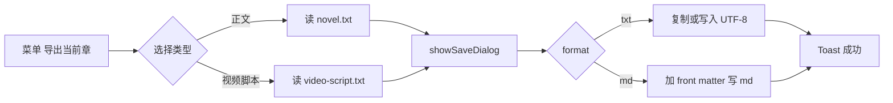

**md front matter 示例：**

```markdown
---
title: 第一章
novel: 书名
author: 作者
exportedAt: 2026-06-01T12:00:00.000Z
---

正文内容...
```

### 流程 F-M10-02：全本导出

```
1. 用户选择「导出全本」→ 类型（正文/视频）→ 格式 → 保存路径
2. Main: 读 outline.json 确定卷章顺序
3. 按序遍历 chapters/{vol}/{ch}/{novel|video-script}.txt
4. 缺失文件 → 跳过并记录 warning 列表
5. 合并：
   - txt: 卷标题 + 章标题 + 分隔线 + 正文
   - 编码 UTF-8 无 BOM
6. 返回统计；若有 skipped → dialog 展示
```

**伪代码：**

```typescript
async function exportFullBook(rootPath: string, type: 'novel' | 'video', destPath: string) {
  const outline = await readOutline(rootPath);
  const parts: string[] = [];
  const skipped: string[] = [];
  for (const vol of outline.volumes) {
    parts.push(`\n\n=== ${vol.title} ===\n\n`);
    for (const ch of vol.chapters) {
      const file = chapterFilePath(rootPath, vol.id, ch.id, type);
      if (!(await fs.pathExists(file))) { skipped.push(ch.id); continue; }
      parts.push(`\n## ${ch.title}\n\n`);
      parts.push(await fs.readFile(file, 'utf8'));
    }
  }
  await fs.writeFile(destPath, parts.join(''), 'utf8');
  return { chapterCount: parts.length, skipped };
}
```

---

## M11 备份与恢复

### 职责

项目目录 **ZIP 备份**与恢复；手动 / 自动策略；保留份数限制；备份不含 API Key。

### 代码映射

| 层级 | 路径 |
|------|------|
| Service | `electron/main/services/backup.service.ts` |
| IPC | `electron/main/ipc/backup.ipc.ts` |

### 流程 F-M11-01：手动备份

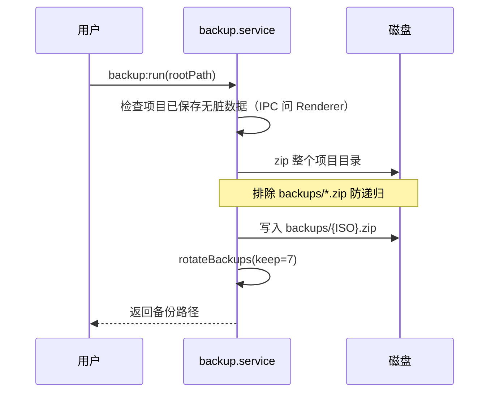

### 流程 F-M11-02：自动备份

```
触发条件（满足任一）:
  - 每日首次启动且打开项目
  - M08 生成成功累计 N 次（默认 N=5，可配置）

动作: 同 F-M11-01，Toast「已自动备份」
```

### 流程 F-M11-03：从备份恢复

```
1. 用户选择 backups/xxx.zip
2. confirm「将覆盖当前项目目录」
3. 解压至临时目录 → 校验 project.json
4. 关闭项目（M02）→ 替换目录内容 → 重新打开（M02）
5. 失败则保留原目录，报告错误
```

### rotate 伪代码

```typescript
async function rotateBackups(backupsDir: string, keep: number) {
  const files = (await fs.readdir(backupsDir))
    .filter((f) => f.endsWith('.zip'))
    .map((f) => ({ f, t: fs.statSync(path.join(backupsDir, f)).mtimeMs }))
    .sort((a, b) => b.t - a.t);
  for (const old of files.slice(keep)) {
    await fs.remove(path.join(backupsDir, old.f));
  }
}
```

---

## M12 配置与安全

### 职责

应用级 **`~/.novelscreator/config.json`**；Dify **API Key** 加密存取；布局文件；CSP；Dify 连接检测。

### 代码映射

| 层级 | 路径 |
|------|------|
| Main | `electron/main/services/config.service.ts`, `secure.service.ts` |
| IPC | `secure:getDifyApiKey`, `secure:setDifyApiKey` |
| UI | `src/components/settings/SettingsPanel.vue` |

### 流程 F-M12-01：读取 / 保存 API Key

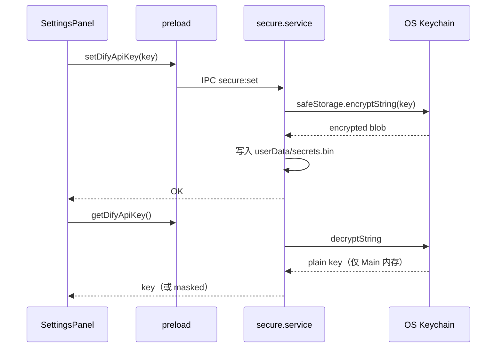

### 流程 F-M12-02：Dify 连接测试

```
1. 设置页填写 baseUrl → 点击「测试连接」
2. GET {baseUrl}/parameters 或轻量 health（带 Bearer）
3. 成功 → StatusBar 绿点；失败 → 红字 + 原因
```

### 流程 F-M12-03：应用配置热更新

```
1. 修改 theme / autoSaveIntervalMs
2. 写 config.json
3. Renderer 监听 config:changed → 切换 CSS 变量 / 重置 debounce 间隔
```

### 安全规则

| 规则 |  enforcement |
|------|----------------|
| API Key 不进 project 目录 | Main 拒绝写入 |
| API Key 不进日志 | difyStore 脱敏 |
| Renderer 无 Node | contextIsolation |
| 仅允许访问配置的 baseUrl | axios 拦截器校验 host |

---

## 14 跨模块协作场景

### 场景 S1：从零创建到首章生成

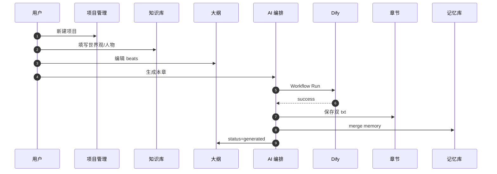

### 场景 S2：熔断 → 修正 → 重试

```
1. M08 circuit_break → Modal 展示 issues
2. U → M04 修改 beats / M03 补设定
3. U → M08 重新生成
4. M09 success → M07 / M05 / M04 更新
```

### 场景 S3：定稿导出与备份

```
1. U → M04 标记 published
2. U → M11 手动备份
3. U → M10 全本导出 novel.txt
```

### 场景 S4：续写第二章（长篇连贯）

```
1. M05 已含 ch-001 memory
2. U → M04 编辑 ch-002 beats
3. M08 组装 inputs 含 plot_memory + previous_chapter_summary
4. M09 N1 Prompt 注入 globalSummary + 上一章状态
5. 成功后 M05 patch 追加 ch-002 摘要
```

---

## 附录：模块 ↔ 菜单映射

| 菜单项 | 模块 | 流程 ID |
|--------|------|---------|
| 文件 → 新建 / 打开 / 关闭 | M02 | F-M02-01 / 02 / 03 |
| 编辑 → 保存 | M06 | F-M06-03 |
| 视图 → 面板 | M06 | F-M06-05 |
| 项目 → 备份 / 恢复 | M11 | F-M11-01 / 03 |
| 生成 → 生成本章 | M08 | F-M08-01 |
| 导出 → 单章 / 全本 | M10 | F-M10-01 / 02 |
| 设置 | M12 | F-M12-* |

---

## 附录：建议实现顺序（按模块）

| 顺序 | 模块 | 理由 |
|------|------|------|
| 1 | M01 + M12 | 壳层与配置 |
| 2 | M02 | 项目空间是一切的根 |
| 3 | M06 | 编辑器与布局承载后续 UI |
| 4 | M03 + M04 + M05 | 内容数据层 |
| 5 | M07 | 章节文件 |
| 6 | M09 + M08 | AI 闭环 |
| 7 | M10 + M11 | 交付与容灾 |

---

*文档版本：v1.0 · 最后更新：2026-06-01*
