# NovelsCreator — 客户端页面布局与跳转流程

> 本文档专门描述 Renderer 层的 **页面结构、IDE 布局分区、路由跳转、面板切换、标签页导航** 及对应流程实现。  
> 关联文档：[DEVELOPMENT.md](./DEVELOPMENT.md) · [MODULES.md](./MODULES.md)（M01 / M06）

---

## 目录

1. [页面体系总览](#1-页面体系总览)
2. [路由与导航守卫](#2-路由与导航守卫)
3. [App 壳层布局](#3-app-壳层布局)
4. [WelcomeView — 欢迎 / 项目入口页](#4-welcomeview--欢迎--项目入口页)
5. [WorkspaceView — IDE 工作区](#5-workspaceview--ide-工作区)
6. [Activity Bar 与侧边面板切换](#6-activity-bar-与侧边面板切换)
7. [中央编辑区与多标签页](#7-中央编辑区与多标签页)
8. [底部 Generation Console](#8-底部-generation-console)
9. [弹层与模态框](#9-弹层与模态框)
10. [MenuBar 菜单跳转映射](#10-menubar-菜单跳转映射)
11. [布局持久化与状态模型](#11-布局持久化与状态模型)
12. [完整跳转流程索引](#12-完整跳转流程索引)

---

## 1. 页面体系总览

### 1.1 视图层级

客户端 Renderer 仅包含 **2 个一级路由页面** + **若干嵌入式面板 / 弹层**（非独立路由）：

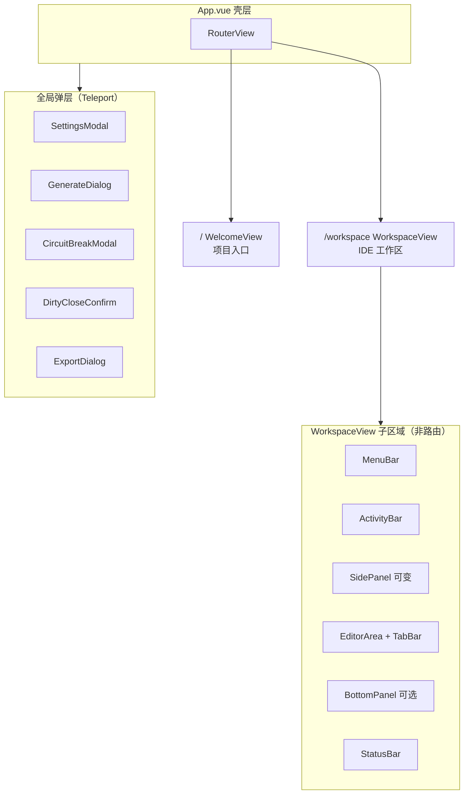

### 1.2 页面职责对照

| 页面 / 区域 | 路由 | 何时可见 | 核心职责 |
|-------------|------|----------|----------|
| **WelcomeView** | `/` | 未打开项目 / 关闭项目后 | 新建、打开、最近项目 |
| **WorkspaceView** | `/workspace` | 项目已加载 | 全部创作 IDE 功能 |
| **SettingsModal** | — | 任意页面可唤起 | Dify / 主题 / 快捷键 |
| **GenerateDialog** | — | 工作区内 | 快速生成确认 |
| **GenerationWizardView** | `/workspace/generate/:chapterId` | 工作区内 | 三要素向导生成（普通用户主路径） |
| **CircuitBreakModal** | — | M08 熔断 | 校验失败人工介入 |

### 1.3 页面跳转总图

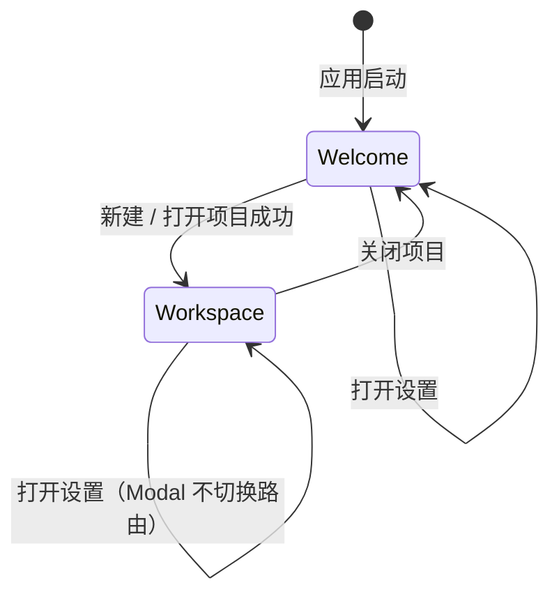

---

## 2. 路由与导航守卫

### 2.1 路由表

| 路径 | 名称 | 组件 | Meta |
|------|------|------|------|
| `/` | `welcome` | `WelcomeView.vue` | `{ requiresProject: false }` |
| `/workspace` | `workspace` | `WorkspaceView.vue` | `{ requiresProject: true }` |
| `/workspace/generate/:chapterId` | `generation-wizard` | `GenerationWizardView.vue` | `{ requiresProject: true, fullscreenWizard: true }` |
| `/*` | — | — | 重定向至 `/` |

**路由模式**：`createWebHashHistory()`（Electron `file://` 兼容）

### 2.2 路由定义（伪代码）

```typescript
// src/router/index.ts
const routes = [
  { path: '/', name: 'welcome', component: WelcomeView },
  {
    path: '/workspace',
    name: 'workspace',
    component: WorkspaceView,
    meta: { requiresProject: true },
  },
  {
    path: '/workspace/generate/:chapterId',
    name: 'generation-wizard',
    component: GenerationWizardView,
    meta: { requiresProject: true, fullscreenWizard: true },
  },
  { path: '/:pathMatch(.*)*', redirect: '/' },
];
```

### 2.3 全局前置守卫

**流程 F-NAV-01：路由跳转守卫**

```mermaid
flowchart TD
    A[router.beforeEach] --> B{to.meta.requiresProject?}
    B -->|否| C[next]
    B -->|是| D{projectStore.isOpen?}
    D -->|是| C
    D -->|否| E[next('/') + Toast 请先打开项目]
```

**关闭项目时的守卫（离开工作区）**

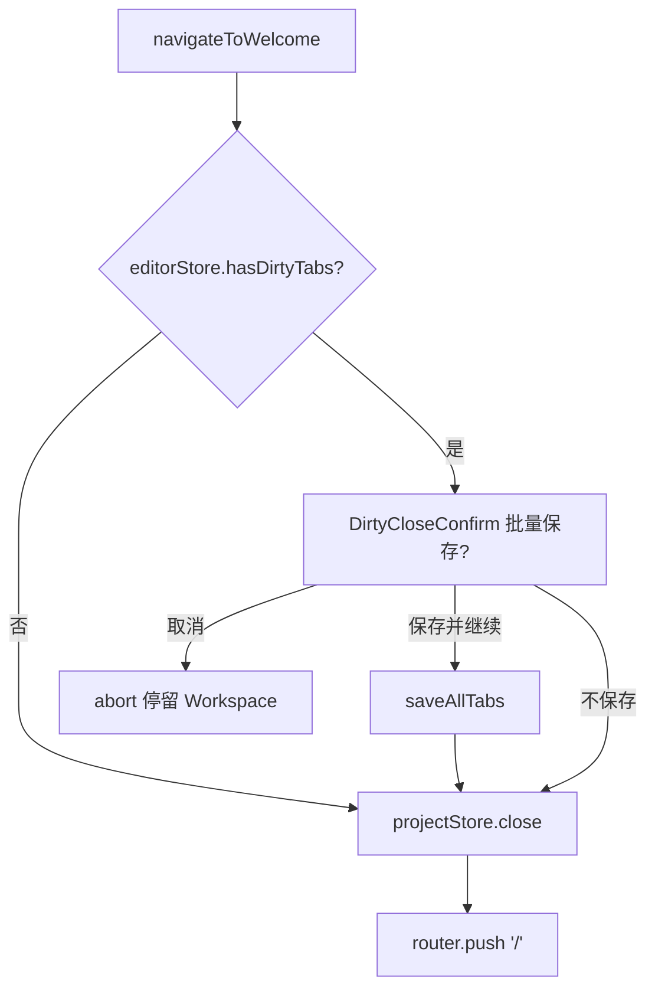

**伪代码：**

```typescript
router.beforeEach((to) => {
  if (to.meta.requiresProject && !projectStore.isOpen) {
    message.warning('请先打开或创建一个项目');
    return { name: 'welcome' };
  }
});

async function navigateToWelcome() {
  if (editorStore.hasDirtyTabs) {
    const action = await showDirtyCloseDialog({ scope: 'all' });
    if (action === 'cancel') return;
    if (action === 'save') await editorStore.saveAll();
  }
  await projectStore.close();
  router.push({ name: 'welcome' });
}
```

---

## 3. App 壳层布局

### 3.1 结构

```
App.vue
├── div.app-root[data-theme="darcula"]
│   ├── RouterView                    # 全屏占满，Welcome / Workspace 二选一
│   └── Teleport → body
│       ├── SettingsModal
│       ├── GlobalMessageHost         # Naive UI n-message 容器
│       └── GlobalDialogHost          # 确认框队列
```

### 3.2 尺寸约束

| 约束 | 值 | 说明 |
|------|-----|------|
| 主窗口最小宽 | 1024px | Main `BrowserWindow` 与 CSS `min-width` 一致 |
| 主窗口最小高 | 640px | 保证 IDE 三区可见 |
| Activity Bar 宽 | 48px | 固定 |
| Status Bar 高 | 24px | 固定 |

### 3.3 流程 F-NAV-02：应用启动 → 首屏

```
1. App.vue mount
2. 读取 config.theme → 设置 data-theme
3. Router 默认 /
4. WelcomeView 渲染
5. 并行：ipc project:listRecent → 渲染最近项目卡片
```

---

## 4. WelcomeView — 欢迎 / 项目入口页

### 4.1 线框布局

```
┌─────────────────────────────────────────────────────────────┐
│  [Logo]  NovelsCreator                    [设置] [关于]      │
├─────────────────────────────────────────────────────────────┤
│                                                             │
│     ┌─────────────────┐    ┌─────────────────────────────┐  │
│     │   新建项目       │    │   最近项目                   │  │
│     │   [+ 创建]       │    │   ┌──────┐ ┌──────┐         │  │
│     └─────────────────┘    │   │ 书A  │ │ 书B  │ ...     │  │
│                            │   └──────┘ └──────┘         │  │
│     ┌─────────────────┐    └─────────────────────────────┘  │
│     │   打开项目       │                                      │
│     │   [文件夹图标]   │    空态：暂无最近项目，请新建或打开    │
│     └─────────────────┘                                      │
│                                                             │
└─────────────────────────────────────────────────────────────┘
```

### 4.2 组件树

```
WelcomeView.vue
├── WelcomeHeader.vue          # Logo + 设置/关于
├── WelcomeActions.vue         # 新建 / 打开 大按钮
├── RecentProjectList.vue      # 卡片列表，双击打开
└── NewProjectDialog.vue       # 新建表单 Modal（内嵌或 Teleport）
```

### 4.3 流程 F-NAV-03：新建项目 → 进入工作区

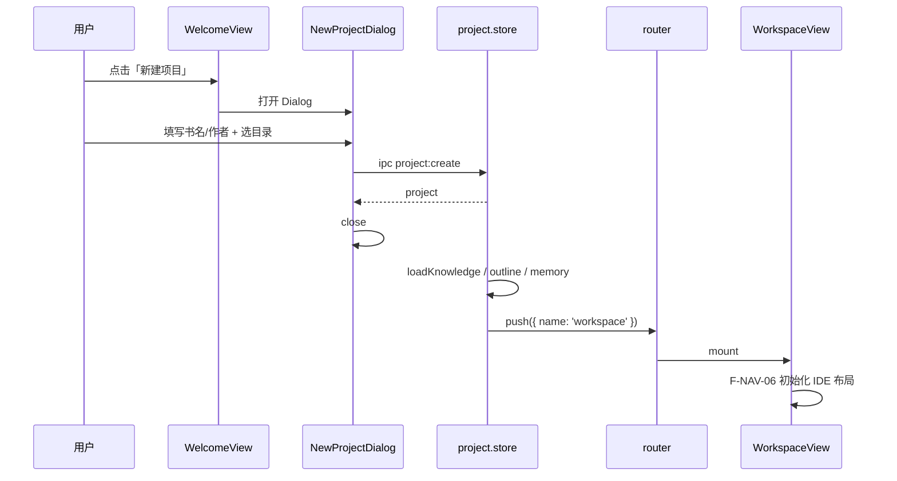

### 4.4 流程 F-NAV-04：打开最近项目 / 文件夹

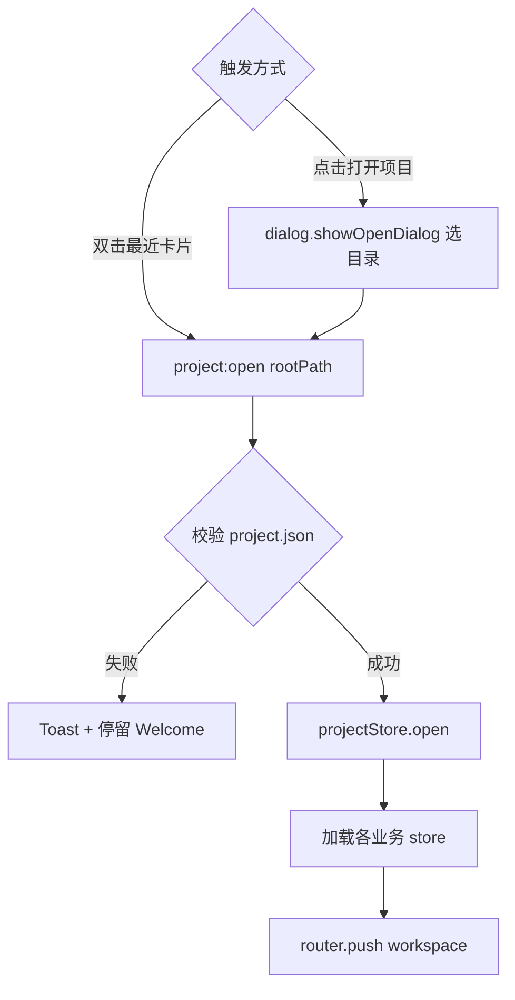

### 4.5 Welcome 页内跳转（不切换路由）

| 操作 | 目标 | 流程 ID |
|------|------|---------|
| 点击「设置」 | SettingsModal | F-NAV-20 |
| 点击「关于」 | AboutDialog | — |

---

## 5. WorkspaceView — IDE 工作区

### 5.1 整体布局（Grid）

WorkspaceView 使用 **CSS Grid** 五区布局，类似 IDEA：

```
grid-template:
  "menubar   menubar   menubar"   32px
  "activity  sidebar   editor"    1fr
  "activity  bottom    bottom"    auto
  "status    status    status"    24px
/ 48px       minmax(200px,320px)  1fr
```

**ASCII 线框：**

```
┌──────────────────────────────────────────────────────────────────┐
│ MenuBar                                                          │
├──┬──────────────┬───────────────────────────────────────────────┤
│A │  SidePanel   │  EditorArea                                   │
│c │  (左栏内容)   │  ┌ TabBar ─────────────────────────────────┐  │
│t │              │  │ [大纲] [人物] [ch-001 正文] ...           │  │
│i │  由 Activity │  ├─────────────────────────────────────────┤  │
│v │  决定显示：   │  │                                         │  │
│i │  · Explorer  │  │         Editor / EmptyEditorPlaceholder │  │
│t │  · Outline   │  │                                         │  │
│y │  · Knowledge │  │                                         │  │
│  │  · Memory    │  └─────────────────────────────────────────┘  │
│  ├──────────────┴───────────────────────────────────────────────┤
│  │  BottomPanel (Generation Console)  [折叠 ▼]                  │
├──┴──────────────────────────────────────────────────────────────┤
│ StatusBar                                                        │
└──────────────────────────────────────────────────────────────────┘
```

> **右停靠扩展**：Editor 与 SidePanel 之间可再插入 `RightPanel`（大纲树 / 记忆库），Grid 在 `layout.store` 控制下动态切换为三分栏。

### 5.2 组件树

```
WorkspaceView.vue
├── MenuBar.vue
├── div.workspace-grid
│   ├── ActivityBar.vue
│   ├── SidePanelHost.vue
│   │   ├── ProjectExplorer.vue      # activity = explorer
│   │   ├── OutlineTreePanel.vue     # activity = outline
│   │   ├── KnowledgePanel.vue       # activity = knowledge
│   │   └── MemoryPanel.vue          # activity = memory
│   ├── EditorArea.vue
│   │   ├── TabBar.vue
│   │   ├── EditorPane.vue           # CodeMirror / Monaco
│   │   └── EmptyEditorPlaceholder.vue
│   ├── BottomPanelHost.vue
│   │   └── GenerationConsole.vue
│   └── RightPanelHost.vue           # 可选，layout.store 控制
│       └── OutlineTreePanel / MemoryPanel / ValidationReport
└── StatusBar.vue
```

### 5.3 流程 F-NAV-05：进入工作区初始化

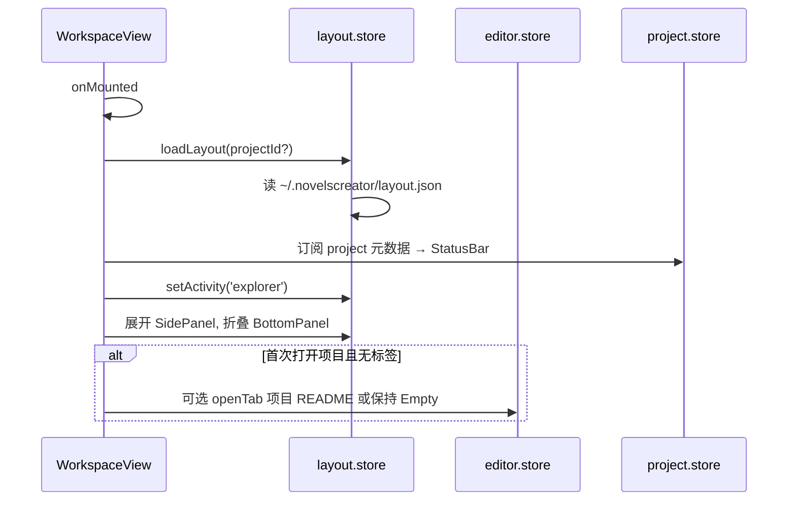

**默认首屏状态：**

| 状态项 | 默认值 |
|--------|--------|
| `activity` | `explorer` |
| `sidePanelVisible` | `true` |
| `bottomPanelCollapsed` | `true` |
| `rightPanelVisible` | `false` |
| `activeTabId` | `null`（Empty 占位） |

---

## 6. Activity Bar 与侧边面板切换

### 6.1 Activity 枚举

```typescript
type ActivityId = 'explorer' | 'outline' | 'knowledge' | 'memory' | 'settings';

interface ActivityItem {
  id: ActivityId;
  icon: string;
  label: string;
  sidePanelComponent: Component;  // settings 打开 Modal 无 sidePanel
}
```

| ID | 图标语义 | SidePanel 内容 | 是否打开 Modal |
|----|----------|----------------|----------------|
| `explorer` | 文件夹 | ProjectExplorer | 否 |
| `outline` | 列表树 | OutlineTreePanel | 否 |
| `knowledge` | 书本 | KnowledgePanel（4 Tab） | 否 |
| `memory` | 脑图/时钟 | MemoryPanel | 否 |
| `settings` | 齿轮 | — | 是 → SettingsModal |

### 6.2 Activity Bar 线框

```
┌────┐
│ 📁 │ ← explorer（选中高亮左边框 2px accent）
│ 📋 │
│ 📖 │
│ 🧠 │
│    │
│ ⚙ │ ← 贴底固定
└────┘
```

### 6.3 流程 F-NAV-06：切换 Activity

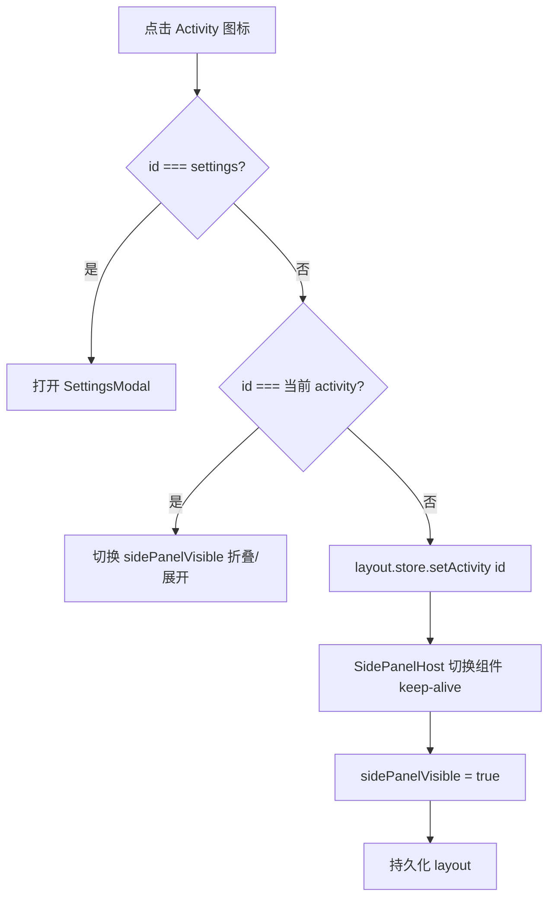

**伪代码：**

```typescript
function onActivityClick(id: ActivityId) {
  if (id === 'settings') {
    settingsStore.openModal();
    return;
  }
  if (layoutStore.activity === id) {
    layoutStore.toggleSidePanel();
  } else {
    layoutStore.setActivity(id);
    layoutStore.sidePanelVisible = true;
  }
  layoutStore.persistDebounced();
}
```

### 6.4 SidePanel 内交互 → 中央标签（跨区跳转）

| SidePanel 操作 | 跳转目标 | 流程 ID |
|----------------|----------|---------|
| Explorer 双击章节 | 打开 `chapter-novel` + `chapter-video` 标签 | F-NAV-10 |
| Outline 点击章节点 | 打开 `outline` 标签 | F-NAV-11 |
| Outline 右键「生成本章」 | GenerateDialog | F-NAV-15 |
| Knowledge 双击人物 | 打开 `knowledge` 标签（人物表单） | F-NAV-12 |
| Memory 点击「编辑本章摘要」 | 打开 `memory-edit` 标签 | F-NAV-13 |

---

## 7. 中央编辑区与多标签页

### 7.1 TabBar 线框

```
┌─────────────────────────────────────────────────────────────────┐
│ [大纲 · 第一章 ×] [设定-人物 · 张三 ×] [ch-001 正文 ● ×] ...  [+] │
└─────────────────────────────────────────────────────────────────┘
  ● = dirty 未保存圆点
```

### 7.2 标签类型与打开规则

| type | 标题模板 | resourceKey | 打开方式 | 默认 focus |
|------|----------|-------------|----------|------------|
| `outline` | `大纲 · {章标题}` | `outline:{chapterId}` | Outline 树点击章 | 是 |
| `knowledge` | `设定-{实体} · {名称}` | `knowledge:{type}:{id}` | Knowledge 列表双击 | 是 |
| `chapter-novel` | `{chapterId} 正文` | `{chapterId}:novel` | Explorer 双击 / 生成完成 | 是（生成时） |
| `chapter-video` | `{chapterId} 视频脚本` | `{chapterId}:video` | 同上 / 生成完成 | 否（第二标签） |
| `memory-edit` | `记忆 · {章标题}` | `memory:{chapterId}` | Memory Panel | 是 |

### 7.3 流程 F-NAV-07：打开标签（统一入口）

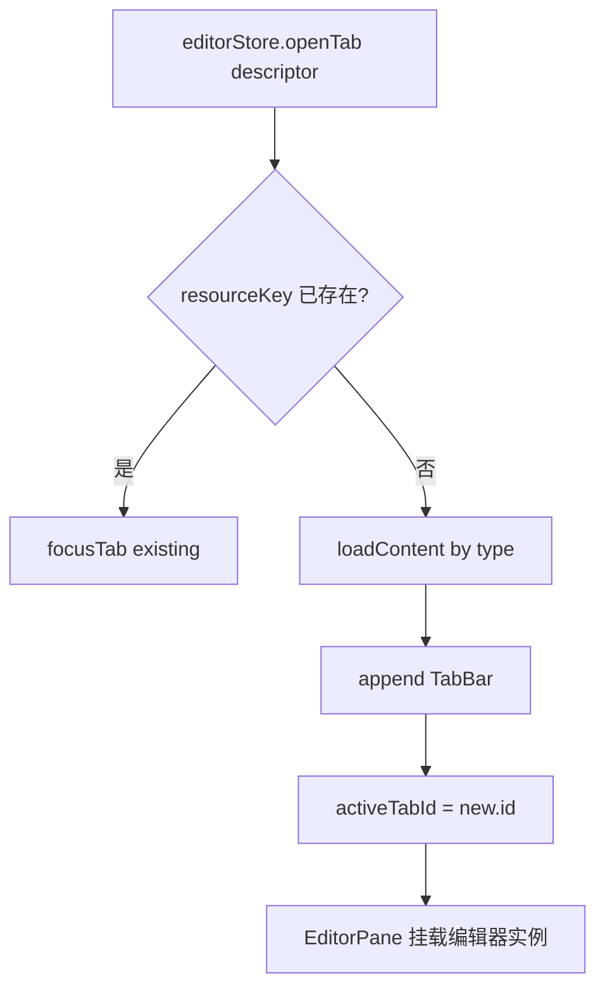

**loadContent 分支：**

```typescript
async function loadContent(tab: TabDescriptor): Promise<string> {
  switch (tab.type) {
    case 'outline':
      return outlineStore.getChapterEditorPayload(tab.chapterId);
    case 'knowledge':
      return JSON.stringify(knowledgeStore.getEntity(tab.entityType, tab.entityId), null, 2);
    case 'chapter-novel':
    case 'chapter-video':
      return ipc.file.readText(chapterPath(tab, tab.type === 'chapter-novel' ? 'novel.txt' : 'video-script.txt'));
    case 'memory-edit':
      return memoryStore.getChapterSummaryText(tab.chapterId);
  }
}
```

### 7.4 流程 F-NAV-08：切换标签

```
触发：点击 Tab / Ctrl+Tab / Ctrl+Shift+Tab
1. editorStore.setActiveTab(tabId)
2. TabBar 滚动至可见
3. EditorPane 切换 model（keep-alive 缓存编辑器状态）
4. StatusBar 更新：文件名、dirty、行列号
```

### 7.5 流程 F-NAV-09：关闭标签

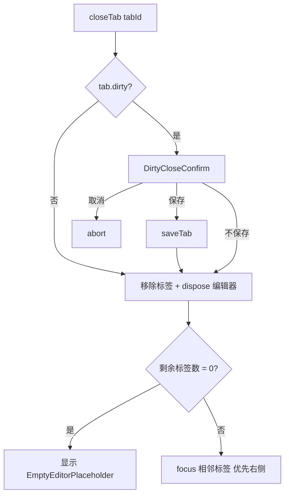

### 7.6 流程 F-NAV-10：Explorer 双击章节 → 双标签

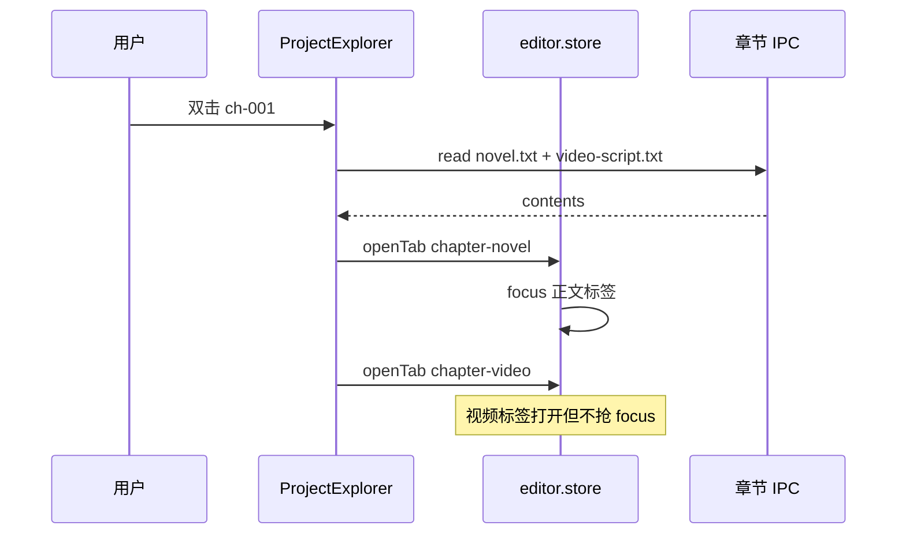

### 7.7 流程 F-NAV-11：Outline 树 → 大纲编辑标签

```
1. 用户点击章节点（单击选中，双击或 Enter 打开）
2. outlineStore.setSelectedChapter(chapterId)
3. editorStore.openTab({ type: 'outline', chapterId, title: `大纲 · ${title}` })
4. Editor 展示：章 summary 文本框 + beats 列表（或 JSON 模式）
5. 编辑 beats → outline store dirty → 联动 Tab dirty
```

### 7.8 流程 F-NAV-12：Knowledge Panel → 设定标签

```
1. KnowledgePanel 内 Tab：世界观 | 人物 | 势力 | 道具
2. 双击列表行 → openTab({ type: 'knowledge', entityType, entityId })
3. 中央 Editor 渲染表单视图（非纯 JSON 时可用专用 FormEditor 组件替 CodeMirror）
4. 保存：Form → knowledge.store → IPC writeJson
```

### 7.9 EmptyEditorPlaceholder

无标签时中央区显示：

```
        ┌─────────────────────────────┐
        │     未打开文件               │
        │  从左侧选择章节或设定开始编辑   │
        │  Ctrl+Enter 生成当前选中章    │
        └─────────────────────────────┘
```

---

## 8. 底部 Generation Console

### 8.1 布局

```
┌─ Generation Console ──────────────────────── [折叠] [清空] ─┐
│ [12:01:02] INFO  开始生成 ch-001 ...                          │
│ [12:01:45] WARN  校验重试 1/3: 偏离大纲节拍 2                  │
│ [12:02:30] OK    生成成功，已保存 novel.txt / video-script.txt │
└──────────────────────────────────────────────────────────────┘
```

### 8.2 显示 / 隐藏流程 F-NAV-14

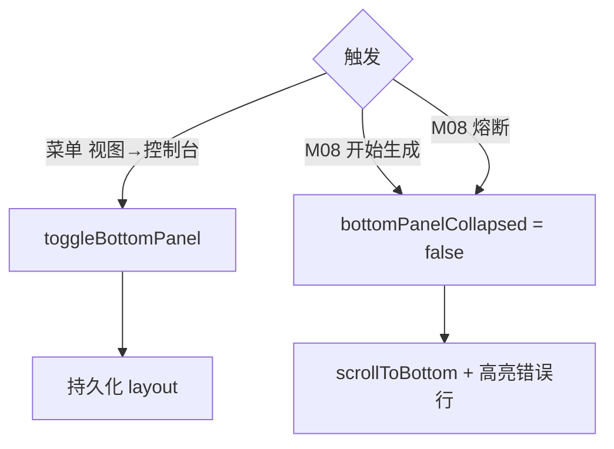

| 状态 | 高度 |
|------|------|
| 折叠 | 0（仅保留 24px 拖拽条） |
| 展开 | 200px（可拖拽 120–400px） |

---

## 9. 弹层与模态框

### 9.1 弹层清单

| 组件 | 触发 | 阻塞 | 关闭后跳转 |
|------|------|------|------------|
| **NewProjectDialog** | Welcome 新建 | 是 | 成功 → `/workspace` |
| **SettingsModal** | Activity ⚙ / 菜单 | 是 | 无路由变化 |
| **GenerateDialog** | 菜单快速生成 / Shift+Ctrl+Enter | 是 | 成功 → 开标签 + Console |
| **GenerationWizardView** | Ctrl+Enter / 菜单向导生成 | 是 | 四步向导 → Dify → 开标签 |
| **CircuitBreakModal** | M08 熔断 | 是 | 用户点「修改大纲」→ focus Outline Activity |
| **DirtyCloseConfirm** | 关标签 / 关项目 | 是 | 依用户选择 |
| **ExportDialog** | 菜单导出 | 是 | 无 |
| **AboutDialog** | Welcome 关于 | 否 | 无 |

### 9.2 流程 F-NAV-15：GenerateDialog → 生成 → 标签跳转

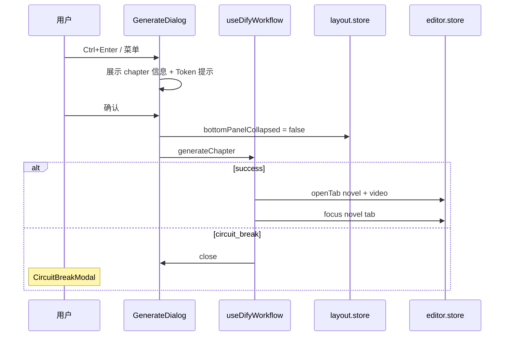

### 9.3 流程 F-NAV-16：CircuitBreakModal → 引导跳转

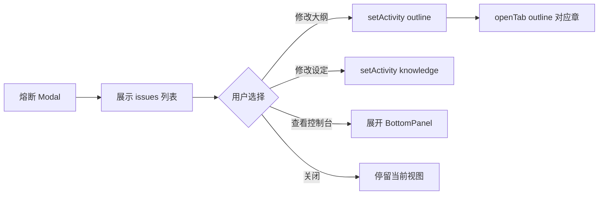

### 9.4 流程 F-NAV-20：SettingsModal

```
入口：Welcome 设置 / Workspace Activity ⚙ / 菜单 文件→设置
布局：左侧 Nav（常规 | Dify | 快捷键 | 外观）+ 右侧表单
保存：Apply → ipc secure:setDifyApiKey + configService.save
关闭：Esc / 取消 → 不保存；无路由变化
```

---

## 10. MenuBar 菜单跳转映射

MenuBar 在 **WorkspaceView 内**渲染；Welcome 页仅简化菜单（设置、关于、退出）。

### 10.1 Welcome 页菜单

| 菜单 | 项 | 动作 | 流程 |
|------|-----|------|------|
| 文件 | 退出 | app.quit | — |
| 帮助 | 关于 | AboutDialog | — |
| — | 设置 | SettingsModal | F-NAV-20 |

### 10.2 Workspace 页菜单

| 菜单 | 项 | UI 跳转 / 动作 |
|------|-----|----------------|
| **文件** | 关闭项目 | F-NAV-01 守卫 → `/` |
| **文件** | 设置 | SettingsModal |
| **编辑** | 保存 | F-NAV-17 保存当前标签 |
| **编辑** | 全部保存 | saveAllTabs |
| **视图** | 项目浏览器 | setActivity(`explorer`) |
| **视图** | 大纲 | setActivity(`outline`) |
| **视图** | 知识库 | setActivity(`knowledge`) |
| **视图** | 记忆库 | setActivity(`memory`) |
| **视图** | 生成控制台 | toggleBottomPanel |
| **视图** | 重置布局 | layoutStore.resetDefault + 确认 |
| **项目** | 备份 | Backup 进度 Toast（无页跳） |
| **生成** | 生成本章 | GenerateDialog（需 outline 选中章） |
| **导出** | 导出当前章 | ExportDialog |
| **导出** | 导出全本 | ExportDialog |
| **帮助** | 关于 | AboutDialog |

### 10.3 流程 F-NAV-17：菜单 → 视图联动

```typescript
// MenuBar 视图菜单与 Activity 统一走 layoutStore
const viewMenuHandlers: Record<string, () => void> = {
  explorer: () => layoutStore.setActivity('explorer'),
  outline: () => layoutStore.setActivity('outline'),
  knowledge: () => layoutStore.setActivity('knowledge'),
  memory: () => layoutStore.setActivity('memory'),
  console: () => layoutStore.toggleBottomPanel(),
};
```

---

## 11. 布局持久化与状态模型

### 11.1 layout.store 状态

```typescript
interface LayoutState {
  // Activity & 面板
  activity: ActivityId;
  sidePanelVisible: boolean;
  sidePanelWidth: number;          // 200–480
  rightPanelVisible: boolean;
  rightPanelWidth: number;
  rightPanelContent: 'outline' | 'memory' | null;
  bottomPanelCollapsed: boolean;
  bottomPanelHeight: number;       // 120–400

  // 可选：按项目记住 Activity
  perProjectActivity: Record<projectId, ActivityId>;
}
```

### 11.2 持久化文件

| 文件 |  scope |
|------|--------|
| `~/.novelscreator/layout.json` | 全局默认布局 |
| `{projectRoot}/.novelscreator/layout.override.json` | 可选，覆盖面板宽度 / 上次 Activity |

### 11.3 editor.store 导航相关状态

```typescript
interface EditorState {
  tabs: EditorTab[];
  activeTabId: string | null;
  tabOrder: string[];              // 用于 Ctrl+Tab

  openTab(desc: TabDescriptor): Promise<void>;
  closeTab(id: string): Promise<void>;
  focusTab(id: string): void;
  focusNextTab(reverse?: boolean): void;
  get hasDirtyTabs(): boolean;
}
```

### 11.4 流程 F-NAV-18：拖拽调整面板尺寸

```
1. 拖拽 SidePanel 右边缘 → 更新 sidePanelWidth
2. 拖拽 BottomPanel 上边缘 → 更新 bottomPanelHeight
3. debounce 300ms → write layout.json
4. Grid 模板列宽 / 行高实时 CSS 变量更新
```

### 11.5 流程 F-NAV-19：重置布局

```
1. 菜单 视图 → 重置布局
2. confirm 对话框
3. layoutStore.resetToDefault()
4. 关闭所有非必要标签（可选 confirm）
5. activity = explorer, bottom collapsed
```

---

## 12. 完整跳转流程索引

| 流程 ID | 名称 | 起点 | 终点 |
|---------|------|------|------|
| **F-NAV-01** | 路由守卫（需项目） | 任意 → `/workspace` | 拦截或放行 |
| **F-NAV-02** | 应用启动首屏 | 进程启动 | Welcome `/` |
| **F-NAV-03** | 新建项目 | Welcome | Workspace |
| **F-NAV-04** | 打开项目 | Welcome | Workspace |
| **F-NAV-05** | 工作区初始化 | mount Workspace | IDE 默认布局 |
| **F-NAV-06** | 切换 Activity | 点击 Activity Bar | SidePanel 切换 |
| **F-NAV-07** | 打开标签 | 各 Panel / 生成 | EditorArea 新 Tab |
| **F-NAV-08** | 切换标签 | TabBar / 快捷键 | focus 另一 Tab |
| **F-NAV-09** | 关闭标签 | × / Ctrl+W | 相邻 Tab 或 Empty |
| **F-NAV-10** | Explorer → 章节双标签 | 双击章 | novel + video Tab |
| **F-NAV-11** | Outline → 大纲 Tab | 点击章 | outline Tab |
| **F-NAV-12** | Knowledge → 设定 Tab | 双击实体 | knowledge Tab |
| **F-NAV-13** | Memory → 记忆 Tab | 编辑摘要 | memory-edit Tab |
| **F-NAV-14** | 控制台展开 | 生成 / 菜单 | BottomPanel |
| **F-NAV-15** | 生成 Dialog 流程 | Ctrl+Enter | 双标签 / 熔断 Modal |
| **F-NAV-16** | 熔断引导跳转 | CircuitBreakModal | Outline / Knowledge |
| **F-NAV-17** | 菜单视图联动 | MenuBar 视图 | Activity / Console |
| **F-NAV-18** | 面板尺寸拖拽 | 拖拽分隔条 | layout 持久化 |
| **F-NAV-19** | 重置布局 | 菜单 | 默认 IDE 布局 |
| **F-NAV-20** | 设置 Modal | 多处入口 | 无路由变化 |
| **F-NAV-21** | 关闭项目回 Welcome | 菜单关闭项目 | `/` + 脏检查 |

### 12.1 端到端：用户日典型路径

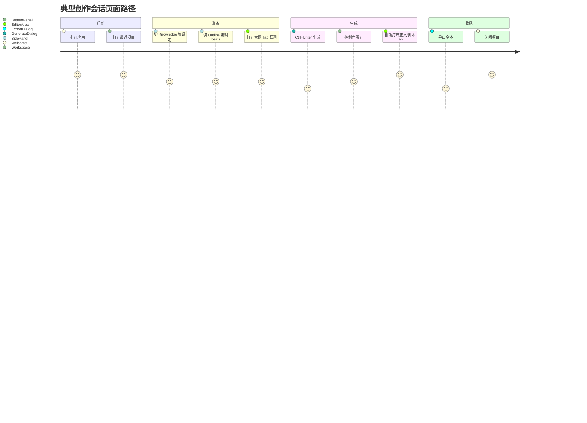

---

## 附录 A：推荐文件清单（实现对照）

```
src/
├── router/
│   ├── index.ts
│   └── guards.ts                 # F-NAV-01, F-NAV-21
├── views/
│   ├── WelcomeView.vue
│   └── WorkspaceView.vue
├── components/
│   ├── layout/
│   │   ├── MenuBar.vue
│   │   ├── ActivityBar.vue
│   │   ├── SidePanelHost.vue
│   │   ├── RightPanelHost.vue
│   │   ├── BottomPanelHost.vue
│   │   ├── EditorArea.vue
│   │   ├── TabBar.vue
│   │   ├── EditorPane.vue
│   │   ├── EmptyEditorPlaceholder.vue
│   │   └── StatusBar.vue
│   ├── welcome/
│   │   ├── WelcomeHeader.vue
│   │   ├── WelcomeActions.vue
│   │   ├── RecentProjectList.vue
│   │   └── NewProjectDialog.vue
│   └── dialogs/
│       ├── SettingsModal.vue
│       ├── GenerateDialog.vue
│       ├── CircuitBreakModal.vue
│       ├── DirtyCloseConfirm.vue
│       └── ExportDialog.vue
├── stores/
│   ├── layout.store.ts           # F-NAV-06, 18, 19
│   └── editor.store.ts           # F-NAV-07~09
└── composables/
    └── useNavigation.ts            # navigateToWelcome, openChapterTabs
```

---

## 附录 B：CSS Grid 变量示例

```css
.workspace-grid {
  display: grid;
  height: 100%;
  grid-template-rows: var(--nc-menubar-h) 1fr auto var(--nc-statusbar-h);
  grid-template-columns: var(--nc-activity-w) var(--nc-sidebar-w) 1fr;
  grid-template-areas:
    "menubar   menubar   menubar"
    "activity  sidebar   editor"
    "activity  bottom    bottom"
    "status    status    status";
}

.workspace-grid.has-right-panel {
  grid-template-columns: var(--nc-activity-w) var(--nc-sidebar-w) 1fr var(--nc-right-w);
  grid-template-areas:
    "menubar   menubar   menubar   menubar"
    "activity  sidebar   editor    right"
    "activity  bottom    bottom    bottom"
    "status    status    status    status";
}
```

---

*文档版本：v1.0 · 最后更新：2026-06-01 · 模块流程见 [MODULES.md](./MODULES.md) M06*
