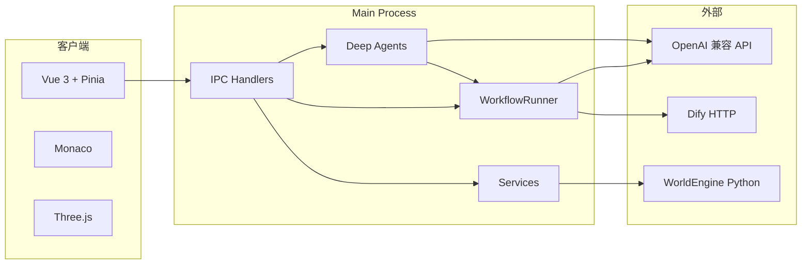

# 技术栈总览

> NovelsCreator v1.0.0 · 桌面端长篇小说 IDE + 内置 LangGraph 工作流 + Deep Agents 小说助手

---

## 1. 架构分层

```
┌─────────────────────────────────────────────────────────────┐
│  Renderer（Vue 3 + TypeScript）                              │
│  Pinia · Vue Router · Monaco · Three.js                      │
└───────────────────────────┬─────────────────────────────────┘
                            │ IPC（contextBridge / preload）
┌───────────────────────────▼─────────────────────────────────┐
│  Main Process（Electron + TypeScript）                        │
│  Services · Workflows · Agent · Python 子进程                 │
└───────┬─────────────────────────────┬───────────────────────┘
        │ 文件 I/O                       │ HTTP / LLM API
        ▼                               ▼
  用户项目目录                    OpenAI 兼容 API / Dify HTTP
  %APPDATA%/novels-creator        resources/python（WorldEngine）
```

---

## 2. 桌面壳层

| 技术 | 版本（package.json） | 用途 |
|------|----------------------|------|
| **Electron** | ^36.4.0 | 跨平台桌面壳、主进程、safeStorage |
| **Node.js** | 20（CI / 推荐） | Main 进程运行时 |
| **Chromium** | 随 Electron | 渲染 Web UI |

**关键路径**

- 主进程入口：`electron/main/index.ts` → 编译为 `out/main/index.js`
- 预加载桥：`electron/preload/index.ts` → `window.novelsCreator`
- 窗口：`electron/main/window.ts`
- 自定义协议：`electron/main/protocols/world-map.protocol.ts`（`nc-map://` 地图图片）

---

## 3. 前端（Renderer）

| 技术 | 版本 | 用途 |
|------|------|------|
| **Vue 3** | ^3.5.16 | UI 框架（Composition API） |
| **TypeScript** | ^5.8.3 | 全栈类型 |
| **Pinia** | ^3.0.2 | 全局状态（project / outline / assistant 等） |
| **Vue Router** | ^4.5.1 | Hash 路由（Welcome / Workspace / Wizard） |
| **Monaco Editor** | ^0.55.1 | 小说正文、脚本、JSON 编辑 |
| **Three.js** | ^0.184.0 | 世界地图 3D / 六边形网格渲染 |

**构建**

| 工具 | 用途 |
|------|------|
| **electron-vite** ^3.1.0 | Main / Preload / Renderer 三端打包 |
| **Vite** ^6.3.5 | 开发服务器与生产构建 |
| **@vitejs/plugin-vue** | Vue SFC 支持 |
| **vue-tsc** | 渲染进程类型检查（`npm run typecheck`） |

**前端目录**

- 视图：`src/views/`（WelcomeView、WorkspaceView、GenerationWizardView、WorldGeneratorView）
- 组件：`src/components/`（workspace、outline、knowledge、agent、settings…）
- 状态：`src/stores/`
- 类型契约：`src/types/api.ts`（与 IPC 对齐）

---

## 4. AI 与工作流

### 4.1 内置引擎（v1.0 默认）

| 技术 | 版本 | 用途 |
|------|------|------|
| **@langchain/core** | ^1.1.48 | LLM 消息、Runnable 抽象 |
| **@langchain/langgraph** | ^1.3.7 | 图编排（StateGraph） |
| **@langchain/langgraph-checkpoint** | ^1.0.4 | 助手会话检查点 |
| **@langchain/openai** | ^1.4.7 | OpenAI 兼容 Chat 模型 |
| **langchain** | ^1.4.4 | Tool 定义、链式调用 |
| **deepagents** | ^1.10.2 | 小说助手 Harness（`createDeepAgent`） |
| **Zod** | ^4.4.3 | Agent Tool 入参校验 |

**实现位置**

- 工作流抽象：`electron/main/workflows/workflow-runner.types.ts`
- 工厂（Local / Dify）：`electron/main/workflows/workflow-runner.factory.ts`
- 内置图：`electron/main/workflows/local/graphs/`（chapter / outline / knowledge / society）
- 节点：`electron/main/workflows/local/nodes/`
- Prompt 加载：`electron/main/workflows/local/prompts/`
- LLM 提供方：`electron/main/workflows/local/llm/llm-provider.ts`

### 4.2 Dify Legacy（可选）

| 技术 | 用途 |
|------|------|
| **axios** ^1.9.0 | Dify Workflow HTTP 调用 |
| **dify/** 目录 | Code 节点 Python、Jinja Prompt、fixtures、MCP manifest |
| **deploy/dify/** | 可导入的 Dify YAML 工作流 |

切换方式：设置 → AI 引擎 → `local`（默认）或 `dify`。

### 4.3 LangGraph Studio（开发调试）

| 技术 | 用途 |
|------|------|
| **@langchain/langgraph-cli** ^0.0.64 | `npm run studio:dev` 本地 Studio |
| **langgraph/** | Studio 用图构建器与 fixtures |
| **langgraph.json** | Studio 图注册 |

---

## 5. Python 子系统

| 技术 | 用途 |
|------|------|
| **worldengine** ≥0.20 | 程序化世界地图生成 |
| **Pillow** | 地图 PNG 输出 |
| **conda / venv** | 开发环境与发布 bundle |

**关键文件**

- CLI：`scripts/worldengine_generate.py`
- 依赖：`scripts/requirements-worldengine.txt`
- 打包：`scripts/build-python-bundle.cjs` → `resources/python/`
- Main 调用：`electron/main/services/worldengine-cli.service.ts`

---

## 6. 数据与安全

| 机制 | 技术 | 路径 |
|------|------|------|
| 项目文件 | JSON + UTF-8 文本 | 用户自选项目根目录 |
| 原子写入 | tmp + rename | `electron/main/utils/atomic-json-write.ts` |
| 文件锁 | 每项目互斥 | `electron/main/services/project-file-mutex.ts` |
| 应用配置 | JSON | `%APPDATA%/novels-creator/config.json` |
| API Key 加密 | Electron **safeStorage** | `dify-secrets.bin`、`llm-secrets.bin` |
| 助手会话 | JSON 转录本 | `assistant-sessions/<projectId>/transcript.json` |
| 检查点 | JSON | `assistant-sessions/checkpoints/<threadId>.json` |

---

## 7. 构建、打包与发布

| 工具 | 用途 |
|------|------|
| **electron-builder** ^25.1.8 | NSIS（Win）/ DMG（Mac）/ AppImage（Linux） |
| **sharp** | SVG → PNG 图标 |
| **png-to-ico** | 多尺寸 ICO |
| **rcedit** | Windows exe 嵌入图标 |
| **archiver** | 备份 ZIP |
| **extract-zip** | 恢复 ZIP |

**打包脚本**

- `scripts/pack-win.cjs` — dir 打包 → 嵌入图标 → NSIS
- `scripts/embed-win-icon.cjs` — rcedit 写 exe 图标
- `build/installer.nsh` — NSIS 快捷方式图标修复

**CI**

- `.github/workflows/ci.yml` — typecheck + client flow tests + build
- `.github/workflows/release.yml` — 三平台安装包 + GitHub Release

---

## 8. 测试与质量

| 类型 | 工具 | 命令示例 |
|------|------|----------|
| 类型检查 | vue-tsc | `npm run typecheck` |
| 本地节点单测 | tsx | `npm run test:outline-local-nodes` |
| 客户端逻辑单测 | tsx | `npm run test:chapter-client` |
| Python Code 节点 | unittest | `npm run test:outline-code` |
| Dify E2E | tsx + axios | `npm run test:chapter-dify`（需 Dify） |
| LLM E2E | tsx | `npm run test:outline-local-e2e`（需 API Key） |
| Studio 图校验 | tsx | `npm run studio:graphs-check` |

---

## 9. 依赖关系简图



---

## 10. 版本与许可证

- 应用版本：`package.json` → `1.0.0`
- 第三方声明：`THIRD_PARTY_NOTICES.md`
- 工作流契约版本：见 `dify/*/mcp/resources/*-manifest.json`
