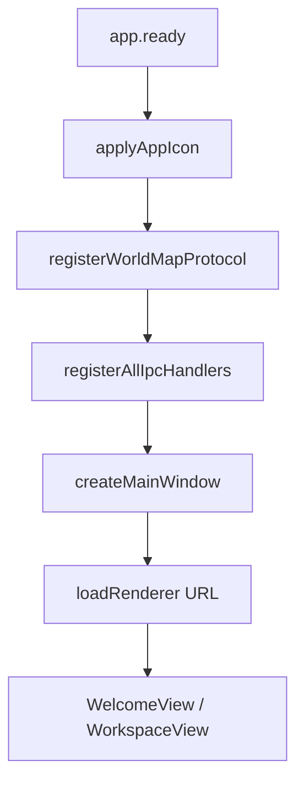

# M01 应用启动与壳层

## 职责

Electron 应用生命周期、主窗口、自定义协议、应用图标、IPC 注册。

## 流程：冷启动

## 关键文件

| 文件 | 说明 |
|------|------|
| `electron/main/index.ts` | 入口：IPC、协议、窗口 |
| `electron/main/window.ts` | BrowserWindow 配置 |
| `electron/main/app-icon.ts` | 解析 `resources/icon.ico/png` |
| `electron/main/protocols/world-map.protocol.ts` | `nc-map://` 本地地图 |
| `src/main.ts` | Vue 挂载 |
| `src/router/index.ts` | Hash 路由 |

## IPC 注册顺序

`config` → `project` → `project-files` → `ai` → `agent` → `dify` → `export` → `backup` → `world-gen`

## 数据流

- 无持久化写入；读取 `userData/config.json` 决定默认项目目录与主题。
