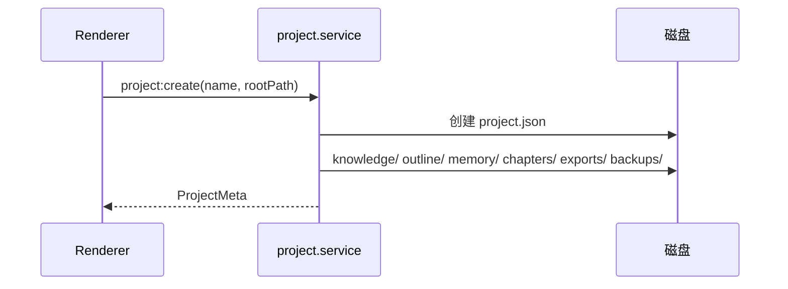

# M02 项目管理

## 职责

创建、打开、关闭、删除项目；脚手架目录；最近项目列表。

## 流程：新建项目



## 流程：打开项目

1. `project:pickOpen` 或最近列表 → `project:open(path)`
2. 校验 `project.json` → 载入 `ProjectMeta`
3. Renderer 跳转 `WorkspaceView`，并行加载 knowledge / outline / memory

## IPC

| 通道 | 说明 |
|------|------|
| `project:create` | 新建 |
| `project:open` / `close` / `delete` | 生命周期 |
| `project:getCurrent` | 当前项目 |
| `project:getRecent` | 最近列表 |
| `project:pickDirectory` / `pickOpen` | 系统对话框 |

## 磁盘结构

```
<Project>/
  project.json
  knowledge/
  outline/outline.json
  memory/plot-memory.json
  chapters/vol-XX/ch-XXX/
  exports/
  backups/
```

## 关键文件

- `electron/main/services/project.service.ts`
- `electron/main/ipc/project.ipc.ts`
- `src/stores/project.store.ts`
- `src/views/WelcomeView.vue`
