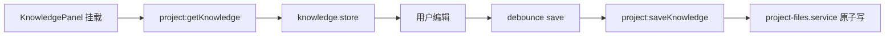

# M03 静态知识库

## 职责

世界观、角色、势力、物品、地点、地图元数据；支持 AI 生成合并与手动编辑。

## 流程：加载与自动保存

## 流程：AI 生成知识库

1. `GenerateKnowledgeDialog` 收集 brief
2. `ai:generateKnowledge` → M08/M09 工作流
3. `knowledge-generation.service` 合并结果 → `knowledge/*.json`
4. Renderer `knowledge-dify-merge.ts` 对齐字段

## 磁盘文件

| 路径 | 内容 |
|------|------|
| `knowledge/world.json` | 世界观设定 |
| `knowledge/characters.json` | 角色表 |
| `knowledge/factions.json` | 势力 |
| `knowledge/items.json` | 物品 |
| `knowledge/locations.json` | 地点 |
| `knowledge/map.json` | 地图网格与社会层索引 |

## 关键文件

- `electron/main/services/project-files.service.ts`
- `electron/main/services/knowledge-generation.service.ts`
- `src/stores/knowledge.store.ts`
- `src/components/knowledge/KnowledgePanel.vue`
- `src/utils/knowledge-dify-merge.ts`
