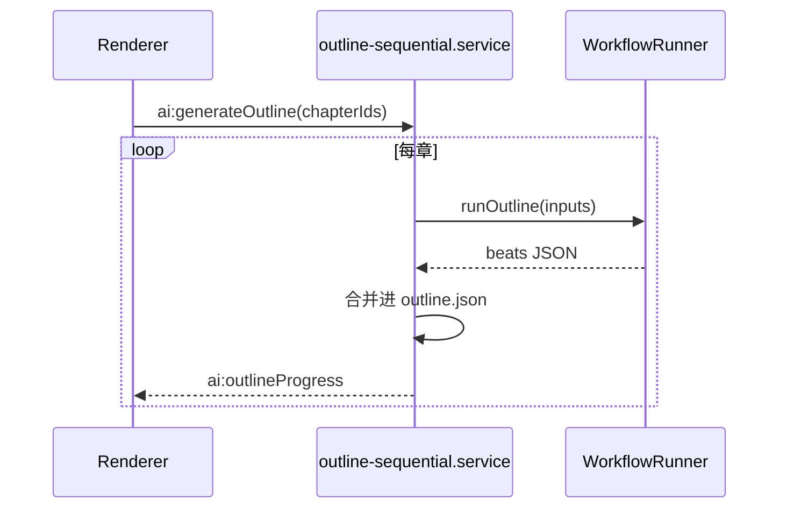

# M04 三级剧情大纲

## 职责

卷（Volume）→ 章（Chapter）→ 节拍（Beat）树形结构；章节状态（草稿/已生成）；大纲 AI 生成。

## 流程：树编辑

1. `outline.store` 持有 `OutlineDocument`
2. `OutlineTreePanel` 拖拽/增删改
3. `project:saveOutline` → `outline/outline.json`

## 流程：批量生成大纲

## 章节状态

- 工具：`electron/main/utils/outline-chapter-status.ts`
- 生成成功后标记 `generated`；熔断/失败保持可重试状态

## 关键文件

- `src/stores/outline.store.ts`
- `src/components/outline/OutlineTreePanel.vue`
- `electron/main/services/outline-sequential.service.ts`
- `electron/main/utils/outline-output-parse.ts`
- `src/utils/outline-preflight.ts`
