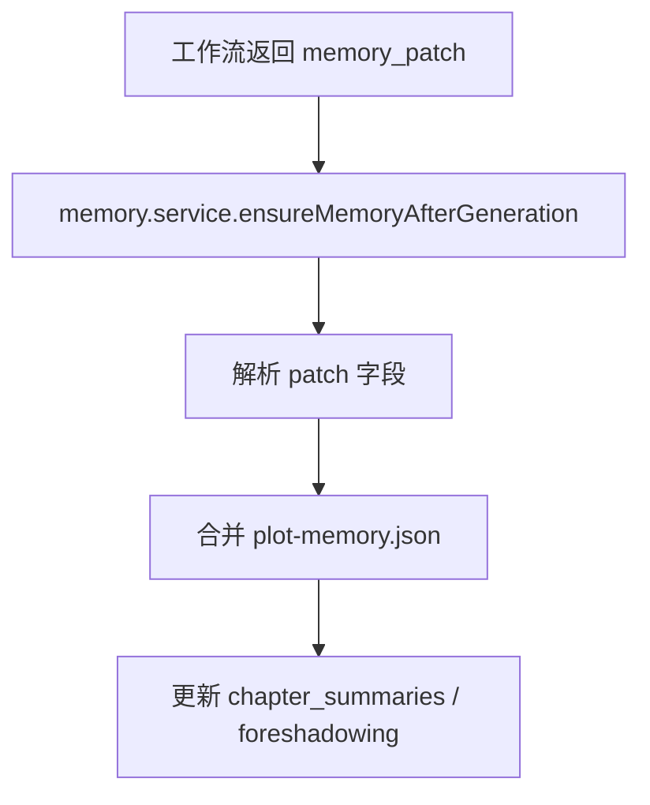

# M05 动态剧情记忆库

## 职责

跨章剧情记忆：章节摘要、伏笔、约束、已出场角色；接收 AI `memory_patch` 合并。

## 流程：章节生成后合并

## 流程：手动编辑

- `MemoryPanel` → `project:getPlotMemory` / `savePlotMemory`
- 原子写入 `memory/plot-memory.json`

## 辅助流程

| 功能 | IPC / 服务 |
|------|------------|
| 补全缺失摘要 | `project:backfillMissingSummaries` |
| 单章摘要回填 | `project:backfillChapterSummary` |
| 扫描出场角色 | `project:scanAppearedCharacters` |
| 晋升到知识库 | `project:promoteAppearedCharacters` |

## 关键文件

- `electron/main/services/memory.service.ts`
- `electron/main/utils/memory-patch-parse.ts`
- `electron/main/services/appeared-characters.service.ts`
- `src/stores/memory.store.ts`
- `src/components/memory/MemoryPanel.vue`
