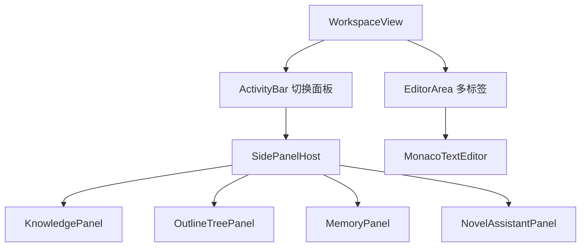

# M06 IDE 布局与多标签编辑

## 职责

类 IDEA 布局：活动栏、侧栏面板、底部状态栏、多标签 Monaco 编辑；布局持久化。

## 流程：打开工作区

## 布局持久化

- `config:setLayout` → `userData/config.json` 的 `workspaceLayout`
- 每项目可记侧栏宽度、打开的面板 ID

## Monaco 集成

| 文件 | 说明 |
|------|------|
| `src/monaco/setup.ts` | Worker、语言注册 |
| `src/monaco/editor.ts` | 编辑器实例工厂 |
| `src/monaco/theme.ts` | Darcula / 浅色主题 |

## 关键文件

- `src/views/WorkspaceView.vue`
- `src/stores/layout.store.ts`
- `src/stores/editor.store.ts`
- `src/stores/ui.store.ts`
- `src/components/workspace/ActivityBar.vue`
- `src/components/workspace/SidePanelHost.vue`
