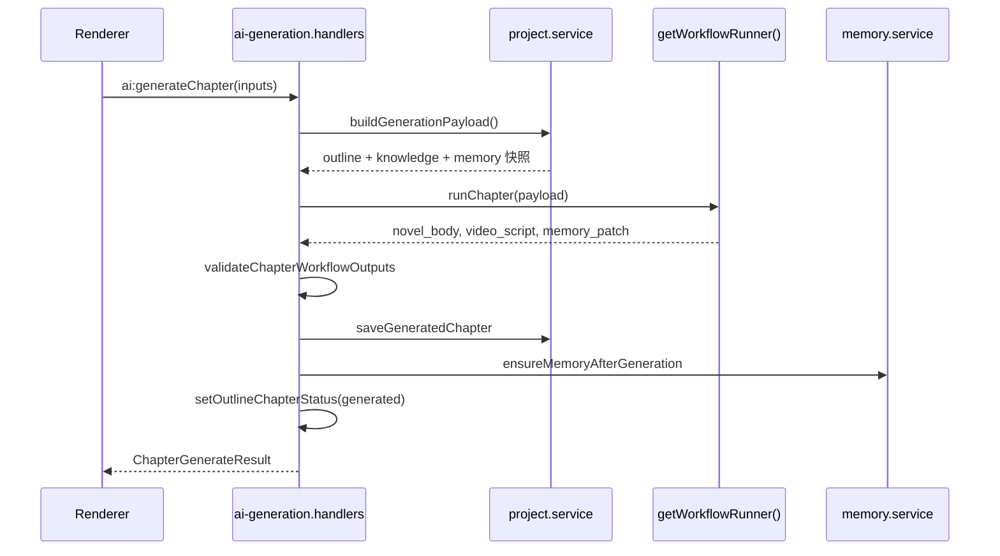

# M08 AI 生成编排（客户端）

## 职责

统一入口调用工作流；组装生成 payload；结果校验、落盘、记忆合并、大纲状态更新、可选自动备份。

## 流程：章节生成（主链路）



## IPC 入口

| 通道 | 处理器 |
|------|--------|
| `ai:generateChapter` | `ai-generation.handlers.ts` |
| `ai:generateOutline` | `outline-sequential.service.ts` |
| `ai:generateKnowledge` | `knowledge-generation.service.ts` |
| `dify:*` | Legacy 别名，同一实现 |

## 引擎选择

```typescript
// workflow-runner.factory.ts
config.ai.engine === 'local' ? localWorkflowRunner : difyWorkflowRunner
```

## 生成后副作用

1. 写入章节文件（M07）
2. 合并 plot-memory（M05）
3. 更新大纲章节状态（M04）
4. `appeared-characters.service` 扫描新角色名
5. 可选 `backup.service` 自动 ZIP

## 关键文件

- `electron/main/ipc/ai.ipc.ts`
- `electron/main/ipc/ai-generation.handlers.ts`
- `electron/main/services/project.service.ts`
- `src/components/generate/GenerateChapterDialog.vue`
- `src/components/console/GenerationConsole.vue`
- `src/utils/chapter-preflight.ts`
