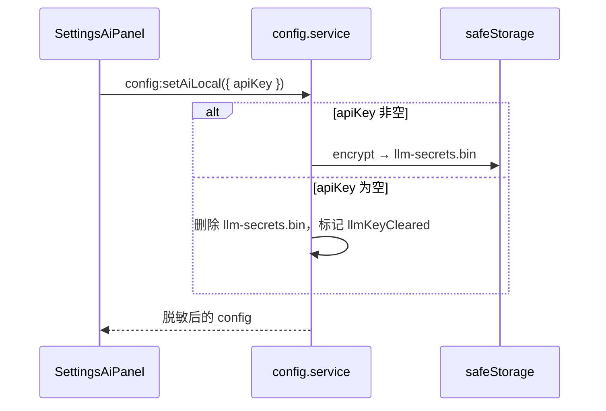

# M12 配置与安全

## 职责

全局配置、AI 引擎切换、LLM/Dify 密钥、布局与外观；密钥永不暴露给 Renderer 明文。

## 配置存储

| 文件 | 内容 |
|------|------|
| `%APPDATA%/novels-creator/config.json` | 公开配置（无密钥） |
| `dify-secrets.bin` | Dify Workflow Key（加密） |
| `llm-secrets.bin` | 内置 LLM Key（加密） |

## 流程：保存 LLM Key

## IPC

| 通道 | 说明 |
|------|------|
| `config:get` | 读取（密钥占位） |
| `config:setAiEngine` | `local` / `dify` |
| `config:setAiLocal` | LLM 提供商字段 + Key |
| `config:setDify` | 各工作流 Dify Key |
| `config:setAiAssistant` | 助手专用模型 |
| `config:testAssistantLlm` / `testDify` | 连通性 |
| `config:setLayout` / `setAppearance` | UI 偏好 |

## 关键文件

- `electron/main/services/config.service.ts`
- `electron/main/services/llm-health.service.ts`
- `electron/main/ipc/config.ipc.ts`
- `src/stores/config.store.ts`
- `src/components/settings/SettingsAiPanel.vue`
- `src/constants/llm-providers.ts`
