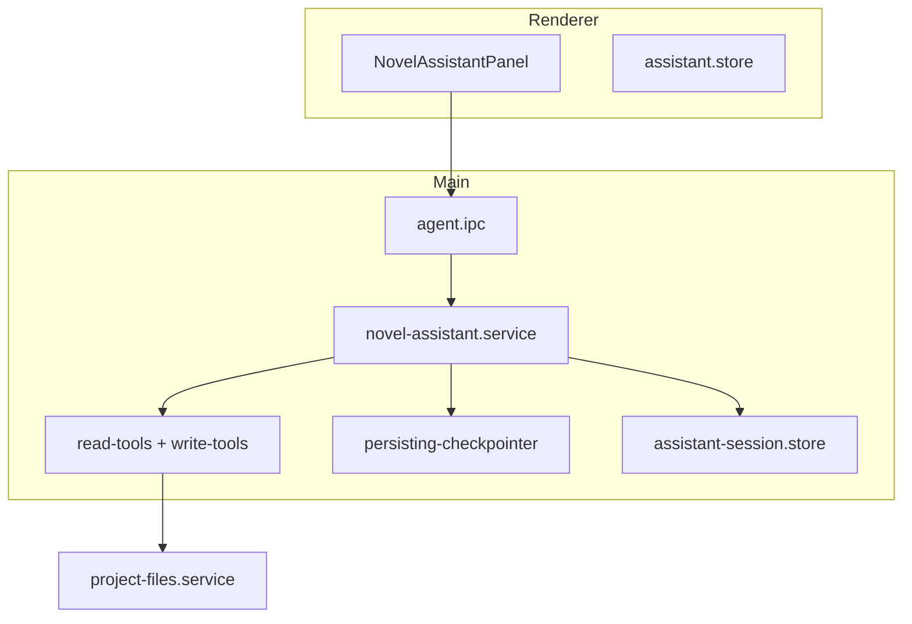

# M13 小说助手（Deep Agents）

## 职责

对话式创作助手：读项目上下文、改大纲/知识/记忆/章节、触发工作流生成；流式输出；HITL 工具审批；会话跨重启持久化。

## 架构



## 流程：流式对话

1. `agent:chatStream({ message, threadId })`
2. `novel-assistant.service` → `createDeepAgent` Harness
3. LLM 流式 token → `agent:streamEvent` 推送 Renderer
4. 每轮结束 `recordAssistantChatTurn` → `transcript.json`
5. LangGraph checkpoint → `checkpoints/{threadId}.json`

## 流程：HITL（人机协同）

生成类 Tool（`generate_chapter` 等）会 **interrupt** 等待用户确认：

1. `agent:getPendingApproval` 查询待审批
2. 用户批准/拒绝 → `agent:resumeStream`
3. 继续执行 Tool → 落盘 → `agent:projectMutated`

## Tool 清单（摘要）

| Tool | 类型 | 说明 |
|------|------|------|
| `get_project_summary` | 读 | 项目元信息 |
| `get_knowledge_snapshot` | 读 | 知识库摘要 |
| `load_project_context` | 读 | 大纲+记忆+章节列表 |
| `get_worldview` / `list_characters` … | 读 | 细分读取 |
| `update_outline` / `update_knowledge` … | 写 | 结构化写入 |
| `generate_chapter` / `generate_outline` … | 写+WF | 调 WorkflowRunner，需 HITL |

定义：`electron/main/agent/tools/read-tools.ts`、`write-tools.ts`、`index.ts`

## 会话持久化路径

```
%APPDATA%/novels-creator/assistant-sessions/
  {projectId}/transcript.json
  checkpoints/{threadId}.json
```

- 加载：`agent:loadSession`（Workspace 挂载时）
- 清空：面板「清空」→ `agent:clearThread` + 删 transcript

## IPC

| 通道 | 说明 |
|------|------|
| `agent:chat` / `chatStream` | 对话 |
| `agent:resume` / `resumeStream` | HITL 恢复 |
| `agent:loadSession` / `saveSession` | 会话 IO |
| `agent:clearThread` | 清空会话 |
| `agent:listSuggestedActions` | 建议操作 |
| `agent:streamEvent`（push） | 流式事件 |
| `agent:projectMutated`（push） | 刷新 UI |

## 关键文件

- `electron/main/agent/novel-assistant.service.ts`
- `electron/main/agent/persisting-checkpointer.ts`
- `electron/main/agent/assistant-session.store.ts`
- `electron/main/agent/prompts/assistant-system.md`
- `electron/main/ipc/agent.ipc.ts`
- `src/stores/assistant.store.ts`
- `src/components/agent/NovelAssistantPanel.vue`

## 延伸阅读

- [../../v1.0/06-NOVEL-ASSISTANT-AGENT.md](../../v1.0/06-NOVEL-ASSISTANT-AGENT.md)
