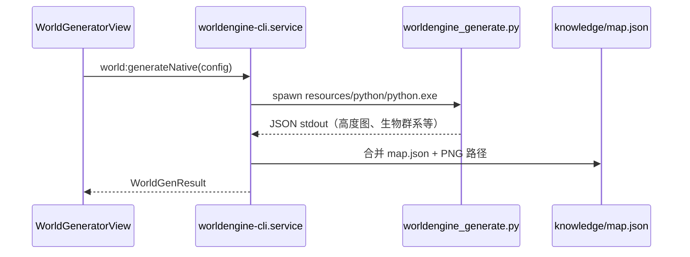
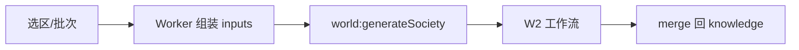

# M14 世界地图与社会层生成

## 职责

WorldEngine 原生地图生成；社会层（地点文化/政治 batch）AI 工作流；地图编辑与 `nc-map://` 展示。

## 子系统 A：原生地图（WorldEngine）

**打包 Python：** `resources/python/` + `resources/scripts/worldengine_generate.py`

**引擎检测：** `world:checkEngine` → 验证 bundle 可 `--check`

## 子系统 B：社会层 AI（W2）

1. 按领土/批次切分 hex → `world-society.worker.ts`（Renderer Worker）
2. `world:generateSociety` → `world-society.service.ts`
3. `getWorkflowRunner().runSociety()`（Local 或 Dify）
4. 解析 END 输出 → 合并进 `locations.json` / `map.json` society 层
5. `world-dify-parse.ts`、`knowledge-dify-merge` 对齐坐标与 ID

## 地图展示

- Three.js 六边形：`src/utils/world-hex-grid.ts`
- 贴图协议：`nc-map://` → `world-map.protocol.ts`
- 视图：`src/views/WorldGeneratorView.vue`

## IPC

| 通道 | 说明 |
|------|------|
| `world:checkEngine` | Python bundle 自检 |
| `world:generateNative` | WorldEngine 生成 |
| `world:readMapFile` | 读地图资源 |
| `world:generateSociety` | 社会层 batch 生成 |

## 关键文件

| 领域 | 文件 |
|------|------|
| CLI | `scripts/worldengine_generate.py` |
| Main | `electron/main/services/worldengine-cli.service.ts` |
| Main | `electron/main/services/world-society.service.ts` |
| Main | `electron/main/services/society-workflow-inputs.ts` |
| Renderer | `src/views/WorldGeneratorView.vue` |
| Renderer | `src/workers/world-society.worker.ts` |
| 契约 | `dify/world/`、`docs/world/` |

## 延伸阅读

- [../../world/WORLDENGINE.md](../../world/WORLDENGINE.md)
- [../../world/w2-society/BATCH-FLOW.md](../../world/w2-society/BATCH-FLOW.md)
