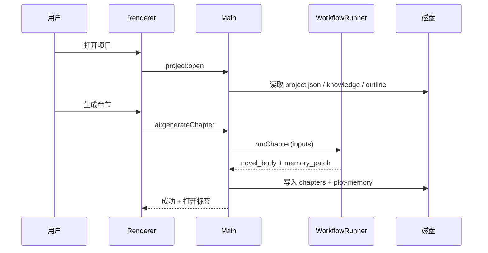

# 模块流程文档索引

每个模块文档包含：**职责**、**触发条件**、**流程图**、**IPC/服务**、**磁盘读写**、**关键源码**。

| 模块 | 文档 | 一句话 |
|------|------|--------|
| M01 应用壳层 | [M01-app-shell.md](./M01-app-shell.md) | Electron 启动、窗口、协议、图标 |
| M02 项目管理 | [M02-project.md](./M02-project.md) | 新建/打开/关闭项目与目录脚手架 |
| M03 静态知识库 | [M03-knowledge.md](./M03-knowledge.md) | 世界观、角色、势力、物品、地点 |
| M04 三级大纲 | [M04-outline.md](./M04-outline.md) | 卷→章→节拍树编辑与状态 |
| M05 剧情记忆 | [M05-memory.md](./M05-memory.md) | 章节摘要、伏笔、出场角色 patch |
| M06 IDE 布局 | [M06-ide-layout.md](./M06-ide-layout.md) | 活动栏、侧栏、多标签 Monaco |
| M07 章节内容 | [M07-chapter.md](./M07-chapter.md) | 正文/脚本预览、meta、向导 |
| M08 AI 编排 | [M08-ai-orchestration.md](./M08-ai-orchestration.md) | 生成请求、落盘、后处理 |
| M09 工作流引擎 | [M09-workflow-engine.md](./M09-workflow-engine.md) | Local LangGraph 与 Dify Legacy |
| M10 导出 | [M10-export.md](./M10-export.md) | 单章/全本 txt/md |
| M11 备份恢复 | [M11-backup.md](./M11-backup.md) | ZIP 手动/自动备份 |
| M12 配置安全 | [M12-config.md](./M12-config.md) | API Key、引擎切换、布局 |
| M13 小说助手 | [M13-novel-assistant.md](./M13-novel-assistant.md) | Deep Agents、Tool、HITL |
| M14 世界生成 | [M14-world-generation.md](./M14-world-generation.md) | WorldEngine 地图 + 社会层 AI |

## 跨模块主链路

更细的 v0.x 时序与伪代码见 [../../MODULES.md](../../MODULES.md)。
