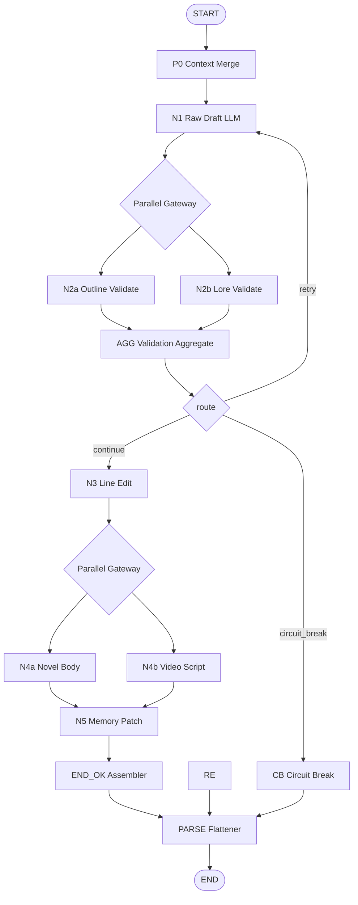
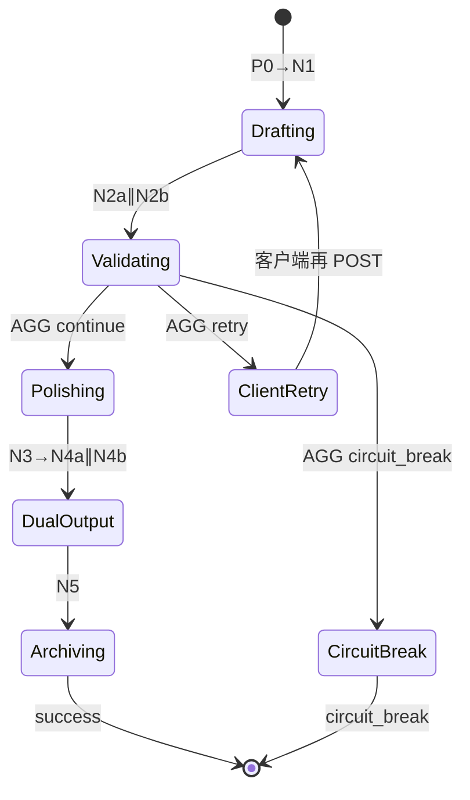

# Dify 工作流 — 设计文档（MCP 协议对齐）

> 工作流 ID：**`novel-chapter-generation-v1.1`**  
> MCP Tool：**`novels_chapter_generate`**  
> Schema 方言：**JSON Schema 2020-12**（[MCP Specification](https://modelcontextprotocol.io/specification/2025-11-25/basic) 默认）  
> 关联：[PROMPT-DESIGN.md](./PROMPT-DESIGN.md) · [GENERATION-WIZARD.md](./GENERATION-WIZARD.md) · [DIFY-WORKFLOW-IMPLEMENTATION.md](./DIFY-WORKFLOW-IMPLEMENTATION.md) · [DIFY-WORKFLOWS-INDEX.md](../DIFY-WORKFLOWS-INDEX.md)

---

## 目录

1. [设计目标与边界](#1-设计目标与边界)
2. [MCP 协议映射](#2-mcp-协议映射)
3. [工作流拓扑](#3-工作流拓扑)
4. [节点规格书](#4-节点规格书)
5. [变量与状态机](#5-变量与状态机)
6. [输入输出契约](#6-输入输出契约)
7. [错误与熔断模型](#7-错误与熔断模型)
8. [与客户端 / MCP 消费者关系](#8-与客户端--mcp-消费者关系)
9. [非功能需求](#9-非功能需求)
10. [版本演进](#10-版本演进)

---

## 1. 设计目标与边界

### 1.1 目标

| 目标 | 说明 |
|------|------|
| **多模型编排外置** | 初稿/校验/润色/双分支/记忆 全在 Dify 内完成，客户端不调度 LLM |
| **MCP 可发现** | 通过 `tools/list`、`resources/list` 暴露能力，Schema 可机器校验 |
| **结构化 IO** | 输入/输出符合 JSON Schema 2020-12；LLM 节点 JSON 输出可解析 |
| **长篇稳定** | 并行校验 + 有限重试 + 熔断人工介入 |
| **双产物** | 单次调用产出 `novel_body` + `video_script` + `memory_patch` |

### 1.2 边界（工作流不负责）

- 项目文件读写（Electron Main）
- 三要素向导 UI 与 `generation_prompt` 组装（客户端）
- AI 视频实际渲染（仅输出脚本文本）
- 用户账号 / 计费

### 1.3 部署形态

```
┌─────────────────┐     HTTP POST          ┌──────────────────┐
│ NovelsCreator   │ ─────────────────────► │ Dify Workflow    │
│ Electron Client │   /workflows/run       │ v1.1             │
└─────────────────┘                        └──────────────────┘
        │                                           │
        │ 可选                                      │ LLM Providers
        ▼                                           ▼
┌─────────────────┐                        OpenAI / Claude / DeepSeek …
│ MCP Server      │ ─── 同源 HTTP 代理 ───► Dify
│ (Cursor/CLI)    │
└─────────────────┘
```

---

## 2. MCP 协议映射

### 2.1 MCP 能力矩阵

| MCP 原语 | NovelsCreator 映射 | 资产路径 |
|----------|---------------------|----------|
| **Tool** | `novels_chapter_generate` | [`dify/chapter/mcp/tools/novel_chapter_generate.json`](../../dify/chapter/mcp/tools/novel_chapter_generate.json) |
| **Tool** | `novels_dify_health_check` | [`dify/shared/mcp/tools/novels_dify_health_check.json`](../../dify/shared/mcp/tools/novels_dify_health_check.json) |
| **Resource** | Workflow Manifest | `novelscreator://dify/workflow/v1.1/manifest` |
| **Resource** | Input Schema | `novelscreator://dify/schemas/novel-chapter-generate.input/v1.1` |
| **Resource** | Output Schema | `novelscreator://dify/schemas/novel-chapter-generate.output/v1.1` |
| **Resource** | Prompt Templates | `novelscreator://dify/chapter/prompts/{node_id}` |

> Resource URI 采用自定义 scheme `novelscreator://`，由 MCP Server 或客户端 Resource Handler 解析到仓库内文件。参见 [IMPLEMENTATION §6](./DIFY-WORKFLOW-IMPLEMENTATION.md#6-mcp-server-桥接可选)。

### 2.2 Tool：`novels_chapter_generate`

**tools/list 条目（符合 MCP Tools 规范）**

| 字段 | 值 |
|------|-----|
| `name` | `novels_chapter_generate` |
| `title` | 生成长篇小说章节 |
| `inputSchema.type` | `object`（2020-12） |
| `outputSchema` | 见 output schema 文件 |
| `annotations.openWorldHint` | `true`（调用外部 LLM） |

**tools/call 语义**

```json
{
  "jsonrpc": "2.0",
  "method": "tools/call",
  "params": {
    "name": "novels_chapter_generate",
    "arguments": {
      "project_id": "550e8400-e29b-41d4-a716-446655440000",
      "chapter_id": "ch-001",
      "chapter_title": "第一章",
      "outline_beats": "[{\"order\":1,\"text\":\"…\"}]",
      "knowledge_snapshot": "{…}",
      "plot_memory": "{…}",
      "video_platform_template": "generic-v1",
      "max_retry": 3,
      "generation_prompt": "",
      "generation_prompt_text": "…"
    }
  }
}
```

**tools/call 成功响应（structuredContent）**

MCP 2020-12 允许 `structuredContent` 为任意符合 `outputSchema` 的 JSON：

```json
{
  "content": [
    {
      "type": "text",
      "text": "章节生成成功，retry_count=1"
    }
  ],
  "structuredContent": {
    "status": "success",
    "circuit_break": false,
    "retry_count": 1,
    "novel_body": "…",
    "video_script": "…",
    "memory_patch": { "…": "…" },
    "validation_report": { "outline_valid": true, "lore_valid": true, "issues": [] },
    "workflow_version": "novel-chapter-generation-v1.1"
  },
  "isError": false
}
```

**tools/call 熔断响应（非 transport 错误，isError=false）**

```json
{
  "structuredContent": {
    "status": "circuit_break",
    "circuit_break": true,
    "human_action_required": true,
    "retry_count": 3,
    "draft_text": "…",
    "validation_report": { "issues": ["…"] }
  },
  "isError": false
}
```

> **设计决策**：`circuit_break` 是业务态失败，不是 MCP 协议错误；仅 HTTP/JSON-RPC 层异常时 `isError: true`。

### 2.3 Resource 清单

完整列表见 [`dify/chapter/mcp/resources/manifest.json`](../../dify/chapter/mcp/resources/manifest.json)。

**resources/read 示例**

| URI | 本地文件 |
|-----|----------|
| `novelscreator://dify/workflow/v1.1/manifest` | `dify/chapter/mcp/resources/workflow-v1.1-manifest.json` |
| `novelscreator://dify/schemas/novel-chapter-generate.input/v1.1` | `dify/chapter/mcp/schemas/novel-chapter-generate.input.schema.json` |
| `novelscreator://dify/chapter/prompts/n1-draft` | `dify/chapter/prompts/n1-draft.md` |

### 2.4 JSON Schema 2020-12 合规要点

| 要求 | 实现 |
|------|------|
| 默认方言 2020-12 | Schema 文件含 `"$schema": "https://json-schema.org/draft/2020-12/schema"` |
| `inputSchema` 必须为 object | Tool arguments 包装为 object |
| 无参 Tool | `additionalProperties: false` 空 object（health check 除外） |
| 输出验证 | MCP Server 可选校验 `structuredContent` against `outputSchema` |

---

## 3. 工作流拓扑

### 3.1 流程图



### 3.2 阶段对照（出版流程）

| Stage | 节点 | 类型 | 产出 |
|-------|------|------|------|
| 0 | P0 | Code | merged_context, effective_beats |
| 1 | N1 | LLM | draft_text |
| 2a | N2a | LLM | outline_result (JSON) |
| 2b | N2b | LLM | lore_result (JSON) |
| 2∑ | AGG | Code | route, retry_count, retry_issues |
| — | CB | Code | circuit_break end_outputs |
| 3 | N3 | LLM | polished_text |
| 4a | N4a | LLM | novel_body |
| 4b | N4b | LLM | video_script |
| 5 | N5 | LLM | memory_patch (JSON) |
| ✓ | END_OK | Code | success end_outputs |
| ✓ | **PARSE** | Code | 扁平 outputs 字段 |

### 3.3 Dify 画布布局建议

| 区域 | 节点 |
|------|------|
| 左列 | START → P0 → N1 |
| 中上 | N2a, N2b 并行 |
| 中下 | AGG → IF/ELSE 三向 |
| 右列 | N3 → N4a/N4b → N5 → END_OK |
| 下支 | CB → END |

---

## 4. 节点规格书

### 4.1 START — 工作流输入

Dify **Start** 节点定义以下输入变量（与 MCP Tool arguments 1:1）：

| 变量 | 类型 | 必填 |
|------|------|------|
| project_id | text | ✓ |
| chapter_id | text | ✓ |
| chapter_title | text | ✓ |
| outline_beats | text | ✓ |
| knowledge_snapshot | text | ✓ |
| plot_memory | text | ✓ |
| previous_chapter_summary | text | |
| video_platform_template | text | ✓ |
| max_retry | number | ✓ |
| generation_prompt | text | |
| generation_prompt_text | text | |

### 4.2 P0 — Context Merge（Code）

| 项 | 内容 |
|----|------|
| 实现 | [`dify/chapter/code/p0_context_merge.py`](../../dify/chapter/code/p0_context_merge.py) |
| 输入 | generation_prompt, knowledge_snapshot, outline_beats |
| 输出 | merged_context, effective_beats, has_wizard, chapter_goal |
| 职责 | 向导优先合并；beats 选取；角色关系网补全 |

### 4.3 N1 — Raw Draft（LLM）

| 项 | 内容 |
|----|------|
| Prompt | [`dify/chapter/prompts/n1-draft.md`](../../dify/chapter/prompts/n1-draft.md) v2.0 |
| 输入 | generation_prompt_text, knowledge_snapshot, plot_memory, previous_chapter_summary, retry_issues_formatted, retry_count |
| 输出 | draft_text（纯文本） |
| 模型建议 | 强创作 · temperature 0.85 |
| 结构化输出 | 关闭（自由文本） |

### 4.4 N2a — Outline Validate（LLM）

| 项 | 内容 |
|----|------|
| Prompt | [`dify/chapter/prompts/n2a-outline-validate.md`](../../dify/chapter/prompts/n2a-outline-validate.md) |
| 输入 | draft_text, effective_beats, chapter_goal |
| 输出 | outline_result（JSON 字符串） |
| 模型建议 | 强推理 · temperature 0.2 |
| Dify 配置 | **JSON Schema / Structured Output** 推荐开启 |

**输出 Schema 核心字段**：`outline_valid`, `outline_issues[]`, `beat_coverage[]`, `sequence_integrity`, `goal_drift_detected`

### 4.5 N2b — Lore Validate（LLM）

| 项 | 内容 |
|----|------|
| Prompt | [`dify/chapter/prompts/n2b-lore-validate.md`](../../dify/chapter/prompts/n2b-lore-validate.md) |
| 输入 | draft_text, merged_context, has_wizard, plot_memory |
| 输出 | lore_result（JSON 字符串） |

**输出 Schema 核心字段**：`lore_valid`, `lore_issues[]`, `character_checks[]`, `world_rules_violations[]`

### 4.6 AGG — Validation Aggregate（Code）

| 项 | 内容 |
|----|------|
| 实现 | [`dify/chapter/code/agg_validation.py`](../../dify/chapter/code/agg_validation.py) |
| 输入 | outline_result, lore_result, retry_count, max_retry, draft_text |
| 输出 | route, retry_count, retry_issues, retry_issues_formatted, merged_issues_for_polish, outline_valid, lore_valid |

**route 枚举**

| 值 | 条件 |
|----|------|
| `continue` | outline_valid ∧ lore_valid |
| `retry` | ¬(outline_valid ∧ lore_valid) ∧ retry_count < max_retry |
| `circuit_break` | ¬(outline_valid ∧ lore_valid) ∧ retry_count ≥ max_retry |

### 4.7 IF/ELSE — 路由（方案 B）

Dify **条件分支** 绑定 **AGG.route**（运算符 **等于**）：

| 条件 | 目标 |
|------|------|
| `route == "retry"` | **RE** → END（**禁止**回 N1） |
| `route == "circuit_break"` | CB |
| `route == "continue"` | N3 |

> **Dify 限制**：无法把边连回已执行的 N1。重试由客户端 / MCP 多次 `POST`，将 `retry_count` 与 `retry_issues_formatted` 写入 **Start inputs**。

### 4.8 N3 — Line Edit（LLM）

Prompt 见 `n3-polish.md`；输入 draft_text + merged_issues_for_polish；输出 polished_text。

### 4.9 N4a / N4b — 并行双分支

| 节点 | 模板 | 条件 |
|------|------|------|
| N4a | n4a-novel-body.md | 无条件 |
| N4b | n4b-video-generic-v1.md 或 n4b-video-platform-x-v1.md | `video_platform_template` 分支 |

Dify **IF/ELSE** 或 **问题分类器** 在 N4b 前选择 Prompt 模板。

### 4.10 N5 — Memory Patch（LLM）

Prompt 见 `n5-memory-patch.md`；输入 novel_body + plot_memory + chapter_id/title；JSON 输出 memory_patch。

### 4.11 CB / END_OK — 输出组装（Code）

| 节点 | 文件 | 输出变量 |
|------|------|----------|
| CB | `cb_circuit_break.py` | end_outputs (JSON string) |
| END_OK | `end_success.py` | end_outputs (JSON string) |
| RE | `retry_end.py` | end_outputs (JSON string) |

### 4.12 PARSE — 扁平化（Code）

| 节点 | 文件 | 输入 | 输出 |
|------|------|------|------|
| PARSE | `parse_end_outputs.py` | re_end_outputs / cb_end_outputs / ok_end_outputs | status, circuit_break, … |

**连线**：RE / CB / END_OK → **PARSE** → END

### 4.13 END — 工作流输出

Dify **结束 / 输出** 节点：11 个字段均绑定 **PARSE**（见 IMPLEMENTATION §4.3.3）。

**必须暴露给 MCP/客户端的 outputs 字段** 见 [§6.2](#62-输出-schema-mcp-structuredcontent)。

---

## 5. 变量与状态机

### 5.1 重试状态（Start inputs · 方案 B）

| 变量名 | 初值 | 更新方 | 说明 |
|--------|------|--------|------|
| `retry_count` | 0 | 客户端 | 收到 `status=retry` 后设为 `outputs.retry_count` |
| `retry_issues_formatted` | `""` | 客户端 | 下轮 POST 回传，供 N1 注入 |

单次 run 内：`draft_text` 由 N1.text 向下游传递；`route` 仅 AGG→IF 使用，无需持久化。

### 5.2 状态机



---

## 6. 输入输出契约

### 6.1 输入 Schema

文件：[`dify/chapter/mcp/schemas/novel-chapter-generate.input.schema.json`](../../dify/chapter/mcp/schemas/novel-chapter-generate.input.schema.json)

### 6.2 输出 Schema（MCP structuredContent）

文件：[`dify/chapter/mcp/schemas/novel-chapter-generate.output.schema.json`](../../dify/chapter/mcp/schemas/novel-chapter-generate.output.schema.json)

**success 必填字段**

```
status, circuit_break, retry_count, novel_body, video_script, memory_patch, validation_report, workflow_version
```

**retry 必填字段**（单次 run 早退，客户端再 POST）

```
status, circuit_break, retry_count, retry_issues_formatted, validation_report, workflow_version
```

**circuit_break 必填字段**

```
status, circuit_break, human_action_required, retry_count, draft_text, validation_report
```

### 6.3 Dify HTTP 映射

| MCP 层 | Dify API 层 |
|--------|-------------|
| tools/call.arguments | POST body `inputs` |
| structuredContent | `data.outputs` 解析 end_outputs 或直接字段 |
| isError=true | HTTP 4xx/5xx 或 `data.status=failed` |
| workflow_run_id | `data.id`（可选写入 structuredContent） |

---

## 7. 错误与熔断模型

### 7.1 错误分层

| 层级 | 类型 | MCP isError | 客户端行为 |
|------|------|-------------|------------|
| L1 Transport | 网络/HTTP/超时 | true | 可重试，不落盘 |
| L2 Dify Platform | workflow failed | true | Toast + Console |
| L3 Business | circuit_break | false | Modal + 保留旧文件 |
| L4 Business | success | false | 落盘双文件 + memory |

### 7.2 熔断策略

```
max_retry 默认 3
每次 retry：全章重写 N1，retry_issues 注入 Prompt 顶部
达到上限：CB 输出 draft_text + issues，status=circuit_break
```

### 7.3 LLM JSON 解析失败（AGG 容错）

AGG Code 对 N2a/N2b 输出执行：
1. 剥离 ```json 围栏
2. JSON.parse
3. 失败时视为 valid=false，issue=`"校验节点 JSON 解析失败，需检查 Prompt/模型"`

---

## 8. 与客户端 / MCP 消费者关系

### 8.1 Electron 客户端（主路径）

```
GenerationWizard / useDifyWorkflow
  → 校验 input against input.schema.json (ajv)
  → POST /workflows/run (blocking)
  → 校验 outputs against output.schema.json
  → 分支 success | circuit_break
```

不经过 MCP JSON-RPC；但 **Schema 与 MCP Tool 共用**，保证契约一致。

### 8.2 MCP Server（可选）

供 Cursor / Claude Desktop 等调用同一 Dify 工作流。见 [IMPLEMENTATION §6](./DIFY-WORKFLOW-IMPLEMENTATION.md#6-mcp-server-桥接可选)。

### 8.3 契约单一来源（Single Source of Truth）

```
dify/chapter/mcp/schemas/*.schema.json  ← 权威 Schema
dify/chapter/mcp/tools/*.json           ← MCP tools/list 元数据 + 内联 Schema
docs/chapter/DIFY-WORKFLOW-DESIGN.md    ← 人类可读设计
dify/chapter/mcp/resources/*.json       ← Resource 索引
```

---

## 9. 非功能需求

| 指标 | 目标 |
|------|------|
| 单次 blocking 超时 | 客户端 600s；Dify 工作流 timeout ≥ 600s |
| 并发 | 每项目同时 1 个生成任务（客户端 mutex） |
| Token | 单节点 User Prompt ≤ 14k 汉字；memory 超长客户端摘要 |
| 可观测 | Dify run id 写入 chapter meta.json |
| 安全 | API Key 仅在客户端/MCP Server 环境变量，不进 inputs |

---

## 10. 版本演进

| 版本 | 变更 | MCP Tool |
|------|------|----------|
| v1.0 | 无 generation_prompt | 同名，input 少 2 字段 |
| **v1.1** | +generation_prompt/_text；N2 rubric v2 | **当前推荐** |
| v1.2（规划） | streaming partial draft | + `response_mode` enum |

**破坏性变更策略**：递增 workflow_id 后缀；MCP Tool 增加 `workflow_version` 参数或新 Tool 名。

---

*文档版本：v1.0 · 2026-06-01 · MCP JSON Schema 2020-12*
