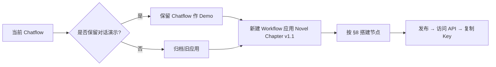
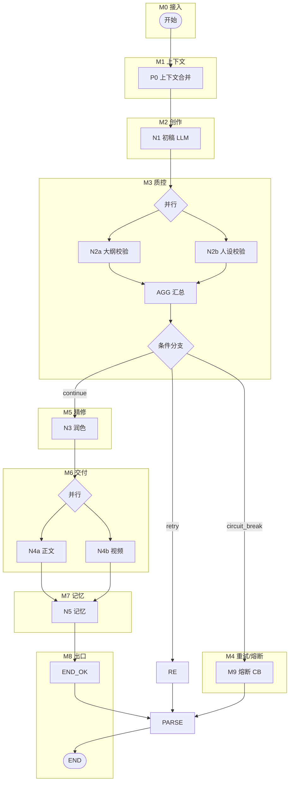
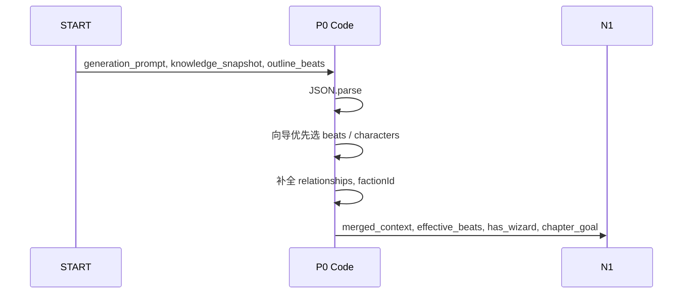
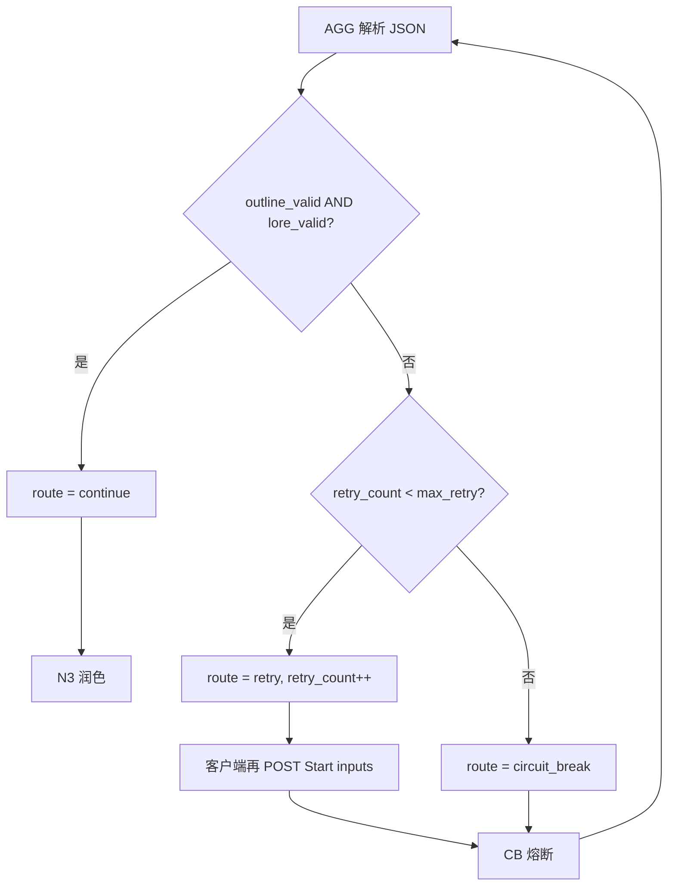
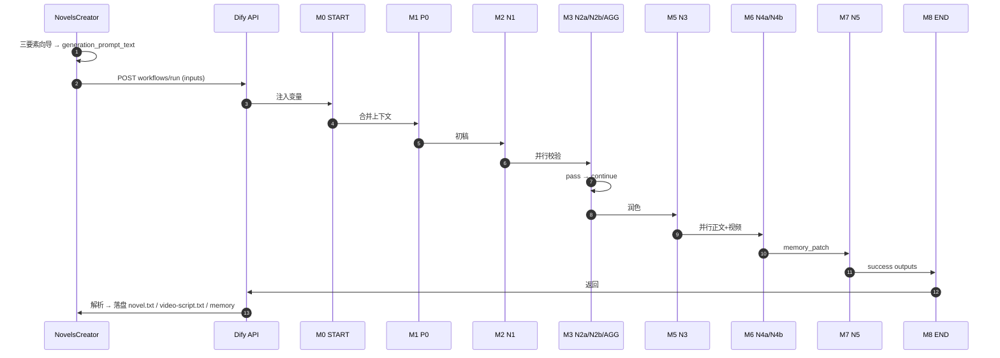
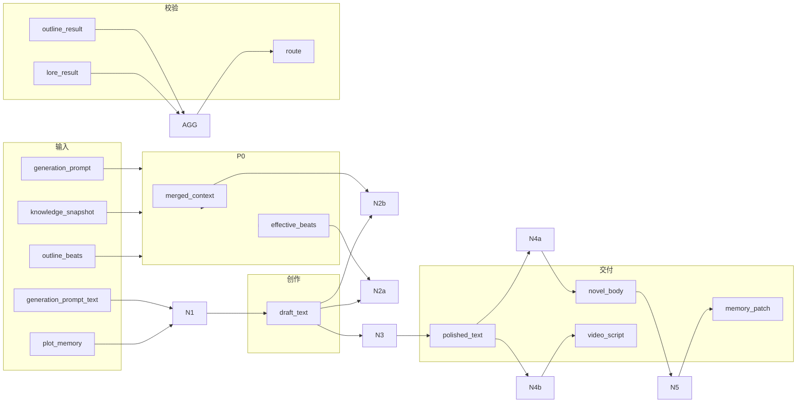

# NovelsCreator — Dify 工作流模块与流程设计（完整版）

> 面向 Dify 画布搭建的 **模块划分、数据流、流程实现、MCP 契约** 总文档。  
> 你当前的 Dify 项目为 **Chatflow（用户输入 → LLM → 直接回复）**，NovelsCreator 客户端需改为 **Workflow（工作流）** 应用，见 [§2](#2-应用类型与画布迁移)。  
> 关联：[DIFY-WORKFLOW-DESIGN.md](./DIFY-WORKFLOW-DESIGN.md) · [DIFY-WORKFLOW-IMPLEMENTATION.md](./DIFY-WORKFLOW-IMPLEMENTATION.md) · [PROMPT-DESIGN.md](./PROMPT-DESIGN.md)

---

## 目录

1. [文档说明与阅读路径](#1-文档说明与阅读路径)
2. [应用类型与画布迁移](#2-应用类型与画布迁移)
3. [工作流总览](#3-工作流总览)
4. [模块体系（12 模块）](#4-模块体系12-模块)
5. [模块详细设计](#5-模块详细设计)
6. [端到端流程设计](#6-端到端流程设计)
7. [数据流与变量字典](#7-数据流与变量字典)
8. [Dify 画布搭建顺序](#8-dify-画布搭建顺序)
9. [MCP 协议映射（模块级）](#9-mcp-协议映射模块级)
10. [与 NovelsCreator 客户端对接](#10-与-novelscreator-客户端对接)
11. [验收与测试流程](#11-验收与测试流程)

---

## 1. 文档说明与阅读路径

| 读者目标 | 阅读章节 |
|----------|----------|
| 理解「为什么要改画布」 | §2 |
| 在 Dify 里从零搭节点 | §4、§5、§8 |
| 理解一次生成的完整链路 | §6 |
| 对接 Electron / MCP | §7、§9、§10 |
| 联调验收 | §11 |

**工作流标识**

| 项 | 值 |
|----|-----|
| workflow_id | `novel-chapter-generation-v1.1` |
| MCP Tool | `novels_chapter_generate` |
| Prompt 版本 | v2.0 专业版 |
| Schema | JSON Schema 2020-12 |

---

## 2. 应用类型与画布迁移

### 2.1 当前画布（截图）vs 目标画布

你当前的 **NovelCreator** 项目结构：

```
用户输入 (query, files)  →  LLM  →  直接回复 ({{LLM.text}})
```

| 维度 | 当前 Chatflow | NovelsCreator 目标 Workflow |
|------|---------------|------------------------------|
| Dify 应用类型 | 对话型 / Chatflow | **工作流 Workflow** |
| 入口节点 | 用户输入 | **开始**（定义 inputs 变量） |
| 出口节点 | 直接回复 | **结束**（定义 outputs 字段） |
| 调用方式 | 对话 API / 聊天窗口 | **`POST /v1/workflows/run`** blocking |
| 输出 | 单段 `text` | `novel_body` + `video_script` + `memory_patch` + status |
| 编排能力 | 单 LLM | Code + 多 LLM + 并行 + 条件分支 + 重试环 |

> **重要**：请在 Dify 中 **新建「工作流」应用**（或把现有项目改为 Workflow 类型），不要继续在「用户输入→直接回复」链路上扩展。Chatflow 无法满足客户端结构化 outputs 与熔断重试。

### 2.2 迁移步骤（5 分钟决策）



1. Dify 工作室 → **创建应用** → 选择 **工作流（Workflow）**
2. 命名：`Novel Chapter Generation v1.1`
3. 删除思维：不再有「用户输入 / 直接回复」节点
4. 使用：**开始 / 结束 / 代码 / LLM / 条件分支 / 并行**

---

## 3. 工作流总览

### 3.1 逻辑架构（模块分层）

```
┌─────────────────────────────────────────────────────────────────┐
│  M0 接入层     START inputs ← HTTP / MCP tools/call              │
├─────────────────────────────────────────────────────────────────┤
│  M1 上下文层   P0 合并向导 + 知识库 + 节拍                        │
├─────────────────────────────────────────────────────────────────┤
│  M2 创作层     N1 章节初稿（Raw Draft）                           │
├─────────────────────────────────────────────────────────────────┤
│  M3 质控层     N2a 结构校验 ∥ N2b 设定校验 → AGG 汇总 → 路由      │
├─────────────────────────────────────────────────────────────────┤
│  M4 重试层     retry → RE/END → 客户端再 POST ； circuit_break → M9 │
├─────────────────────────────────────────────────────────────────┤
│  M5 精修层     N3 线稿润色（Line Edit）                           │
├─────────────────────────────────────────────────────────────────┤
│  M6 交付层     N4a 小说正文 ∥ N4b 视频脚本（并行）                │
├─────────────────────────────────────────────────────────────────┤
│  M7 记忆层     N5 剧情记忆 patch                                  │
├─────────────────────────────────────────────────────────────────┤
│  M8 出口层     END_OK / RE / CB → PARSE → END outputs              │
└─────────────────────────────────────────────────────────────────┘
```

### 3.2 画布拓扑（目标态）



---

## 4. 模块体系（12 模块）

| 模块 ID | 名称 | Dify 节点 | 类型 | 上游 | 下游 |
|---------|------|-----------|------|------|------|
| **M0** | 接入与输入校验 | START | 开始 | HTTP/MCP | M1 |
| **M1** | 上下文合并 | P0 | Code | M0 | M2 |
| **M2** | 章节初稿生成 | N1 | LLM | M1, **M0(retry inputs)** | M3 |
| **M3a** | 大纲结构校验 | N2a | LLM | M2 | M3∑ |
| **M3b** | 人设世界观校验 | N2b | LLM | M2 | M3∑ |
| **M3∑** | 校验汇总与路由 | AGG + IF | Code + 条件 | M3a,M3b | M4/M5/M9 |
| **M4** | 重试与熔断 | IF→**RE** / CB | 分支+Code | M3∑ | **M0(再 POST)** 或 M9 |
| **M5** | 文本润色 | N3 | LLM | M3∑(pass) | M6 |
| **M6a** | 标准小说正文 | N4a | LLM | M5 | M7 |
| **M6b** | AI 视频脚本 | N4b | LLM | M5 | M7 |
| **M7** | 剧情记忆归档 | N5 | LLM | M6a | M8 |
| **M8** | 成功出口组装 | END_OK | Code | M7 | PARSE |
| **M8∑** | 输出扁平化 | **PARSE** | Code | M8/M4/M9 | END |
| **M9** | 熔断出口组装 | CB | Code | M4 | PARSE |

---

## 5. 模块详细设计

### M0 — 接入与输入校验

**职责**：接收 NovelsCreator / MCP 传入的全部 inputs；无 LLM。

**Dify 节点**：工作流 **开始**

**输入变量**（与 MCP `inputSchema` 一致）

| 变量 | 类型 | 必填 | 来源 |
|------|------|------|------|
| project_id | 文本 | ✓ | 客户端 |
| chapter_id | 文本 | ✓ | 客户端 |
| chapter_title | 文本 | ✓ | 客户端 |
| outline_beats | 文本(JSON串) | ✓ | outline.json |
| knowledge_snapshot | 文本(JSON串) | ✓ | M03 知识库 |
| plot_memory | 文本(JSON串) | ✓ | M05 记忆库 |
| previous_chapter_summary | 文本 | | M05 |
| video_platform_template | 文本 | ✓ | project.settings |
| max_retry | 数字 | ✓ | 默认 3 |
| generation_prompt | 文本(JSON串) | | 三要素向导 |
| generation_prompt_text | 文本 | | 客户端渲染 |
| retry_count | 数字 | | 默认 0；客户端重试回传 |
| retry_issues_formatted | 文本 | | 默认空；N1 驳回注入 |

**流程 F-M0-01**

```
1. HTTP POST /workflows/run 携带 inputs
2. Dify 注入 START 变量
3. 进入 M1（不在 Dify 内做 Schema 校验；由客户端/MCP Server ajv 校验）
```

**异常**：客户端在调用前校验失败则不发起请求。

---

### M1 — 上下文合并（P0）

**职责**：合并向导与知识库；确定有效节拍 `effective_beats`；输出审读用 `merged_context`。

**Dify 节点**：**代码** · `P0 Context Merge`  
**源码**：[`dify/chapter/code/p0_context_merge.py`](../../dify/chapter/code/p0_context_merge.py)

**流程 F-M1-01**



**输出变量**

| 变量 | 消费者 |
|------|--------|
| merged_context | N2b |
| effective_beats | N2a |
| has_wizard | N2b Prompt 分支说明 |
| chapter_goal | N2a |

---

### M2 — 章节初稿生成（N1）

**职责**：依据三要素 Brief + 知识库 + 前情记忆撰写 **Raw Draft**。

**Dify 节点**：**LLM** · `N1 Raw Draft`  
**Prompt**：[`dify/chapter/prompts/n1-draft.md`](../../dify/chapter/prompts/n1-draft.md)

| 配置项 | 值 |
|--------|-----|
| 模型 | 强创作（GPT-4o / Claude Sonnet / DeepSeek-V3） |
| temperature | 0.85 |
| 结构化输出 | **关闭** |
| **Jinja** | **开启**（USER） |
| 记忆 | **关闭**（长篇用 plot_memory，不用对话记忆） |
| 视觉 | 关闭 |

**User Prompt 变量绑定**

| 模板占位 | Dify 变量 |
|----------|-----------|
| generation_prompt_text | `开始.generation_prompt_text`（空则用 Fallback 模板） |
| knowledge_snapshot | `开始.knowledge_snapshot` |
| plot_memory | `开始.plot_memory` |
| previous_chapter_summary | `开始.previous_chapter_summary` |
| retry_issues_formatted | **开始 → retry_issues_formatted** |
| retry_count | **开始 → retry_count** |

**流程 F-M2-01（首稿）**

```
1. 读取 M1 输出 + START 中 Brief
2. 无 retry_issues → 按 Stage-1 规范写全文
3. 输出 **N1.text** → 供 N2/N3/CB/RE 引用（无需工作流变量）
4. 进入 M3 并行校验
```

**流程 F-M2-02（重试稿）**

```
1. retry_count > 0
2. User Prompt 顶部注入「编辑驳回通知」+ issues 列表
3. 全章重写（非局部修补）
4. 更新 draft_text → 再进 M3
```

---

### M3a — 大纲结构校验（N2a）

**职责**：Developmental Edit — 节拍覆盖、顺序、跑题。

**Dify 节点**：**LLM** · `N2a Outline Validate`  
**Prompt**：[`dify/chapter/prompts/n2a-outline-validate.md`](../../dify/chapter/prompts/n2a-outline-validate.md)

| 配置项 | 值 |
|--------|-----|
| temperature | 0.2 |
| 结构化输出 | **开启**（JSON Schema） |
| **Jinja** | **开启**（USER） |

**输入**：`draft_text`, `effective_beats`, `chapter_goal`  
**输出**：`outline_result`（JSON 字符串）

**Hard Fail**：任一 beat `covered=false`；`sequence_integrity=false`；`goal_drift_detected=true`

---

### M3b — 人设世界观校验（N2b）

**职责**：Continuity / Lore Audit — 三观、说话方式、样貌、世界规则、未授权设定。

**Dify 节点**：**LLM** · `N2b Lore Validate`  
**Prompt**：[`dify/chapter/prompts/n2b-lore-validate.md`](../../dify/chapter/prompts/n2b-lore-validate.md)  
**Jinja**：**开启**（USER）

**输入**：`draft_text`, `merged_context`, `has_wizard`, `plot_memory`  
**输出**：`lore_result`（JSON 字符串）

---

### M3∑ — 校验汇总与路由（AGG + IF）

**职责**：解析 N2a/N2b JSON；合并 issues；决定 retry / continue / circuit_break。

**Dify 节点**：

1. **代码** · `AGG Validation Aggregate` — [`agg_validation.py`](../../dify/chapter/code/agg_validation.py)
2. **条件分支** · 绑定 `route`

**流程 F-M3-01**



**方案 B**：无 Dify 工作流变量更新。`route=retry` 时 **RE** 输出 `status=retry`，由客户端写入下轮 **Start inputs**。

---

### M4 — 重试与熔断（方案 B）

**职责**：单次 run 内路由；**不在画布回 M2**。

| route | 动作 | 下一模块 |
|-------|------|----------|
| retry | RE 输出 `status=retry` | **客户端再 POST → M0** |
| continue | 进入润色 | M5 |
| circuit_break | CB 组装 JSON | M9 → END |

**与旧画布对比**：旧 Chatflow 无此模块；单次 LLM 无法保证长篇一致性。

---

### M5 — 文本润色（N3）

**职责**：Line Edit — 提升文笔，**不改变情节事实**。

**Dify 节点**：**LLM** · `N3 Line Edit`  
**Prompt**：[`dify/chapter/prompts/n3-polish.md`](../../dify/chapter/prompts/n3-polish.md)

**输入**：`draft_text`（校验通过版）, `merged_issues_for_polish`  
**输出**：`polished_text`  
**temperature**：0.5

---

### M6a — 标准小说正文（N4a）

**职责**：Publication Format — 章标题、段落、对话标点规范。

**Dify 节点**：**LLM** · `N4a Novel Body`  
**Prompt**：[`dify/chapter/prompts/n4a-novel-body.md`](../../dify/chapter/prompts/n4a-novel-body.md)

**输入**：`polished_text`, `chapter_title`  
**输出**：`novel_body`

---

### M6b — AI 视频脚本（N4b）

**职责**：分镜脚本，供 AI 视频平台消费。

**Dify 节点**：**LLM** · `N4b Video Script`  
**Prompt 分支**：

| video_platform_template | 文件 |
|-------------------------|------|
| generic-v1 | n4b-video-generic-v1.md |
| platform-x-v1 | n4b-video-platform-x-v1.md |

**Dify 实现**：N4b 前加 **条件分支** 或两个 LLM 节点二选一。

**输入**：`polished_text`, `chapter_title`, `chapter_id`  
**输出**：`video_script`

**并行**：与 M6a 同时从 M5 出发，汇聚于 M7 之前。

---

### M7 — 剧情记忆归档（N5）

**职责**：从定稿正文提取 `memory_patch`，供下一章 continuity。

**Dify 节点**：**LLM** · `N5 Memory Patch`  
**Prompt**：[`dify/chapter/prompts/n5-memory-patch.md`](../../dify/chapter/prompts/n5-memory-patch.md)

**输入**：`novel_body`（来自 N4a）, `plot_memory`, `chapter_id`, `chapter_title`  
**输出**：`memory_patch`（JSON）  
**结构化输出**：**开启**

---

### M8 — 成功出口组装（END_OK）

**职责**：合并为 MCP/客户端统一的 `structuredContent`。

**Dify 节点**：**代码** · `END_OK` — [`end_success.py`](../../dify/chapter/code/end_success.py)

**输出 end_outputs 字段**

```json
{
  "status": "success",
  "circuit_break": false,
  "human_action_required": false,
  "retry_count": 1,
  "novel_body": "...",
  "video_script": "...",
  "memory_patch": { },
  "validation_report": { "outline_valid": true, "lore_valid": true, "issues": [] },
  "workflow_version": "novel-chapter-generation-v1.1"
}
```

**Dify 结束 / 输出节点**：11 个字段均绑定 **PARSE**（见 IMPLEMENTATION §4.3.3）。`memory_patch` / `validation_report` 为 JSON 字符串。

### M8∑ — 输出扁平化（PARSE）

**职责**：将 `end_outputs` JSON 串拆为 API 可读的扁平 outputs。

**Dify 节点**：**代码** · `PARSE` — [`parse_end_outputs.py`](../../dify/chapter/code/parse_end_outputs.py)

| 输入 | 来源 |
|------|------|
| re_end_outputs | RE |
| cb_end_outputs | CB |
| ok_end_outputs | END_OK |

| 输出 | 下游 |
|------|------|
| status, circuit_break, …, workflow_version | END |

---

### M9 — 熔断出口组装（CB）

**职责**：校验失败达上限，返回 draft + issues，供用户改向导后重跑。

**Dify 节点**：**代码** · `CB` — [`cb_circuit_break.py`](../../dify/shared/code/cb_circuit_break.py)

```json
{
  "status": "circuit_break",
  "circuit_break": true,
  "human_action_required": true,
  "retry_count": 3,
  "draft_text": "...",
  "validation_report": { "issues": ["..."] }
}
```

**客户端**：`isError=false`（MCP 业务态失败）；弹 CircuitBreakModal。

---

## 6. 端到端流程设计

### 6.1 主流程：向导生成成功路径



### 6.2 子流程：校验失败重试（方案 B）

```
N2a/N2b 任一 fail
  → AGG: retry_count < max_retry
  → route=retry → RE → END (status=retry)
  → 客户端 POST 再次调用（retry_count, retry_issues_formatted）
  → N1 全章重写（第 k 次）
  → 再并行 N2a/N2b
```

### 6.3 子流程：熔断人工介入

```
AGG: retry_count >= max_retry 且仍 fail
  → route=circuit_break
  → CB 组装
  → END
  → 客户端 Modal 展示 issues
  → 用户修改三要素向导
  → 重新 POST（retry_count 从 0 开始）
```

### 6.4 子流程：快速生成（无向导）

```
generation_prompt = ""
generation_prompt_text = Fallback Brief（PROMPT-DESIGN §4）
其余 inputs 不变
```

---

## 7. 数据流与变量字典

### 7.1 主数据流图



### 7.2 重试状态（Start inputs · 方案 B）

| 变量 | 初值 | 更新方 | 读取节点 |
|------|------|--------|----------|
| retry_count | 0 | 客户端（`status=retry` 后） | N1, AGG, END_OK, RE, CB |
| retry_issues_formatted | `""` | 客户端回传 | N1 |

单次 run：`draft_text` = N1.text；`route` = AGG→IF；`merged_issues_for_polish` = AGG→N3。

---

## 8. Dify 画布搭建顺序

> 按此顺序在 Dify 编排界面添加节点，避免连线遗漏。

| 步骤 | 操作 | 对应模块 |
|------|------|----------|
| 1 | 新建 **Workflow** 应用 | — |
| 2 | 配置 **开始** 13 个输入变量（含 retry_*） | M0 |
| 3 | 添加 **代码** P0，粘贴 p0_context_merge.py | M1 |
| 4 | 添加 **LLM** N1，粘贴 n1-draft.md，retry_* 绑 Start | M2 |
| 5 | N1 后 **并行** N2a、N2b | M3a,M3b |
| 6 | 汇聚后 **代码** AGG（retry_count ← Start） | M3∑ |
| 7 | **条件分支**：retry→**RE**, CB, N3 | M4 |
| 8 | **代码** RE → **结束** | M4 |
| 9 | **LLM** N3 | M5 |
| 10 | N3 后 **并行** N4a、N4b | M6 |
| 11 | **LLM** N5 | M7 |
| 12 | **代码** END_OK → **PARSE** → **结束** | M8 + M8∑ |
| 13 | CB / RE → **PARSE** | M9 / M4 |
| 14 | 客户端实现重试 loop | M4 |
| 15 | 调试运行 fixture → **发布** | — |

**画布布局建议（方案 B）**

```
        [开始]
           ↓
        [P0]
           ↓
        [N1]
           ↓
      ┌────┴────┐
    [N2a]    [N2b]
      └────┬────┘
        [AGG]
           ↓
        [IF/ELSE]
       ↙    ↓    ↘
    [RE]  [N3]  [CB]
     ↓     ↓      ↓
   [结束] …    [结束]
              (N3→N4→N5→END_OK→结束)

客户端: status=retry → 再 POST → [开始]
```

---

## 9. MCP 协议映射（模块级）

| 模块 | MCP 暴露方式 |
|------|--------------|
| M0–M9 整体 | Tool `novels_chapter_generate` 一次调用 |
| 输入契约 | Resource `novelscreator://dify/schemas/.../input/v1.1` |
| 输出契约 | Resource `.../output/v1.1` |
| 节点 Prompt | Resource `novelscreator://dify/chapter/prompts/n1-draft` 等 |
| 拓扑清单 | Resource `novelscreator://dify/workflow/v1.1/manifest` |

**tools/call 与模块关系**

```
arguments (M0 全部 inputs)
    → 单次 run 顺序执行 M1→…→M8 或 M9
    → structuredContent = END outputs
```

**模块不单独暴露为 MCP Tool**（避免 Host 编排复杂度）；若需细粒度，可后续拆 `novels_validate_outline` 等。

---

## 10. 与 NovelsCreator 客户端对接

### 10.1 调用链

```
GenerationWizardView
  → buildPayload() → generation_prompt + generation_prompt_text
  → useDifyWorkflow.generateChapter()
  → POST /workflows/run
  → 解析 status
  → success: M07 落盘 + M05 merge memory + Editor 开标签
  → circuit_break: CircuitBreakModal → 回向导
```

### 10.2 与旧 Chatflow 回复的差异

| 旧画布输出 | 新 Workflow 输出 |
|------------|------------------|
| `{{LLM.text}}` 单字符串 | `novel_body` + `video_script` + `memory_patch` |
| 无校验 | N2a/N2b + 重试 |
| 对话记忆 ON | 关记忆，用 plot_memory |

### 10.3 project.json 配置

```json
{
  "settings": {
    "dify": {
      "baseUrl": "https://api.dify.ai/v1",
      "workflowId": "novel-chapter-generation-v1.1"
    },
    "videoPlatformTemplate": "generic-v1"
  }
}
```

---

## 11. 验收与测试流程

### 11.1 模块级验收

| 模块 | 测试方法 | 通过标准 |
|------|----------|----------|
| M0 | fixture POST | 200, 进入 P0 |
| M1 | 日志看 P0 输出 | effective_beats 正确 |
| M2 | 单独跑 N1 | draft_text 非空 |
| M3 | 故意缺 beat | outline_valid=false |
| M3 | OOC 对话 | lore_valid=false |
| M4 | max_retry=1 | 重试 1 次后熔断或成功 |
| M6 | 两模板 | video 格式符合 |
| M7 | JSON | memory_patch 可 parse |
| M8 | outputs | ajv 通过 output schema |

### 11.2 端到端用例

见 [DIFY-WORKFLOW-IMPLEMENTATION.md §12](./DIFY-WORKFLOW-IMPLEMENTATION.md#12-测试清单)。

### 11.3 发布前检查

- [ ] 应用类型为 **Workflow**（非 Chatflow）
- [ ] 已删除「用户输入→直接回复」依赖
- [ ] N1 未开启对话记忆
- [ ] N2/N5 已开结构化 JSON
- [ ] 并行分支均汇聚
- [ ] 已发布并配置 API Key 到客户端

---

## 附录 A：模块 ↔ 文件速查

| 模块 | Prompt | Code |
|------|--------|------|
| M1 | — | p0_context_merge.py |
| M2 | n1-draft.md | — |
| M3a | n2a-outline-validate.md | — |
| M3b | n2b-lore-validate.md | — |
| M3∑ | — | agg_validation.py |
| M5 | n3-polish.md | — |
| M6a | n4a-novel-body.md | — |
| M6b | n4b-video-*.md | — |
| M7 | n5-memory-patch.md | — |
| M8 | — | end_success.py |
| M9 | — | cb_circuit_break.py |

---

## 附录 B：从截图画布的具体操作清单

你当前 **NovelCreator（Chatflow）** 建议：

1. **不要** 在现有 LLM 节点里堆 Prompt — 单节点无法做校验/双分支/记忆  
2. **新建** Workflow 应用 `Novel Chapter Generation v1.1`  
3. 新应用 **没有**「用户输入」「直接回复」— 改用「开始」「结束」  
4. LLM 节点需 **6 个**（N1,N2a,N2b,N3,N4a,N4b,N5 共 7 个）+ **4 个 Code**  
5. 右侧 LLM 配置：选择模型、粘贴 Prompt；**N1/N2a/N2b 开 Jinja**；按模块表开关结构化 JSON  
6. 发布后在 **访问 API** 获取 Key，填入 NovelsCreator 设置  

---

*文档版本：v1.0 · 2026-06-01*
