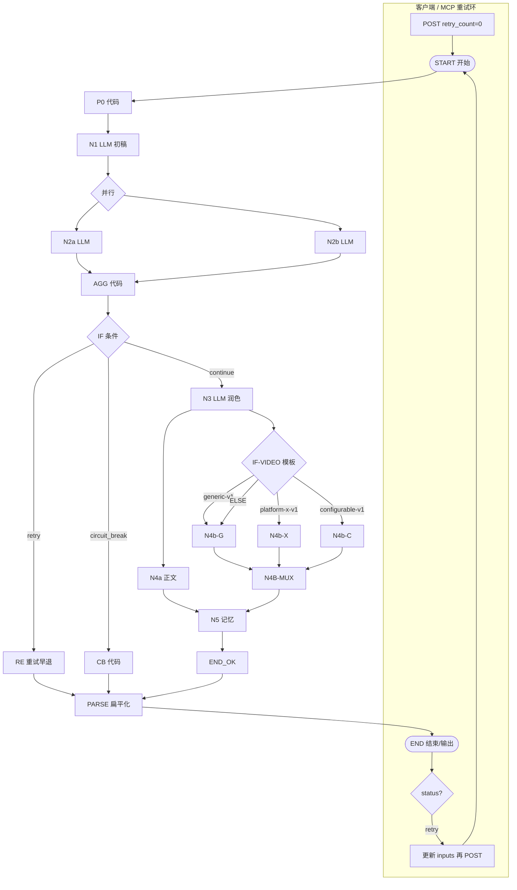
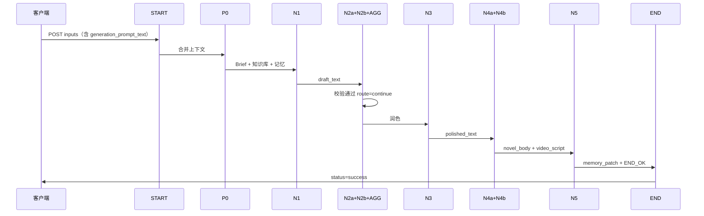
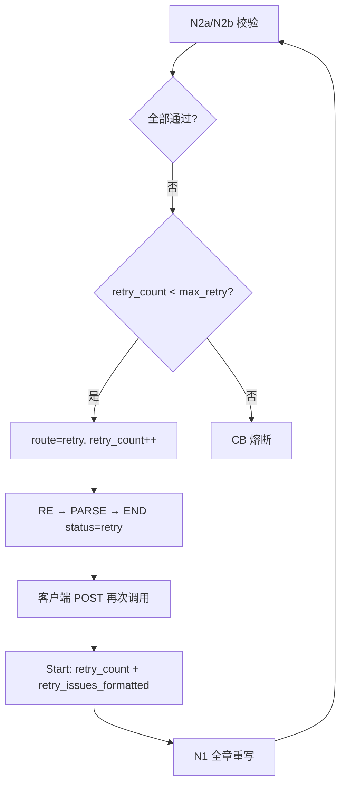
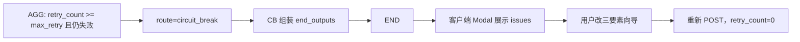
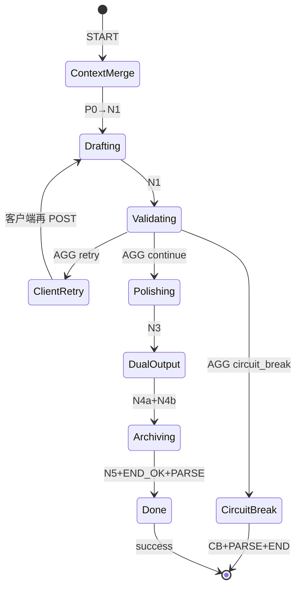

# Dify 工作流 — 节点设计与流程

> 工作流：`novel-chapter-generation-v1.1`  
> 应用类型：**Workflow（工作流）** · 非 Chatflow  
> **重试策略**：**方案 B — 客户端 / MCP Orchestration**（Dify **不回连 N1**；`route=retry` 早退 END，由调用方再次 `POST`）  
> 详述：[DIFY-WORKFLOW-MODULES-AND-PROCESS.md](./DIFY-WORKFLOW-MODULES-AND-PROCESS.md) · 实现：[DIFY-WORKFLOW-IMPLEMENTATION.md](./DIFY-WORKFLOW-IMPLEMENTATION.md)

---

## 〇、画布重构要点（方案 B）

Dify 禁止把条件分支 **连回** 已执行过的 N1。重试环改在 **NovelsCreator / MCP** 实现：

```text
客户端 loop:
  POST workflow(inputs: retry_count=0, retry_issues_formatted="")
    → status=retry → 带上 outputs.retry_count / retry_issues_formatted 再 POST
    → status=success → 落盘
    → status=circuit_break → Modal
```

**画布上你要改的四处：**

1. **删除** `IF-ROUTE → N1` 连线（若存在）。  
2. **新增** Code 节点 **`RE`（Retry Handoff）**，粘贴 `dify/shared/code/retry_end.py`。  
3. **新增** Code 节点 **`PARSE`**，粘贴 `dify/chapter/code/parse_end_outputs.py`；**RE / CB / END_OK** 均连 **PARSE → END**（勿直连 END）。  
4. **条件分支** 三路：`retry` → **RE → PARSE → END**；`circuit_break` → **CB → PARSE → END**；`continue` → **N3 → … → END_OK → PARSE → END**。

**不再需要** Dify「工作流变量」存 `retry_count`（改为 **开始节点输入**）。

---

## 一、节点总览

### 1.1 节点清单（21 个画布元素 · N4b 三分支 + PARSE）

| 序号 | 节点 ID | Dify 节点类型 | 名称 | 是否 LLM |
|------|---------|---------------|------|----------|
| 0 | START | 开始 | 工作流输入 | 否 |
| 1 | P0 | 代码 | 上下文合并 | 否 |
| 2 | N1 | LLM | 章节初稿 | 是 |
| 3 | PAR-VAL | 并行 | 校验并行网关 | 否 |
| 4 | N2a | LLM | 大纲剧情校验 | 是 |
| 5 | N2b | LLM | 人设世界观校验 | 是 |
| 6 | AGG | 代码 | 校验汇总 | 否 |
| 7 | IF-ROUTE | 条件分支 | 通过/重试/熔断 | 否 |
| 8 | RE | 代码 | 重试早退输出 | 否 |
| 9 | CB | 代码 | 熔断输出 | 否 |
| 10 | N3 | LLM | 文本润色 | 是 |
| 11 | N4a | LLM | 标准小说正文 | 是 |
| 12 | IF-VIDEO | 条件分支 | N4b 模板路由 | 否 |
| 13 | N4b-G | LLM | 视频 generic-v1 | 是 |
| 14 | N4b-X | LLM | 视频 platform-x-v1 | 是 |
| 15 | N4b-C | LLM | 视频 configurable-v1 | 是 |
| 16 | N4B-MUX | 代码 | 视频分支合并 | 否 |
| 17 | N5 | LLM | 剧情记忆 patch | 是 |
| 18 | END_OK | 代码 | 成功输出组装 | 否 |
| 19 | **PARSE** | **代码** | **end_outputs 扁平化** | **否** |
| 20 | END | 结束 / 输出 | 工作流输出 | 否 |

> PAR-OUT 为 **N3 双出线** 的逻辑并行，非独立节点。

### 1.2 画布连线表

| 从 | 到 | 条件/说明 |
|----|-----|-----------|
| START | P0 | 始终 |
| P0 | N1 | 始终 |
| N1 | PAR-VAL | 始终 |
| PAR-VAL | N2a | 并行分支 A |
| PAR-VAL | N2b | 并行分支 B |
| N2a | AGG | 汇聚 |
| N2b | AGG | 汇聚 |
| AGG | IF-ROUTE | 始终 |
| IF-ROUTE | RE | `route == retry`（**不回 N1**） |
| IF-ROUTE | CB | `route == circuit_break` |
| IF-ROUTE | N3 | `route == continue` |
| RE | **PARSE** | 始终 |
| CB | **PARSE** | 始终 |
| N3 | N4a | 并行支路 A |
| N3 | IF-VIDEO | 并行支路 B |
| IF-VIDEO | N4b-G | `video_platform_template == generic-v1` |
| IF-VIDEO | N4b-X | `== platform-x-v1` |
| IF-VIDEO | N4b-C | `== configurable-v1` |
| IF-VIDEO | N4b-G | ELSE 默认 |
| N4b-G / N4b-X / N4b-C | N4B-MUX | 三分支均连 MUX |
| N4a | N5 | 正文驱动记忆 |
| N4B-MUX | N5 | 与 N4a 汇聚后执行 N5 |
| N5 | END_OK | 始终 |
| END_OK | **PARSE** | 始终 |
| **PARSE** | **END** | 始终 |

### 1.3 拓扑图



---

## 二、节点详细设计

### START — 开始

| 项 | 内容 |
|----|------|
| **职责** | 接收客户端 / MCP 传入的全部业务参数 |
| **类型** | Dify「开始」 |
| **Prompt** | 无 |

**输入变量**

| 变量名 | 类型 | 必填 | 说明 |
|--------|------|------|------|
| project_id | 文本 | ✓ | 项目 UUID |
| chapter_id | 文本 | ✓ | 如 ch-001 |
| chapter_title | 文本 | ✓ | 章标题 |
| outline_beats | 文本 | ✓ | JSON 串：`[{order,text}]` |
| knowledge_snapshot | 文本 | ✓ | JSON 串：世界/人物/势力/道具 |
| plot_memory | 文本 | ✓ | JSON 串：剧情记忆库 |
| previous_chapter_summary | 文本 | | 上一章摘要 |
| video_platform_template | 文本 | ✓ | generic-v1 / platform-x-v1 / **configurable-v1** |
| video_template_config | 文本 | | configurable-v1 必填 |
| **estimated_duration_sec** | 数字 | | **N4b-G / N4b-X** 默认 **180** |
| max_retry | 数字 | ✓ | 默认 3 |
| generation_prompt | 文本 | | 三要素向导 JSON；快速生成传空 |
| generation_prompt_text | 文本 | | 自然语言 Brief |
| **retry_count** | 数字 | | 默认 **0**；客户端收到 `status=retry` 后传入上轮 `outputs.retry_count` |
| **retry_issues_formatted** | 文本 | | 默认空；客户端传入上轮 `outputs.retry_issues_formatted` |

**输出**：无（变量供下游引用 `开始.xxx`）

---

### P0 — 上下文合并

| 项 | 内容 |
|----|------|
| **职责** | 合并向导与知识库；确定有效节拍与审读上下文 |
| **类型** | 代码（Python3） |
| **源码** | `dify/chapter/code/p0_context_merge.py` |

| 输入 | 来源 |
|------|------|
| generation_prompt | START |
| knowledge_snapshot | START |
| outline_beats | START |

| 输出 | 下游 |
|------|------|
| merged_context | N2b |
| effective_beats | N2a |
| has_wizard | N2b（true/false 字符串） |
| chapter_goal | N2a |

---

### N1 — 章节初稿

| 项 | 内容 |
|----|------|
| **职责** | Stage-1 Raw Draft：按三要素 Brief 写全章初稿 |
| **类型** | LLM |
| **Prompt** | `dify/chapter/prompts/n1-draft.md` |
| **模型** | 强创作 · temperature **0.85** |
| **结构化输出** | 关 |
| **Jinja** | **开**（USER） |
| **对话记忆** | **关** |
| **视觉** | 关 |

| 输入 | 来源 |
|------|------|
| generation_prompt_text | START |
| knowledge_snapshot | START |
| plot_memory | START |
| previous_chapter_summary | START |
| retry_issues_formatted | **开始 → retry_issues_formatted** |
| retry_count | **开始 → retry_count** |

| 输出 | 下游 |
|------|------|
| text → **draft_text** | N2a, N2b, N3, CB；写入变量 draft_text |

**重试时**：User Prompt 顶部注入「编辑驳回通知」+ issues，**全章重写**。

---

### PAR-VAL — 校验并行网关

| 项 | 内容 |
|----|------|
| **职责** | N2a 与 N2b 同时执行，完成后汇聚 AGG |
| **类型** | Dify「并行」 |
| **配置** | 2 个分支，均须完成再汇聚 |

---

### N2a — 大纲剧情校验

| 项 | 内容 |
|----|------|
| **职责** | 节拍覆盖、顺序、跑题审读 |
| **类型** | LLM |
| **Prompt** | `dify/chapter/prompts/n2a-outline-validate.md` |
| **模型** | 强推理 · temperature **0.2** |
| **结构化输出** | **开**（JSON） |
| **Jinja** | **开**（USER） |

| 输入 | 来源 |
|------|------|
| draft_text | N1 |
| effective_beats | P0 |
| chapter_goal | P0 |

| 输出 | 下游 |
|------|------|
| **outline_result**（JSON 串） | AGG |

**关键 JSON 字段**：`outline_valid`, `outline_issues[]`, `beat_coverage[]`

---

### N2b — 人设世界观校验

| 项 | 内容 |
|----|------|
| **职责** | 三观、说话方式、样貌、世界规则、未授权设定 |
| **类型** | LLM |
| **Prompt** | `dify/chapter/prompts/n2b-lore-validate.md` |
| **模型** | 强推理 · temperature **0.2** |
| **结构化输出** | **开**（JSON） |
| **Jinja** | **开**（USER） |

| 输入 | 来源 |
|------|------|
| draft_text | N1 |
| merged_context | P0 |
| has_wizard | P0 |
| plot_memory | START |

| 输出 | 下游 |
|------|------|
| **lore_result**（JSON 串） | AGG |

**关键 JSON 字段**：`lore_valid`, `lore_issues[]`, `character_checks[]`

---

### AGG — 校验汇总

| 项 | 内容 |
|----|------|
| **职责** | 解析 N2a/N2b JSON；合并 issues；计算 route |
| **类型** | 代码 |
| **源码** | `dify/chapter/code/agg_validation.py` |

| 输入 | 来源 |
|------|------|
| outline_result | N2a → text |
| lore_result | N2b → text |
| retry_count | **开始 → retry_count** |
| max_retry | START |
| draft_text | N1 |

> 输入变量名须与 `agg_validation.py` 的 `main()` 一致（`outline_result`，非 `outline_text`）。代码已兼容误绑的 `outline_text` / `lore_text`，并自动剥离 `` 再解析 JSON。

| 输出 | 说明 |
|------|------|
| route | `continue` / `retry` / `circuit_break` |
| retry_count | 递增后的值 |
| retry_issues | JSON 数组串 |
| retry_issues_formatted | 供 **下轮** 开始输入 / N1 注入 |
| merged_issues_for_polish | 供 N3 参考 |
| outline_valid, lore_valid | 供 CB / RE |

**路由规则**

```
若 outline_valid AND lore_valid → route = continue
否则若 retry_count < max_retry → route = retry, retry_count++
否则 → route = circuit_break
```

**方案 B**：AGG 后 **无需** 写 Dify 工作流变量；`route=retry` 时由 **RE** 早退 END，客户端带 `retry_count` + `retry_issues_formatted` 再次 POST。

---

### RE — 重试早退输出

| 项 | 内容 |
|----|------|
| **职责** | 校验未通过且仍可重试；组装 `status=retry` 的 outputs |
| **类型** | 代码 |
| **源码** | `dify/shared/code/retry_end.py` |

| 输入 | 来源 |
|------|------|
| draft_text | N1 → text |
| retry_count | AGG |
| outline_valid, lore_valid | AGG |
| retry_issues | AGG |
| retry_issues_formatted | AGG |

| 输出 | 下游 |
|------|------|
| end_outputs（JSON 串） | **PARSE** |

**end_outputs.status** = `retry`；客户端读取 PARSE 扁平字段后再次调用工作流。

---

### IF-ROUTE — 条件分支

| 项 | 内容 |
|----|------|
| **职责** | 按 AGG.route 三路分流（**禁止**连回 N1） |
| **类型** | 条件分支（IF/ELSE） |

| 条件 | 运算符 | 值 | 目标节点 |
|------|--------|-----|----------|
| AGG.route | **等于** | `retry` | **RE** |
| AGG.route | **等于** | `circuit_break` | **CB** |
| AGG.route | **等于** / ELSE | `continue` | **N3** |

---

### CB — 熔断输出

| 项 | 内容 |
|----|------|
| **职责** | 校验达上限，输出可人工介入的结构 |
| **类型** | 代码 |
| **源码** | `dify/shared/code/cb_circuit_break.py` |

| 输入 | 来源 |
|------|------|
| draft_text | N1 |
| retry_count | AGG |
| outline_valid, lore_valid | AGG |
| retry_issues | AGG |

| 输出 | 下游 |
|------|------|
| end_outputs（JSON 串） | **PARSE** |

**end_outputs.status** = `circuit_break`

---

### PARSE — end_outputs 扁平化

| 项 | 内容 |
|----|------|
| **职责** | 将 RE / CB / END_OK 的 `end_outputs` JSON 串拆为「结束 / 输出」节点可绑定的扁平变量 |
| **类型** | 代码 |
| **源码** | `dify/chapter/code/parse_end_outputs.py` |

| 输入 | 来源 |
|------|------|
| re_end_outputs | **RE → end_outputs** |
| cb_end_outputs | **CB → end_outputs** |
| ok_end_outputs | **END_OK → end_outputs** |

**Dify 必填问题（两路为空是正常的）**

单次 run 只有 RE / CB / END_OK 之一执行，另两路 **必然为空**。请在 PARSE 节点对每个输入：

1. **取消「必填 / Required」**（若有该开关）
2. **默认值** 填 `""`（空字符串）
3. 类型保持 **String**

若 Dify 仍报「变量不存在 / 输入不能为空」，在 PARSE 前加 **变量聚合** 节点（见下 §六）。

> 代码内 `_pick_raw` 取首个非空，**无需** `if route`。请粘贴最新 `parse_end_outputs.py`。

| 输出 | 下游 |
|------|------|
| status, circuit_break, human_action_required, retry_count | **END** |
| novel_body, video_script, memory_patch | **END** |
| draft_text, retry_issues_formatted, validation_report, workflow_version | **END** |

> `memory_patch`、`validation_report` 输出为 **JSON 字符串**（END 变量类型选「文本」）；客户端可 `JSON.parse`。

### N3 — 文本润色

| 项 | 内容 |
|----|------|
| **职责** | Stage-3 Line Edit：改文笔，不改情节 |
| **类型** | LLM |
| **Prompt** | `dify/chapter/prompts/n3-polish.md` |
| **模型** | 创作 · temperature **0.5** |
| **结构化输出** | 关 |

| 输入 | 来源 |
|------|------|
| draft_text | N1 |
| merged_issues_for_polish | AGG |

| 输出 | 下游 |
|------|------|
| **polished_text** | N4a, IF-VIDEO 下三路 N4b |

---

### PAR-OUT — 双产物并行（逻辑）

| 项 | 内容 |
|----|------|
| **职责** | N3 完成后 **N4a** 与 **IF-VIDEO→N4b** 同时执行 |
| **实现** | N3 **拖两条线**：→ N4a；→ IF-VIDEO（无独立「并行」菜单项） |

---

### IF-VIDEO — N4b 模板路由

| 项 | 内容 |
|----|------|
| **职责** | 按 `video_platform_template` 选择 N4b Prompt |
| **类型** | 条件分支 |
| **变量** | **开始 → video_platform_template** |
| **运算符** | **等于**（勿用「包含」） |

| 条件 | 目标 |
|------|------|
| 等于 `generic-v1` | **N4b-G** |
| 等于 `platform-x-v1` | **N4b-X** |
| 等于 `configurable-v1` | **N4b-C** |
| ELSE | **N4b-G** |

---

### N4a — 标准小说正文

| 项 | 内容 |
|----|------|
| **职责** | 出版格式：章标题、段落、对话标点 |
| **类型** | LLM |
| **Prompt** | `dify/chapter/prompts/n4a-novel-body.md` |
| **temperature** | 0.4 |

| 输入 | 来源 |
|------|------|
| polished_text | N3 |
| chapter_title | START |

| 输出 | 下游 |
|------|------|
| **novel_body** | N5, END_OK |

---

### N4b-G / N4b-X / N4b-C — AI 视频脚本（三分支 LLM）

| 节点 | Prompt 文件 | 额外 USER 绑定 |
|------|-------------|----------------|
| **N4b-G** | `n4b-video-generic-v1.md` | — |
| **N4b-X** | `n4b-video-platform-x-v1.md` | — |
| **N4b-C** | `n4b-video-configurable-v1.md` | **开始 → video_template_config** |

**三分支通用**

| 项 | 值 |
|----|-----|
| 温度 | **0.5** |
| 结构化输出 | **关** |
| 上下文 | **空** |

| USER 绑定 | 来源 |
|------------|------|
| polished_text | **N3 → text** |
| chapter_title | **开始 → chapter_title** |
| chapter_id | **开始 → chapter_id** |
| estimated_duration_sec | **开始 → estimated_duration_sec**（N4b-G、N4b-X；默认 180） |

| 输出 | 下游 |
|------|------|
| **text** | **N4B-MUX**（参数名见下） |

**N4b-C** 时长由 `video_template_config.estimatedDurationSec` 决定，无需绑 `estimated_duration_sec`。

---

### N4B-MUX — 视频分支合并

| 项 | 内容 |
|----|------|
| **职责** | 三路 N4b 仅一路有 text；合并为单一 `video_script` |
| **类型** | 代码 |
| **源码** | `dify/chapter/code/n4b_mux.py` |

| 输入 | 来源 |
|------|------|
| generic_text | **N4b-G → text** |
| platform_text | **N4b-X → text** |
| configurable_text | **N4b-C → text** |

| 输出 | 下游 |
|------|------|
| **video_script** | N5（汇聚）、**END_OK** |

---

### ~~N4b~~（单节点已废弃 → 见 IF-VIDEO + N4b-G/X/C + N4B-MUX）

---

### N5 — 剧情记忆 patch

| 项 | 内容 |
|----|------|
| **职责** | 从定稿正文提取 continuity 摘要 |
| **类型** | LLM |
| **Prompt** | `dify/chapter/prompts/n5-memory-patch.md` |
| **temperature** | 0.2 |
| **结构化输出** | **开**（JSON） |

| 输入 | 来源 |
|------|------|
| novel_body | N4a |
| plot_memory | START |
| chapter_id, chapter_title | START |

| 输出 | 下游 |
|------|------|
| **memory_patch**（JSON） | END_OK |

---

### END_OK — 成功输出组装

| 项 | 内容 |
|----|------|
| **职责** | 组装 success 态 end_outputs |
| **类型** | 代码 |
| **源码** | `dify/chapter/code/end_success.py` |

| 输入 | 来源 |
|------|------|
| novel_body | N4a |
| video_script | **N4B-MUX → video_script** |
| memory_patch | **N5 → text**（或 N5 结构化输出的对象；`end_success.py` 两种均支持） |
| retry_count | **开始 → retry_count**（反映客户端已重试轮次） |

> N5 开启 **结构化 JSON** 时，Dify 可能把 `memory_patch` 以 **dict** 传入 END_OK，勿在 Code 里再 `.strip()`。请粘贴最新 `end_success.py`。

| 输出 | 下游 |
|------|------|
| end_outputs（JSON 串） | **PARSE** |

---

### END — 结束 / 输出

| 项 | 内容 |
|----|------|
| **职责** | 暴露给 API / MCP 的最终 outputs |
| **类型** | Dify「结束」或 Chatflow「输出」 |

**输出变量绑定（均 ← PARSE）**

| END 输出变量 | PARSE 字段 | 类型建议 |
|--------------|------------|----------|
| status | status | 文本 |
| circuit_break | circuit_break | 文本 / 布尔 |
| human_action_required | human_action_required | 文本 / 布尔 |
| retry_count | retry_count | 数字 |
| novel_body | novel_body | 文本 |
| video_script | video_script | 文本 |
| memory_patch | memory_patch | 文本（JSON 串） |
| draft_text | draft_text | 文本 |
| retry_issues_formatted | retry_issues_formatted | 文本 |
| validation_report | validation_report | 文本（JSON 串） |
| workflow_version | workflow_version | 文本 |

**各路径字段有无**

| 字段 | success | retry | circuit_break |
|------|---------|-------|---------------|
| status | success | **retry** | circuit_break |
| circuit_break | false | false | true |
| human_action_required | false | false | true |
| retry_count | ✓ | ✓ | ✓ |
| retry_issues_formatted | — | ✓ | — |
| novel_body | ✓ | — | — |
| video_script | ✓ | — | — |
| memory_patch | ✓ | — | — |
| draft_text | — | ✓ | ✓ |
| validation_report | ✓ | ✓ | ✓ |
| workflow_version | v1.1 | v1.1 | v1.1 |

> **勿**将 END 字段直连 N4a / N5 / 开始节点；**统一**从 **PARSE** 绑定。  
> 若只需单字段 API，可仅暴露 `end_outputs` 并跳过 PARSE（见 IMPLEMENTATION §4.3 方案 A）。

---

## 三、重试状态（Start 输入，非工作流变量）

| 变量名 | 初值（客户端） | 写入方 | 读取节点 |
|--------|----------------|--------|----------|
| retry_count | 0 | 客户端收到 `status=retry` 后设为 `outputs.retry_count` | N1, AGG, END_OK, RE, CB |
| retry_issues_formatted | `""` | 客户端回传 `outputs.retry_issues_formatted` | N1 |

> **不再使用** Dify「工作流变量」存 retry 状态。若画布中已建，可删除以免混淆。

---

## 四、流程设计

### 4.1 主流程（成功路径）



**步骤说明**

| 步 | 节点 | 动作 |
|----|------|------|
| 1 | START | 注入 11 项 inputs |
| 2 | P0 | 解析 JSON；向导 beats 优先 |
| 3 | N1 | 生成初稿 → draft_text |
| 4 | N2a∥N2b | 并行 JSON 校验 |
| 5 | AGG | route=continue |
| 6 | N3 | 润色 → polished_text |
| 7 | N4a∥N4b | 正文 + 视频脚本 |
| 8 | N5 | memory_patch |
| 9 | END_OK→PARSE→END | 返回 success outputs |
| 10 | 客户端 | 写 novel.txt / video-script.txt / merge memory |

---

### 4.2 重试子流程（方案 B · 客户端 Orchestration）



| 步 | 说明 |
|----|------|
| 1 | 单次 run：AGG 判定失败 |
| 2 | `retry_count < max_retry` → `route=retry`，RE 输出 `status=retry` |
| 3 | 客户端把 `retry_count`、`retry_issues_formatted` 写入 **下一轮 inputs** |
| 4 | 再次 POST；N1 USER 顶部注入驳回意见，**全章重写** |
| 5 | 重复直到 `success` 或 `circuit_break` |

**Dify 画布内无回边**；勿尝试 IF → N1。

---

### 4.3 熔断子流程



---

### 4.4 快速生成子流程（无向导）

| 差异点 | 向导模式 | 快速模式 |
|--------|----------|----------|
| generation_prompt | JSON v1.0 | 空串 |
| generation_prompt_text | Chapter Creative Brief | Fallback Brief |
| P0 has_wizard | true | false |
| effective_beats | 来自向导 | 来自 outline_beats |

其余节点与主流程相同。

---

### 4.5 状态机



---

## 五、节点配置速查

| 节点 | 模型温度 | 结构化 JSON | Jinja | 记忆 | 视觉 |
|------|----------|-------------|-------|------|------|
| N1 | 0.85 | 关 | **开** | 关 | 关 |
| N2a | 0.2 | **开** | **开** | 关 | 关 |
| N2b | 0.2 | **开** | **开** | 关 | 关 |
| N3 | 0.5 | 关 | 关 | 关 | 关 |
| N4a | 0.4 | 关 | 关 | 关 | 关 |
| N4b-G / N4b-X / N4b-C | 0.5 | 关 | 关 | 关 | 关 |
| N5 | 0.2 | **开** | 关 | 关 | 关 |

---

## 六、出口层重构（PARSE + END）

若画布上 **RE / CB / END_OK 直连 END**，按下列步骤改：

| 步 | 操作 |
|----|------|
| 1 | 添加 Code **`PARSE`**，粘贴 `dify/chapter/code/parse_end_outputs.py` |
| 2 | **删除** RE→END、CB→END、END_OK→END 三条旧线 |
| 3 | **RE → PARSE**、**CB → PARSE**、**END_OK → PARSE**、**PARSE → END** |
| 4 | PARSE：三输入 **非必填** + 默认 `""`；或 **变量聚合 → 单输入 end_outputs**（§六） |
| 5 | END（输出）11 字段均绑 **PARSE**（见 §END 绑定表） |
| 6 | 发布 → 调试 run → **上次运行** 确认 `status` 非空 |

### 6.1 方案 A：三输入 + 非必填（当前 PARSE）

PARSE 三个输入 **允许为空**；代码取首个非空。Dify 里务必 **关必填** + 默认 `""`。

### 6.1b 方案 B：变量聚合 + 单输入（Dify 仍报空时用）

若 Dify 强制三输入均非空，在 PARSE 前加 **变量聚合**：

```
RE.end_outputs ──┐
CB.end_outputs ──┼→ 【变量聚合】→ end_outputs → PARSE（仅 1 个输入）
END_OK.end_outputs ─┘
```

1. 添加 **变量聚合** 节点，三组变量均映射 `end_outputs`（或各分支同名输出）
2. 聚合组策略：**取有值的一组** / Assigner 等价逻辑
3. PARSE 只保留 **一个** 输入 `end_outputs` ← 变量聚合输出
4. `parse_end_outputs.py` 的 `main(end_outputs=...)` 已支持单输入

---

## 七、搭建顺序（N4b 三分支）

1. **N3** 后：→ **N4a** + → **IF-VIDEO**  
2. IF-VIDEO → **N4b-G / N4b-X / N4b-C** → **N4B-MUX** → **N5**（与 N4a 共连 N5）  
3. **END_OK**：`video_script` ← **N4B-MUX**  
4. **END_OK / RE / CB → PARSE → END**（§六）  
5. 删旧单节点 **N4b** 及其直连 N5 的线  

详见 [DIFY-WORKFLOW-IMPLEMENTATION.md](./DIFY-WORKFLOW-IMPLEMENTATION.md) §7.5、§8.2–8.4。

---

## 八、相关文件

| 类型 | 路径 |
|------|------|
| Code | `dify/chapter/code/*.py`（含 **parse_end_outputs.py**、n4b_mux.py、retry_end.py） |
| Prompt | `dify/chapter/prompts/*.md` |
| 联调样例 | `dify/chapter/fixtures/run-request-success.json` |
| MCP 输入 Schema | `dify/chapter/mcp/schemas/novel-chapter-generate.input.schema.json` |
| MCP 输出 Schema | `dify/chapter/mcp/schemas/novel-chapter-generate.output.schema.json` |

---

*文档版本：v1.3 · N4b 三分支 + N4B-MUX · 方案 B*
