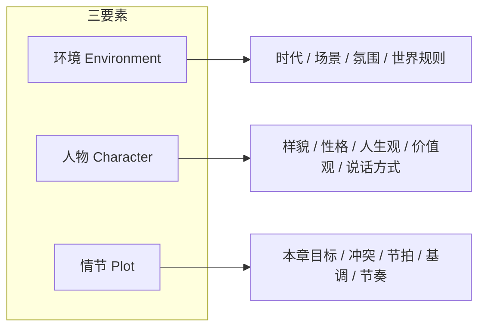
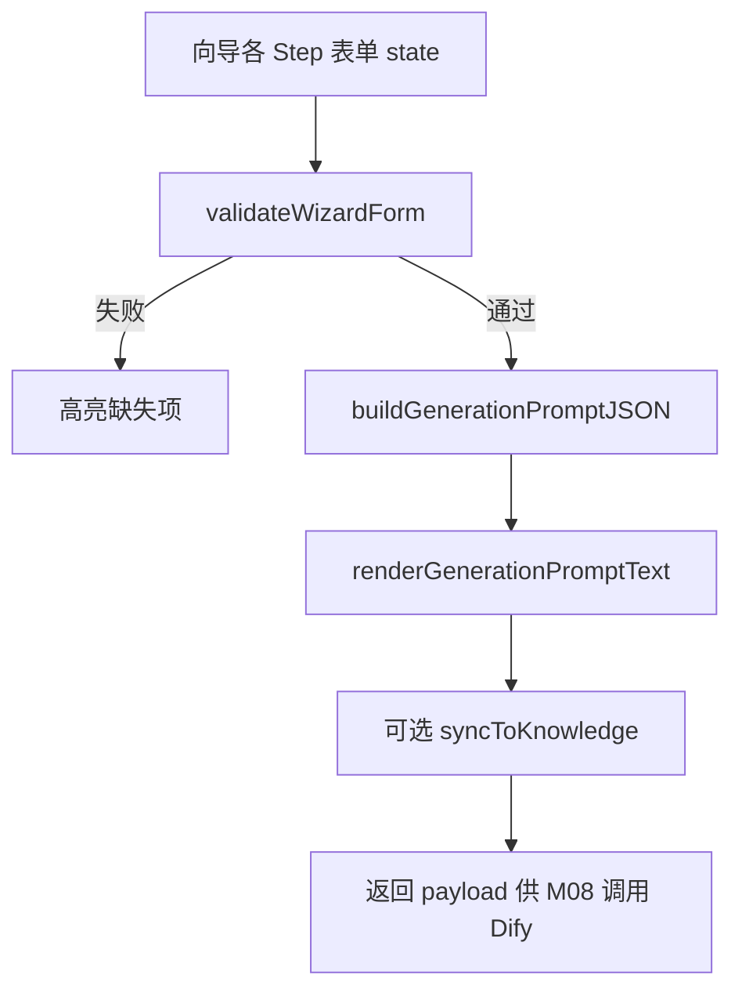
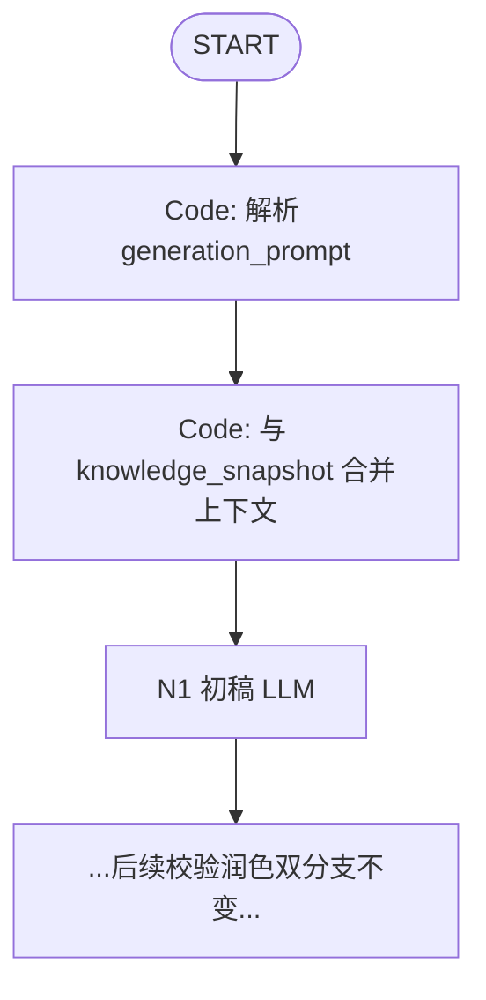
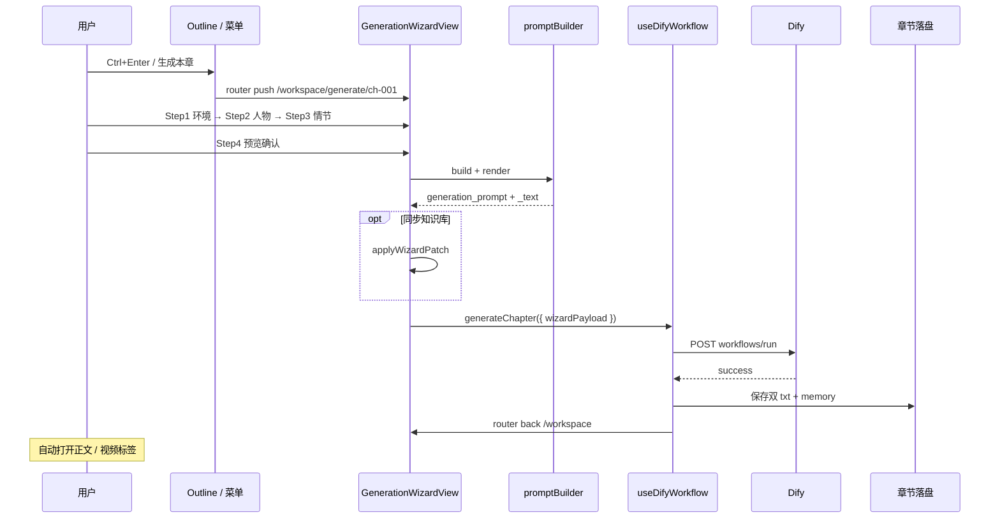

# NovelsCreator — 生成选择页（三要素向导）

> 面向普通用户的 **可视化章节生成向导**：按小说三要素（**人物 · 情节 · 环境**）点选性格、人生观、价值观、样貌等，客户端组装为 **统一格式 `generation_prompt`**，交给 Dify 工作流处理。  
> 关联：[DEVELOPMENT.md](../app/DEVELOPMENT.md) · [MODULES.md](../app/MODULES.md) M08 · [UI-NAVIGATION.md](../app/UI-NAVIGATION.md)

---

## 目录

1. [设计目标](#1-设计目标)
2. [小说三要素与页面对应](#2-小说三要素与页面对应)
3. [生成选择页 UI 设计](#3-生成选择页-ui-设计)
4. [选项库与预设标签](#4-选项库与预设标签)
5. [统一 Prompt 数据格式](#5-统一-prompt-数据格式)
6. [Prompt 组装与渲染](#6-prompt-组装与渲染)
7. [与 Dify 工作流对接](#7-与-dify-工作流对接)
8. [与知识库的双向同步](#8-与知识库的双向同步)
9. [完整用户流程](#9-完整用户流程)
10. [代码映射与接口](#10-代码映射与接口)

---

## 1. 设计目标

| 目标 | 说明 |
|------|------|
| **降低门槛** | 用户无需手写 Prompt 或直接编辑 JSON，通过点选完成配置 |
| **结构清晰** | 严格对应「人物 / 情节 / 环境」三要素，符合创作直觉 |
| **输出统一** | 客户端生成固定 Schema 的 `generation_prompt`，Dify 侧只解析一种格式 |
| **可进阶** | 支持从已有知识库预填；向导结果可回写知识库 |
| **与现有架构兼容** | 保留 `outline_beats`、`plot_memory` 等字段；新增 `generation_prompt` 增强初稿节点 |

### 与现有 GenerateDialog 的关系

| 模式 | 用户 | 入口 |
|------|------|------|
| **快速生成**（保留） | 熟练用户 | GenerateDialog 一键确认，直接用知识库快照 |
| **向导生成**（本方案） | 普通用户 | 生成选择页逐步点选 → 预览 Prompt → 生成 |

默认：`Ctrl+Enter` 打开 **生成选择页**；Shift+Ctrl+Enter 或菜单「快速生成」走原 Dialog。

### 可配置创作模板（与视频 configurable-v1 同思路）

人物、世界观、大纲**不应写死在 Vue 组件里**，而由项目级 **`NovelCreativeTemplate`** JSON 驱动：

| 层级 | 配置对象 | Schema | 作用 |
|------|----------|--------|------|
| 项目/类型 | `novelCreativeTemplate` | [`novel-creative-template.schema.json`](../../dify/chapter/mcp/schemas/novel-creative-template.schema.json) | 向导显示哪些字段、预设标签、节拍上下限 |
| 单次生成 | `generation_prompt` v1.0 | GENERATION-WIZARD §5.1 | 用户点选结果 → 机器可读 Brief |
| 静态设定 | `knowledge_snapshot` | PROMPT-DESIGN §2.3 | world / 关系 / 势力 / 道具 |
| 大纲 | `outline_beats` | outline.json | N2a 校验节拍；与 plot.beats 对齐 |
| 视频 | `video_template_config` | video-template-config.schema.json | N4b 可配置列 |

**原则**：Dify **不解析**创作模板 Schema；客户端读模板 → 渲染向导 → 组装上述 **4 个 workflow inputs**。改字段只改 `novelCreativeTemplate`（或换 genre 模板文件），无需改 Dify Prompt。

示例：[`dify/chapter/fixtures/novel-creative-template.example.json`](../../dify/chapter/fixtures/novel-creative-template.example.json)

```
novelCreativeTemplate (项目 settings)
    → 向导 UI 动态表单
    → buildGenerationPrompt() → generation_prompt + generation_prompt_text
    → buildKnowledgeSnapshot() → knowledge_snapshot
    → buildOutlineBeats() → outline_beats
    → POST Dify workflows/run
```

---

## 2. 小说三要素与页面对应



| 三要素 | 向导步骤 | 数据来源 | 用户操作 |
|--------|----------|----------|----------|
| **环境** | Step 1 | `world.json` 预填 + 预设标签 | 点选时代、地点、氛围、规则 |
| **人物** | Step 2 | `characters.json` 选人 + 特质标签 | 为每个出场角色配置三观与样貌 |
| **情节** | Step 3 | `outline.json` 本章 beats | 确认节拍、选冲突类型与故事基调 |

Step 4 为 **预览与生成**，展示可读 Prompt 摘要，非第四要素。

---

## 3. 生成选择页 UI 设计

### 3.1 页面形态

**推荐**：Workspace 内 **全屏向导页**（子路由，保留 MenuBar / StatusBar）

- 路由：`/workspace/generate/:chapterId`
- 自 `/workspace` 进入，完成后返回工作区并打开生成结果标签

**线框（Step 指示器 + 内容区 + 底栏）**：

```
┌─────────────────────────────────────────────────────────────────┐
│ MenuBar    生成向导 · 第一章                         [× 关闭]   │
├─────────────────────────────────────────────────────────────────┤
│  ● 环境 ─── ○ 人物 ─── ○ 情节 ─── ○ 预览                        │
├─────────────────────────────────────────────────────────────────┤
│                                                                 │
│   [ 当前步骤表单 / 卡片点选区 ]                                   │
│                                                                 │
├─────────────────────────────────────────────────────────────────┤
│  [从知识库导入]              [上一步]  [下一步]  [生成本章]        │
└─────────────────────────────────────────────────────────────────┘
```

### 3.2 Step 1 — 环境

```
┌─ 时代背景 ─────────────────────────────────────────────────────┐
│  [古代] [近代] [现代] [近未来] [架空] [自定义...]                  │
├─ 主要场景 ─────────────────────────────────────────────────────┤
│  [都市] [宗门] [校园] [废土] [宫廷] [自定义...]                  │
├─ 氛围基调 ─────────────────────────────────────────────────────┤
│  [热血] [悬疑] [治愈] [黑暗] [轻松] [史诗]  （可多选，最多 3）   │
├─ 世界规则（可选）────────────────────────────────────────────── │
│  [ ] 使用项目世界观设定    [查看/编辑 world.json]               │
│  补充说明：[________________________________]                    │
└─────────────────────────────────────────────────────────────────┘
```

### 3.3 Step 2 — 人物

为本章 **出场角色** 逐个配置（左侧角色列表，右侧特质面板）：

```
┌──────────────┬──────────────────────────────────────────────────┐
│ 本章出场角色  │  张三（主角）                                     │
│ ┌──────────┐ │  ─ 样貌 ─────────────────────────────────────   │
│ │● 张三    │ │  [清秀] [英武] [冷峻] [平凡] [妖异] [自定义]       │
│ │  李四    │ │  发型/特征：[黑色短发，左颊有疤___________]        │
│ │  + 添加  │ │  ─ 性格 ─────────────────────────────────────   │
│ └──────────┘ │  [冷静] [热血] [腹黑] [傲娇] [温润] [偏执]       │
│              │  （主性格 1 个 + 副性格最多 2 个）                 │
│              │  ─ 人生观 ───────────────────────────────────   │
│              │  [进取] [宿命] [享乐] [复仇] [守护] [虚无]        │
│              │  ─ 价值观 ───────────────────────────────────   │
│              │  [正义] [利己] [集体] [秩序] [自由] [生存优先]    │
│              │  ─ 说话方式 ───────────────────────────────────   │
│              │  [简短] [文绉] [粗犷] [幽默] [毒舌] [自定义]       │
│              │  ─ 本章角色目标（一句话）──────────────────────   │
│              │  [________________________________]              │
└──────────────┴──────────────────────────────────────────────────┘
```

**添加角色**：从项目 `characters.json` 列表选择，或「临时角色」（仅本次生成，不写入库）。

### 3.4 Step 3 — 情节

```
┌─ 本章目标 ─────────────────────────────────────────────────────┐
│  [________________________________________________]            │
├─ 核心冲突 ─────────────────────────────────────────────────────┤
│  [人 vs 人] [人 vs 环境] [人 vs 自我] [人 vs 命运] [无明确冲突]  │
├─ 情节节拍（来自大纲，可微调文案）──────────────────────────────  │
│  1. [主角抵达破庙避雨_______________] [↑][↓][×]                 │
│  2. [遭遇神秘剑客_______________]     [↑][↓][×]                 │
│  [+ 添加节拍]                                                   │
├─ 叙事基调 ─────────────────────────────────────────────────────┤
│  [紧张] [舒缓] [反转] [铺垫] [高潮] [余韵]                       │
├─ 叙事节奏 ─────────────────────────────────────────────────────┤
│  慢 ○──●───────○ 快          预计字数：[3000] 字               │
└─────────────────────────────────────────────────────────────────┘
```

### 3.5 Step 4 — 预览

```
┌─ Prompt 预览（用户可读摘要）───────────────────────────────────┐
│ 【环境】现代都市，雨夜，悬疑氛围；灵气复苏，常人不可见妖祟。        │
│ 【人物】张三：冷峻、疤痕；人生观守护、价值观正义；本章目标：保护...  │
│ 【情节】目标：…；冲突：人 vs 人；节拍：①…②…；基调：紧张。          │
├─ 高级：查看结构化 JSON  [展开 ▼]                                │
└─────────────────────────────────────────────────────────────────┘
  [ ] 生成前将人物设定同步回知识库
  [ ] 生成后自动打开正文与视频脚本标签

                    [上一步]  [生成本章 →]
```

---

## 4. 选项库与预设标签

### 4.1 配置文件

路径：`src/assets/generation/presets.zh-CN.json`（可 i18n）

```json
{
  "environment": {
    "era": ["古代", "近代", "现代", "近未来", "架空"],
    "scene": ["都市", "宗门", "校园", "废土", "宫廷", "荒野"],
    "atmosphere": ["热血", "悬疑", "治愈", "黑暗", "轻松", "史诗"]
  },
  "character": {
    "appearance": ["清秀", "英武", "冷峻", "平凡", "妖异", "儒雅"],
    "personality": ["冷静", "热血", "腹黑", "傲娇", "温润", "偏执", "滑头", "沉稳"],
    "worldview": ["进取", "宿命", "享乐", "复仇", "守护", "虚无"],
    "values": ["正义", "利己", "集体", "秩序", "自由", "生存优先"],
    "speechStyle": ["简短", "文绉", "粗犷", "幽默", "毒舌"]
  },
  "plot": {
    "conflict": ["人 vs 人", "人 vs 环境", "人 vs 自我", "人 vs 命运", "无明确冲突"],
    "tone": ["紧张", "舒缓", "反转", "铺垫", "高潮", "余韵"]
  }
}
```

### 4.2 选择规则

| 字段 | 规则 |
|------|------|
| 氛围 `atmosphere` | 多选，1–3 个 |
| 性格 `personality` | 主 1 + 副 0–2 |
| 人生观 / 价值观 | 各选 1 个为主，可选第二倾向 |
| 自定义项 | 任意字段可追加 `custom` 文本，最长 200 字 |

---

## 5. 统一 Prompt 数据格式

### 5.1 Schema 版本

**`generation_prompt` v1.0** — 客户端组装，Dify Code 节点解析。

```json
{
  "version": "1.0",
  "locale": "zh-CN",
  "chapter": {
    "id": "ch-001",
    "title": "第一章",
    "volumeId": "vol-01"
  },
  "environment": {
    "era": "现代",
    "scene": "都市",
    "atmosphere": ["悬疑", "黑暗"],
    "worldRulesRef": true,
    "worldSummary": "灵气复苏，常人不可见妖祟",
    "customNote": "暴雨夜，霓虹灯故障"
  },
  "characters": [
    {
      "id": "char-001",
      "name": "张三",
      "role": "protagonist",
      "appearance": {
        "tags": ["冷峻"],
        "description": "黑色短发，左颊有疤"
      },
      "personality": {
        "primary": "冷静",
        "secondary": ["偏执"]
      },
      "worldview": "守护",
      "values": "正义",
      "speechStyle": "简短",
      "chapterGoal": "在雨夜保护目击者离开险境",
      "persistToKnowledge": true
    }
  ],
  "plot": {
    "chapterGoal": "揭开剑客真实身份",
    "conflict": "人 vs 人",
    "beats": [
      { "order": 1, "text": "主角抵达破庙避雨" },
      { "order": 2, "text": "遭遇神秘剑客" }
    ],
    "tone": ["紧张", "反转"],
    "pacing": 0.65,
    "targetWordCount": 3000
  },
  "meta": {
    "assembledAt": "2026-06-01T12:00:00.000Z",
    "source": "generation-wizard"
  }
}
```

### 5.2 字段说明

| 路径 | 类型 | 必填 | 说明 |
|------|------|------|------|
| `version` | string | 是 | 固定 `1.0`，便于 Dify 分支 |
| `environment.*` | object | 是 | 环境三要素 |
| `characters[]` | array | 是 | 至少 1 人 |
| `characters[].personality.primary` | string | 是 | 主性格 |
| `characters[].worldview` | string | 是 | 人生观 |
| `characters[].values` | string | 是 | 价值观 |
| `characters[].appearance` | object | 是 | 样貌 tags + description |
| `plot.beats` | array | 是 | 与 outline 对齐 |
| `plot.targetWordCount` | number | 否 | 默认 3000 |

---

## 6. Prompt 组装与渲染

### 6.1 双层输出

客户端产出两个字符串，一并传给 Dify：

| 字段 | 用途 |
|------|------|
| `generation_prompt` | 上述 JSON 字符串（机器可读，Code 节点解析） |
| `generation_prompt_text` | 人类可读自然语言（直接嵌入 LLM Prompt 模板） |

### 6.2 自然语言模板（客户端渲染）

> **v2.0 专业版完整模板**见 [PROMPT-DESIGN.md §3.2](./PROMPT-DESIGN.md#32-generation_prompt_text-完整模板v20-专业版)，含 Chapter Creative Brief 结构、Beat Sheet、三观 hint 与 Execution Standards。  
> 渲染器须从 [标签语义词典](./PROMPT-DESIGN.md#16-标签语义词典v20-专业版) 注入 `worldview_hint` / `values_hint` / `speechStyle_hint` / `pacing_instruction`。

### 6.3 组装流程 F-GW-01



---

## 7. 与 Dify 工作流对接

### 7.1 工作流 inputs 变更（v1.1）

在原有 inputs 基础上 **新增** 两个字段（向后兼容：快速生成时可传空字符串）：

```json
{
  "inputs": {
    "project_id": "uuid",
    "chapter_id": "ch-001",
    "chapter_title": "第一章",
    "outline_beats": "[...]",
    "knowledge_snapshot": "{...}",
    "plot_memory": "{...}",
    "video_platform_template": "generic-v1",
    "max_retry": 3,
    "previous_chapter_summary": "...",
    "generation_prompt": "{ ... JSON v1.0 ... }",
    "generation_prompt_text": "## 创作任务：..."
  }
}
```

### 7.2 Dify 工作流调整



**N1 初稿节点 Prompt 结构建议：**

```
【系统】你是长篇小说作者...

【结构化创作指令】
{{generation_prompt_text}}

【项目知识库摘要】（校验用人设细节）
{{knowledge_snapshot}}

【前情记忆】
{{plot_memory}}

【上一章摘要】
{{previous_chapter_summary}}

若 generation_prompt 为空，则仅依据 outline_beats 与 knowledge_snapshot 创作。
```

**Code 节点 merge 逻辑（Dify 内）：**

```python
import json

def main(generation_prompt: str, knowledge_snapshot: str) -> dict:
    gp = json.loads(generation_prompt) if generation_prompt else None
    ks = json.loads(knowledge_snapshot) if knowledge_snapshot else {}
    # 向导优先：人物三观以 generation_prompt 为准，知识库补充关系网/道具
    merged_characters = merge_characters(gp, ks.get("characters", []))
    return {
        "merged_context": json.dumps({
            "from_wizard": gp is not None,
            "characters": merged_characters,
            "world": ks.get("world", {}),
        }, ensure_ascii=False)
    }
```

### 7.3 校验节点适配

| 节点 | 调整 |
|------|------|
| N2a 大纲校验 | beats 优先读 `generation_prompt.plot.beats`，fallback `outline_beats` |
| N2b 人设校验 | 三观/样貌优先读 `generation_prompt.characters` |

完整 Prompt 模板见 [PROMPT-DESIGN.md](./PROMPT-DESIGN.md)。

---

## 8. 与知识库的双向同步

### 8.1 向导 ← 知识库（预填）

**流程 F-GW-02：进入向导时自动导入**

```
1. 打开 /workspace/generate/:chapterId
2. environment ← world.json（era/geography/rules 映射到标签，无法映射的放 customNote）
3. characters ← 从 outline beats 文本匹配 characters.json 名称 + 默认主角
4. plot.beats ← outline 本章 beats
```

### 8.2 向导 → 知识库（回写）

用户勾选「生成前同步到知识库」时：

| 向导字段 | 写入目标 |
|----------|----------|
| appearance.tags + description | `characters[].traits`, 新增 `appearance` 字段 |
| personality / worldview / values | `characters[].traits`, `characters[].arc` |
| speechStyle | `characters[].speechStyle`（新字段） |
| environment 自定义 | `world.json` 对应字段 |

**流程 F-GW-03：**

```
1. buildGenerationPromptJSON 完成后
2. if persistToKnowledge → knowledgeStore.applyWizardPatch(payload)
3. IPC 写入 characters.json / world.json
4. 再调用 M08 generateChapter
```

---

## 9. 完整用户流程

### 9.1 流程 F-GW-04：向导生成（主路径）



### 9.2 流程 F-GW-05：从大纲树快捷进入

```
Outline 树右键「向导生成本章」→ /workspace/generate/:chapterId
Project Explorer 选中章 + 菜单「生成 → 向导生成」→ 同上
```

### 9.3 校验失败时

```
Dify circuit_break → 回 Workspace → CircuitBreakModal
Modal「返回向导修改」→ /workspace/generate/:chapterId?retry=1
向导加载上次 payload（存 sessionStorage 或 .novelscreator/last-wizard.json）
```

---

## 10. 代码映射与接口

### 10.1 新增文件

```
src/
├── views/
│   └── GenerationWizardView.vue       # 四步向导容器
├── components/
│   └── generation/
│       ├── WizardStepper.vue
│       ├── EnvironmentStep.vue        # Step 1
│       ├── CharacterStep.vue          # Step 2
│       ├── PlotStep.vue               # Step 3
│       ├── PreviewStep.vue            # Step 4
│       ├── TagSelector.vue            # 通用标签点选
│       └── CharacterTraitPanel.vue
├── stores/
│   └── generationWizard.store.ts
├── types/
│   └── generation-prompt.v1.ts
├── utils/
│   ├── generationPromptBuilder.ts
│   ├── generationPromptRenderer.ts
│   └── wizardKnowledgeSync.ts
└── assets/
    └── generation/
        └── presets.zh-CN.json
```

### 10.2 路由扩展

```typescript
{
  path: '/workspace/generate/:chapterId',
  name: 'generation-wizard',
  component: GenerationWizardView,
  meta: { requiresProject: true, fullscreenWizard: true },
}
```

### 10.3 Store 接口

```typescript
interface GenerationWizardStore {
  chapterId: string;
  step: 1 | 2 | 3 | 4;
  environment: EnvironmentFormState;
  characters: CharacterFormState[];
  plot: PlotFormState;

  loadFromProject(chapterId: string): Promise<void>;
  loadPresets(): void;
  nextStep(): void;
  prevStep(): void;
  validateStep(step: number): ValidationResult;
  buildPayload(): GenerationPromptV1;
  persistDraft(): void;           // sessionStorage
  restoreDraft(chapterId: string): boolean;
}
```

### 10.4 M08 扩展

```typescript
interface GenerateChapterOptions {
  chapterId: string;
  force?: boolean;
  wizardPayload?: GenerationPromptV1;  // 新增
}

// useDifyWorkflow 内
const inputs = {
  ...existingInputs,
  generation_prompt: wizardPayload
    ? JSON.stringify(wizardPayload)
    : '',
  generation_prompt_text: wizardPayload
    ? renderGenerationPromptText(wizardPayload)
    : '',
};
```

---

## 附录 A：三要素与文学理论对照（给用户看的文案）

| 三要素 | 向导文案 | 帮助说明 |
|--------|----------|----------|
| 环境 | 「故事发生在什么样的世界里？」 | 决定场景描写与规则边界 |
| 人物 | 「谁出场？他们是什么样的人？」 | 性格、三观决定行为逻辑 |
| 情节 | 「本章要发生什么？」 | 节拍即场景顺序 |

---

## 附录 B：Dify 工作流版本

| 工作流 ID | 变更 |
|-----------|------|
| `novel-chapter-generation-v1` | 原协议，无 generation_prompt |
| `novel-chapter-generation-v1.1` | 支持 generation_prompt + _text，推荐 |

---

*文档版本：v1.0 · 最后更新：2026-06-01*
