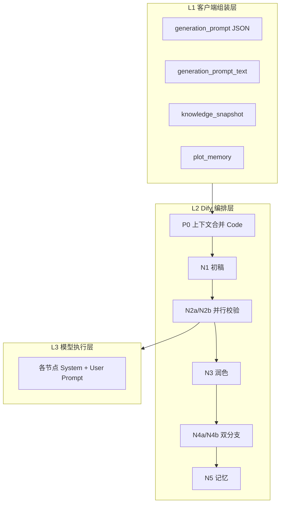

# NovelsCreator — Prompt 设计文档

> 本文档定义 NovelsCreator 从 **客户端三要素向导** 到 **Dify 工作流全节点** 的完整 Prompt 体系：变量约定、系统指令、节点模板、输出 JSON Schema、重试注入与示例。  
> 关联：[GENERATION-WIZARD.md](./GENERATION-WIZARD.md) · [DEVELOPMENT.md](../app/DEVELOPMENT.md) · 模板文件目录 [`../../dify/chapter/prompts/`](../../dify/chapter/prompts/)

---

## 目录

1. [Prompt 体系总览](#1-prompt-体系总览)
2. [输入变量与上下文分层](#2-输入变量与上下文分层)
3. [客户端 Prompt：三要素向导](#3-客户端-prompt三要素向导)
4. [快速生成模式 Prompt 兜底](#4-快速生成模式-prompt-兜底)
5. [Dify 工作流全局约定](#5-dify-工作流全局约定)
6. [节点 P0：上下文合并（Code）](#6-节点-p0上下文合并code)
7. [节点 N1：章节初稿生成](#7-节点-n1章节初稿生成)
8. [节点 N2a：大纲剧情校验](#8-节点-n2a大纲剧情校验)
9. [节点 N2b：人设世界观校验](#9-节点-n2b人设世界观校验)
10. [节点 N3：文本润色](#10-节点-n3文本润色)
11. [节点 N4a：标准小说正文](#11-节点-n4a标准小说正文)
12. [节点 N4b：AI 视频脚本](#12-节点-n4bai-视频脚本)
13. [节点 N5：剧情记忆 patch](#13-节点-n5剧情记忆-patch)
14. [节点 CB：熔断输出](#14-节点-cb熔断输出)
15. [重试 Prompt 注入规范](#15-重试-prompt-注入规范)
16. [标签语义词典](#16-标签语义词典)
17. [端到端示例](#17-端到端示例)
18. [版本与维护](#18-版本与维护)

---

## 1. Prompt 体系总览

### 1.1 三层结构



| 层级 | 职责 | 维护位置 |
|------|------|----------|
| **L1 客户端** | 三要素可视化选择 → 统一 JSON + 自然语言 | `src/utils/generationPrompt*.ts` |
| **L2 Dify 编排** | 合并上下文、重试、熔断、并行 | Dify 工作流可视化 + Code 节点 |
| **L3 节点 Prompt** | 各 LLM 系统/用户指令 | `dify/chapter/prompts/*.md`（本文档 §7–§13） |

### 1.2 设计原则

| 原则 | 说明 |
|------|------|
| **出版流程对齐** | 节点划分对应 Raw Draft → Developmental Edit → Line Edit → Publication Format → Archive |
| **单一事实来源（向导优先）** | 有三要素向导时，人物三观/样貌/节拍以 `generation_prompt` 为准；知识库补充关系、道具、势力 |
| **Rubric 驱动审读** | 校验节点使用 Hard Fail 量表 + 可量化阈值，减少主观漂移 |
| **结构化输出** | 校验 / 记忆节点强制 JSON；正文节点输出纯文本 |
| **可重试** | 失败原因写入 `retry_issues`，N1 以「编辑驳回通知」形式全章重写 |
| **Token 预算** | 单节点 User Prompt 建议 ≤ 14k 汉字；超长 memory 由客户端摘要 |

> **模板版本**：v2.0 专业版（2026-06-01）。Dify 节点请同步 [`dify/chapter/prompts/`](../../dify/chapter/prompts/) 下最新文件。

---

## 2. 输入变量与上下文分层

### 2.1 Workflow inputs 全表

| 变量名 | 来源 | 必填 | 用途 |
|--------|------|------|------|
| `project_id` | 客户端 | 是 | 日志 / user 标识 |
| `chapter_id` | 客户端 | 是 | 章节 ID |
| `chapter_title` | 客户端 | 是 | 章标题 |
| `outline_beats` | outline.json | 是 | 快速模式节拍；校验 fallback |
| `knowledge_snapshot` | M03 组装 | 是 | 世界/人物/势力/道具摘要 |
| `plot_memory` | M05 组装 | 是 | 全书+分章记忆 |
| `previous_chapter_summary` | M05 | 否 | 上一章摘要 |
| `video_platform_template` | project.settings | 是 | N4b 模板 ID（含 **configurable-v1**） |
| `video_template_config` | project.settings.videoTemplate | 否 | **configurable-v1 必填**；VideoTemplateConfig JSON 串 |
| `estimated_duration_sec` | project.settings / 默认 180 | 否 | **N4b-G / N4b-X**；configurable-v1 用模板内 `estimatedDurationSec` |
| `max_retry` | 客户端 / 默认 3 | 是 | 校验重试上限 |
| `generation_prompt` | 向导 JSON | 否 | 三要素结构化指令 |
| `generation_prompt_text` | 客户端渲染 | 否 | 三要素自然语言指令 |
| `retry_count` | 客户端 inputs | 是 | 首轮 0；`status=retry` 后回传 outputs.retry_count |
| `retry_issues_formatted` | 客户端 inputs | 否 | 上轮驳回 Markdown；首轮空 |

### 2.2 上下文优先级（冲突时）

```
generation_prompt.characters[].三观/样貌/说话方式
  > knowledge_snapshot.characters
generation_prompt.plot.beats
  > outline_beats
generation_prompt.environment
  > knowledge_snapshot.world（向导 customNote 追加，不覆盖 world.rules）
plot_memory（人工修正条目）
  > plot_memory（AI 生成条目，Prompt 中标注「不可 contradict」）
```

### 2.3 knowledge_snapshot 推荐结构

客户端传入 JSON 字符串：

```json
{
  "world": {
    "title": "书名世界",
    "era": "现代",
    "rules": "灵气复苏，妖隐匿于市",
    "geography": "东海市",
    "history": "三百年前封印崩解…"
  },
  "characters": [
    {
      "id": "char-001",
      "name": "张三",
      "factionId": "fac-001",
      "traits": ["冷静", "正义"],
      "relationships": [{ "targetId": "char-002", "relation": "师徒" }],
      "arc": "从旁观者到守护者"
    }
  ],
  "factions": [{ "id": "fac-001", "name": "巡夜司", "goals": "维护隐秘秩序" }],
  "items": [{ "id": "item-001", "name": "破魔符", "ownerId": "char-001" }]
}
```

---

## 3. 客户端 Prompt：三要素向导

> 完整 Schema 见 [GENERATION-WIZARD.md §5](./GENERATION-WIZARD.md#5-统一-prompt-数据格式)。

### 3.1 双层输出

| 字段 | 格式 | 消费者 |
|------|------|--------|
| `generation_prompt` | JSON v1.0 | P0 Code、N2a/N2b 校验 |
| `generation_prompt_text` | Markdown 风自然语言 | N1 User Prompt 主体 |

### 3.2 generation_prompt_text 完整模板（v2.0 专业版）

> **客户端渲染**：使用 **Jinja2**（与 Dify N1/N2 一致）。Electron 实现推荐 `nunjucks` 或等价引擎。

```markdown
# 章节创作任务书 · Chapter Creative Brief

**文档类型**：Primary Brief（主创作指令）  
**章节**：{{ chapter.title }}（ID: {{ chapter.id }} / 卷: {{ chapter.volumeId }}）  
**目标体量**：约 {{ plot.targetWordCount }} 汉字（允许 ±15%）  
**叙事节奏系数**：{{ plot.pacing }} — {{ pacing_label }}

---

## 一、环境要素（Environment · 三要素之一）

环境不仅是背景板，而是参与叙事的压力源与氛围载体。

| 维度 | 设定 |
|------|------|
| 时代框架 | {{ environment.era }} |
| 主场景类型 | {{ environment.scene }} |
| 氛围基调 | {{ environment.atmosphere | join('、') }} |

| 世界规则摘要 | {{ environment.worldSummary }} |


| 本章场景补充 | {{ environment.customNote }} |


**环境执行要求**：
- 开章 300 字内须建立可感知的时间、空间与氛围（至少两种感官通道）；
- 氛围词须转化为可见可听的环境表现，不可只作形容词标注；
- 不得违反世界规则摘要中的硬约束。

---

## 二、人物要素（Character · 三要素之二）

以下角色为本章**授权出场名单**。各角色的决策逻辑须可回溯至其三观锚点；对话须符合说话方式档案。


### {{ char.name }} · 主角 · 对立角色 · 配角

| 属性维度 | 设定内容 |
|----------|----------|
| 外貌气质 | {{ char.appearance.tags | join('、') }} |
| 外貌细节 | {{ char.appearance.description }} |
| 性格（主/辅） | 主「{{ char.personality.primary }}」 / 辅「{{ char.personality.secondary | join('、') }}」 |
| 人生观 | {{ char.worldview }} — {{ char.worldview_hint }} |
| 价值观 | {{ char.values }} — {{ char.values_hint }} |
| 说话方式 | {{ char.speechStyle }} — {{ char.speechStyle_hint }} |
| 本章个人目标 | {{ char.chapterGoal }} |

**行为约束**：该角色的重大抉择须与其人生观、价值观一致；对话句长与修辞习惯须匹配说话方式；首次出场或相关场景须自然体现外貌细节。



---

## 三、情节要素（Plot · 三要素之三）

| 维度 | 设定 |
|------|------|
| 本章戏剧总目标 | {{ plot.chapterGoal }} |
| 核心冲突类型 | {{ plot.conflict }} |
| 叙事基调 | {{ plot.tone | join('、') }} |
| 节奏策略 | {{ pacing_label }}：{{ pacing_instruction }} |

### 3.1 情节节拍表（Beat Sheet · 必须严格执行）

> 每一条节拍须对应一个 dramatized scene（含时地人事件），按序号顺序在正文中呈现，不可省略或颠倒。


**Beat {{ beat.order }}** · {{ beat.text }}


### 3.2 冲突执行说明

- 冲突类型「{{ plot.conflict }}」须通过**具体事件**而非角色口头讨论来呈现；
- 章内须存在至少一次与叙事基调匹配的张力峰值；
- 章末宜保留情绪余波或未解悬念，避免叙事 abrupt stop。

---

## 四、创作执行规范（Execution Standards）

**结构层**
1. 节拍覆盖优先于文辞润色；每个 Beat 须有独立可辨识的场景承载。
2. 场景切换须有因果或情绪过渡，避免「拼接式」叙事。

**人物层**
3. 性格 = 稳定行为模式；人生观 = 长期信念驱动；价值观 = 抉择时的优先级 — 三者须在行动中可观察。
4. 对话须具备角色辨识度，禁止所有角色使用同一套语感。

**世界观层**
5. 不引入本 Brief 与知识库均未授权的新重要角色、新势力、新关键道具。
6. 路人/龙套可以出现，但不得承担推动主线的唯一功能。

**连续性层**
7. 与前情记忆保持一致；未解伏笔可呼应但不得提前揭穿（除非 Brief 明确要求）。
8. 默认第三人称限知（以主角为锚点），不随意跳 POV。

**输出层**
9. 输出连续叙事正文；不要章节标题、大纲、分析、写作思路、Markdown 格式。
```

**pacing 映射与执行说明**：

| pacing 值 | 标签 | 执行说明 |
|-----------|------|----------|
| 0.0–0.33 | 慢节奏 · 氛围沉浸型 | 描写:对话:动作 ≈ 5:2:3；强化环境与内省 |
| 0.34–0.66 | 标准节奏 · 均衡推进型 | 描写:对话:动作 ≈ 3:3:4 |
| 0.67–1.0 | 快节奏 · 冲突驱动型 | 描写:对话:动作 ≈ 2:3:5；短句短段，减少静态描写 |

**三观/说话方式 hint 字段**：客户端渲染时从 [§16 标签语义词典](#16-标签语义词典) 自动附加一句专业释义，注入 `worldview_hint` / `values_hint` / `speechStyle_hint`。

---

## 4. 快速生成模式 Prompt 兜底

当 `generation_prompt` 为空（Shift+Ctrl+Enter 快速生成）时，客户端应组装以下 **Fallback Brief**：

```markdown
# 章节创作任务书 · Fallback Brief（快速生成模式）

**章节**：{{ chapter_title }}（{{ chapter_id }}）  
**模式**：Knowledge-Driven（无三要素向导，以知识库快照为主）

---

## 情节节拍表（Beat Sheet）


**Beat {{ beat.order }}** · {{ beat.text }}


---

## 项目设定摘要（Canon Reference）

{{ knowledge_snapshot_text }}

---

## 前情记忆库（Continuity Reference）

{{ plot_memory_text }}


## 上一章摘要（Immediate Prequel）

{{ previous_chapter_summary }}


---

## 执行规范

1. 按 Beat 顺序 dramatize 每个节拍，不可省略；
2. 人物行为与对话须符合 knowledge 中的 traits / relationships；
3. 不得 contradict 前情记忆；
4. 不引入设定摘要外的重要新角色/势力/道具；
5. 输出连续正文，无标题、无分析、无 Markdown。
```

---

## 5. Dify 工作流全局约定

### 5.1 工作流 ID

| ID | 版本 | 说明 |
|----|------|------|
| `novel-chapter-generation-v1` | 1.0 | 无 generation_prompt |
| `novel-chapter-generation-v1.1` | 1.1 | **推荐**，支持三要素向导 |

### 5.2 全局 System Prompt

完整文本见 [`dify/chapter/prompts/_global-system.md`](../../dify/chapter/prompts/_global-system.md) v2.0，核心定位：

| 节点类型 | 角色定位 | 关键能力 |
|----------|----------|----------|
| 创作/润色 | 出版级长篇执笔者 | 场景结构、POV 稳定、展示式叙事、对话辨识度 |
| 校验 | Developmental Editor + Lore Master | Rubric 审读、Hard Fail 判定、JSON-only |
| 记忆 | Continuity Archivist | 客观摘要、状态快照、伏笔索引 |

### 5.3 流水线阶段对照

| Stage | 节点 | 出版流程等价 |
|-------|------|--------------|
| Stage-0 | P0 Code | 素材归并 / Story Bible 合并 |
| Stage-1 | N1 | Raw Draft / 原始草稿 |
| Stage-2a | N2a | Developmental Edit — 结构维 |
| Stage-2b | N2b | Continuity / Lore Audit |
| Stage-3 | N3 | Line Edit / 线稿编辑 |
| Stage-4a | N4a | Publication Format |
| Stage-4b | N4b | Transmedia Adaptation（视频） |
| Stage-5 | N5 | Continuity Archive Update |

### 5.4 Jinja2 模板（Dify + 客户端）

| 范围 | 是否 Jinja | 说明 |
|------|------------|------|
| **N1 / N2a / N2b** USER | **开** | 见 [`dify/chapter/prompts/README.md`](../../dify/chapter/prompts/README.md) |
| **N3 / N4 / N5** | 关（推荐） | 仅 `{{ variable }}`，无 `` |
| **客户端** `generation_prompt_text` | Jinja2 | §3.2、§4 模板 |

Dify 中：LLM 节点 Prompt 编辑器右上角 **Jinja** 开关。勿再使用 Handlebars 语法（`{{#if}}`、`{{#each}}`）。

### 5.5 模型建议（Dify 节点内配置，非客户端）

| 节点 | 建议模型类型 | temperature | 说明 |
|------|--------------|-------------|------|
| N1 初稿 | 强创作模型 | 0.85 | 需要创造力 |
| N2a/N2b 校验 | 强推理模型 | 0.2 | 需要稳定 JSON |
| N3 润色 | 创作模型 | 0.5 | 保留文风 |
| N4a 正文 | 创作模型 | 0.4 | 格式化 |
| N4b 视频 | 创作模型 | 0.5 | 分镜描述 |
| N5 记忆 | 推理模型 | 0.2 | 结构化摘要 |

---

## 6. 节点 P0：上下文合并（Code）

**类型**：Code 节点（非 LLM）  
**模板文件**：无（Python 逻辑）

### 6.1 输入

- `generation_prompt`（string，可空）
- `knowledge_snapshot`（string）
- `outline_beats`（string）

### 6.2 输出变量

| 变量 | 说明 |
|------|------|
| `merged_context` | JSON 字符串，供 N2b 使用 |
| `effective_beats` | JSON 字符串，供 N2a 使用 |
| `has_wizard` | `"true"` / `"false"` |

### 6.3 合并规则（伪代码）

```python
def main(generation_prompt, knowledge_snapshot, outline_beats):
    gp = json.loads(generation_prompt) if generation_prompt.strip() else None
    ks = json.loads(knowledge_snapshot) if knowledge_snapshot.strip() else {}
    beats = json.loads(outline_beats) if outline_beats.strip() else []

    effective_beats = gp["plot"]["beats"] if gp else beats

    characters = []
    if gp:
        for wc in gp["characters"]:
            kb = find_char(ks.get("characters", []), wc.get("id"), wc.get("name"))
            characters.append({
                **wc,
                "relationships": kb.get("relationships", []) if kb else [],
                "factionId": kb.get("factionId") if kb else None,
            })
    else:
        characters = ks.get("characters", [])

    merged = {
        "has_wizard": gp is not None,
        "world": {**ks.get("world", {}), "wizard_env": gp["environment"] if gp else None},
        "characters": characters,
        "factions": ks.get("factions", []),
        "items": ks.get("items", []),
    }
    return {
        "merged_context": json.dumps(merged, ensure_ascii=False),
        "effective_beats": json.dumps(effective_beats, ensure_ascii=False),
        "has_wizard": "true" if gp else "false",
    }
```

---

## 7. 节点 N1：章节初稿生成

**模板文件**：[`dify/chapter/prompts/n1-draft.md`](../../dify/chapter/prompts/n1-draft.md)

### 7.1 节点变量

| 变量 | 来源 |
|------|------|
| `generation_prompt_text` | inputs |
| `knowledge_snapshot` | inputs |
| `plot_memory` | inputs |
| `previous_chapter_summary` | inputs |
| `retry_issues_formatted` | **Start inputs**（首轮空） |
| `retry_count` | **Start inputs**（首轮 0） |

### 7.2 System Prompt

```
{{GLOBAL_AUTHOR_SYSTEM}}

额外要求：
- 根据「目标字数」控制篇幅，允许 ±15% 浮动。
- 若存在「上次校验失败原因」，必须在修订时逐条修正，不可重复相同错误。
- 输出仅为小说正文，不要章节标题行（标题由后续节点处理）。
```

### 7.3 User Prompt 模板

完整正文见 [`dify/chapter/prompts/n1-draft.md`](../../dify/chapter/prompts/n1-draft.md)（**须开 Jinja**）。条件片段示例：

```jinja

【编辑驳回通知 · 第 {{ retry_count }} 次修订】
{{ retry_issues_formatted }}


{{ generation_prompt_text }}
{{ knowledge_snapshot }}
{{ plot_memory }}


【上一章摘要】
{{ previous_chapter_summary }}

```

### 7.4 输出

| 字段 | 类型 | 说明 |
|------|------|------|
| `draft_text` | string | 初稿全文 |

---

## 8. 节点 N2a：大纲剧情校验

**模板文件**：[`dify/chapter/prompts/n2a-outline-validate.md`](../../dify/chapter/prompts/n2a-outline-validate.md)

### 8.1 System Prompt

```
{{GLOBAL_VALIDATOR_SYSTEM}}

你负责「大纲与节拍一致性」审读，不审人设细节（另有专人）。
```

### 8.2 User Prompt

```
## 待审草稿

{{draft_text}}

---

## 本章有效节拍（审读依据）

{{effective_beats}}

---

## 审读规则

1. 每个节拍是否都在正文中有对应场景或事件？缺失则判不通过。
2. 节拍顺序是否被颠倒或合并导致语义偏离？
3. 是否出现与「本章总目标」明显无关的大段跑题？
4. 允许文学化扩写，但不允许跳过关键节拍。

---

## 输出 JSON Schema（严格遵守）

{
  "outline_valid": boolean,
  "outline_issues": string[],
  "beat_coverage": [
    { "order": number, "beat_text": string, "covered": boolean, "note": string }
  ]
}

若 outline_valid 为 false，outline_issues 至少 1 条，用中文简述问题。
只输出 JSON。
```

### 8.3 输出 JSON 示例

```json
{
  "outline_valid": false,
  "outline_issues": ["节拍 2「遭遇神秘剑客」在正文中未出现对应相遇场景"],
  "beat_coverage": [
    { "order": 1, "beat_text": "主角抵达破庙避雨", "covered": true, "note": "开头已体现" },
    { "order": 2, "beat_text": "遭遇神秘剑客", "covered": false, "note": "全文未出现剑客" }
  ]
}
```

---

## 9. 节点 N2b：人设世界观校验

**模板文件**：[`dify/chapter/prompts/n2b-lore-validate.md`](../../dify/chapter/prompts/n2b-lore-validate.md)

### 9.1 User Prompt

```
## 待审草稿

{{draft_text}}

---

## 审读依据：合并设定上下文

{{ merged_context }}


**优先级说明**：人物三观、样貌、说话方式以 wizard 中 characters 为准；关系网/势力/道具以 knowledge 为准。


---

## 审读规则

1. **三观一致性**：角色决策是否符合其人生观与价值观？严重 OOC 判不通过。
2. **说话方式**：对话是否符合各角色 speechStyle？连续严重不符判不通过。
3. **样貌/特征**：是否出现与设定矛盾的外貌描述（如设定有疤却变成俊美无痕）？
4. **世界规则**：是否违反 world.rules 或 wizard 环境硬约束？
5. **未授权设定**：是否引入设定中不存在的重要新势力/神器/角色（路人除外）？
6. **前情矛盾**：若 plot_memory 在上下文中提供，检查是否推翻已发生事实。

---

## 输出 JSON Schema

{
  "lore_valid": boolean,
  "lore_issues": string[],
  "character_checks": [
    {
      "name": string,
      "worldview_ok": boolean,
      "values_ok": boolean,
      "speech_ok": boolean,
      "appearance_ok": boolean,
      "notes": string
    }
  ]
}

只输出 JSON。
```

---

## 10. 节点 N3：文本润色

**模板文件**：[`dify/chapter/prompts/n3-polish.md`](../../dify/chapter/prompts/n3-polish.md)

### 10.1 System Prompt

```
{{GLOBAL_AUTHOR_SYSTEM}}

你现在的任务是润色已通过编辑校验的章节草稿：提升文笔、节奏与可读性，但不改变情节事实与节拍覆盖。
```

### 10.2 User Prompt

```
## 已通过校验的草稿

{{draft_text}}

---

## 编辑意见（润色时可参考，勿改变事实）

{{merged_issues_for_polish}}

---

## 润色要求

1. 修正语病、重复用词、 awkward 对话。
2. 增强场景感与情绪张力，符合 narrative tone。
3. 对话引号使用中文「」；段落不宜过长。
4. 不改变事件顺序，不增删关键节拍对应场景。
5. 保持人物说话方式与人设一致。

直接输出润色后的全文正文，不要说明性文字。
```

---

## 11. 节点 N4a：标准小说正文

**模板文件**：[`dify/chapter/prompts/n4a-novel-body.md`](../../dify/chapter/prompts/n4a-novel-body.md)

### 11.1 User Prompt

```
## 润色后文稿

{{polished_text}}

---

## 格式化要求（标准小说阅读规范）

1. **章标题**：首行输出「{{chapter_title}}」，独立一行，不加「第 X 章」前缀除非标题本身含。
2. **段落**：每段 2–5 句为宜；场景切换处空一行。
3. **对话**：使用中文「」；同说话人连续台词可合并段落。
4. **内心独白**：可使用单引号『』或无前缀短句，全书风格须统一。
5. **禁止**：Markdown 标题（#）、列表、括号旁白（如「作者注：」）、JSON、分镜标记。
6. **篇幅**：与润色稿相当，不做大幅增删。

直接输出最终小说正文。
```

### 11.2 输出

| 字段 | 类型 |
|------|------|
| `novel_body` | string |

---

## 12. 节点 N4b：AI 视频脚本

**模板文件**：

| template ID | 文件 | 适用 |
|-------------|------|------|
| generic-v1 | [`n4b-video-generic-v1.md`](../../dify/chapter/prompts/n4b-video-generic-v1.md) | 通用人读分镜块 |
| platform-x-v1 | [`n4b-video-platform-x-v1.md`](../../dify/chapter/prompts/n4b-video-platform-x-v1.md) | 固定 8 列管道导入 |
| **configurable-v1** | [`n4b-video-configurable-v1.md`](../../dify/chapter/prompts/n4b-video-configurable-v1.md) | **可配置列 / JSON**（对接任意 AI 视频软件） |

**字段配置 Schema（SSOT）**：[`dify/chapter/mcp/schemas/video-template-config.schema.json`](../../dify/chapter/mcp/schemas/video-template-config.schema.json)

**示例配置**：

- JSON 输出：[`dify/chapter/fixtures/video-template-config.example.json`](../../dify/chapter/fixtures/video-template-config.example.json)
- 管道输出：[`dify/chapter/fixtures/video-template-config-delimited.example.json`](../../dify/chapter/fixtures/video-template-config-delimited.example.json)

### 12.1 模板路由

```
if video_platform_template == "generic-v1"       → n4b-video-generic-v1
if video_platform_template == "platform-x-v1"    → n4b-video-platform-x-v1
if video_platform_template == "configurable-v1"  → n4b-video-configurable-v1
else → generic-v1
```

### 12.2 configurable-v1：如何用配置驱动生成

1. 在 NovelsCreator **项目设置**（或对接软件导入向导）编辑 `VideoTemplateConfig` JSON。  
2. 客户端 `JSON.stringify(config)` → 写入 Dify inputs **`video_template_config`**。  
3. 设置 **`video_platform_template` = `configurable-v1`**。  
4. Dify N4b 节点粘贴 `n4b-video-configurable-v1.md` 的 System + User；User 中绑定：

| 占位 | 来源 |
|------|------|
| polished_text | N3 → text |
| chapter_title / chapter_id | 开始 |
| estimated_duration_sec | 开始（N4b-G / N4b-X） |
| video_template_config | **开始 → video_template_config** |

5. 模型按配置中的 `outputFormat` 输出：
   - **`json`**：单个对象 `{ templateId, chapterId, shots: [...] }`，客户端 `JSON.parse` 后按 `columns[].key` 映射到目标软件；  
   - **`delimited`**：表头 + 分隔行，客户端按 `delimiter` 拆列导入。

**改字段**：只改项目里的 `columns`（增删 key、enum options、description），**无需改 Dify Prompt**（除非 globalRules 要固定写死）。

### 12.3 VideoTemplateConfig 字段说明

| 字段 | 说明 |
|------|------|
| templateId | 逻辑 ID，写入输出 JSON.templateId |
| outputFormat | `json` \| `delimited` |
| delimiter | delimited 列分隔符，默认 `\|` |
| includeHeader | delimited 是否首行输出列 key |
| estimatedDurationSec | 全章目标秒数 |
| shotCount.min/max | 镜头数量区间 |
| columns[] | 可配置列：key, label, type, options, description, emptyValue… |
| globalRules[] | 追加 Hard Constraints |

**columns.type**：`string` \| `text` \| `integer` \| `number` \| `boolean` \| `enum`

### 12.4 generic-v1 User Prompt 摘要

```
基于润色稿生成 AI 视频分镜脚本。

## 输入文稿
{{polished_text}}

## 输出格式（纯文本，UTF-8）

每个镜头块：

---
【镜头 {{序号}}】
时长：{{秒数}}s
画面：{{画面描述，含景别/主体/环境/光影}}
动作：{{人物动作}}
对白/旁白：{{台词或 null}}
音效/BGM：{{可选}}
---

要求：
- 镜头数 8–20 个，覆盖全章关键节拍。
- 画面描述具体、可生成，避免抽象修辞。
- 对白取自文稿或忠实改写，勿 OOC。
- 不要输出 JSON 或 Markdown 表格。
```

### 12.5 platform-x-v1 差异点

在 generic 基础上，输出字段名改为目标平台规范，例如：

```
Scene_ID|Duration|Visual_Prompt|Dialogue|Camera_Movement
```

具体字段以对接平台文档为准，在 Dify 条件分支内维护。

### 12.6 输出

| 字段 | 类型 |
|------|------|
| `video_script` | string |

---

## 13. 节点 N5：剧情记忆 patch

**模板文件**：[`dify/chapter/prompts/n5-memory-patch.md`](../../dify/chapter/prompts/n5-memory-patch.md)

### 13.1 User Prompt

```
## 本章定稿正文

{{novel_body}}

---

## 现有剧情记忆（更新基础，勿删除历史章摘要）

{{plot_memory}}

---

## 任务

生成本章记忆增量 patch，供长篇续写使用。

## 输出 JSON Schema

{
  "chapterSummary": {
    "chapterId": "{{chapter_id}}",
    "title": "{{chapter_title}}",
    "summary": "本章 150–400 字摘要",
    "keyEvents": ["事件1", "事件2"],
    "characterStates": [
      { "characterId": "id或unknown", "name": "姓名", "state": "结尾状态" }
    ],
    "openThreads": ["未解伏笔或悬念"]
  },
  "globalSummaryDelta": "追加到全书摘要的 1–3 句话",
  "foreshadowingUpdates": [
    { "id": "fs-optional", "plantedIn": "{{chapter_id}}", "description": "...", "resolved": false }
  ]
}

规则：
- summary 客观叙述，不用「本章讲述了」开头。
- keyEvents 3–8 条。
- 若某伏笔已揭示，设 resolved: true。
- 只输出 JSON。
```

---

## 14. 节点 CB：熔断输出

**类型**：Template / Code（非 LLM）

### 14.1 输出 JSON 结构

```json
{
  "status": "circuit_break",
  "circuit_break": true,
  "human_action_required": true,
  "retry_count": 3,
  "draft_text": "{{last_draft_text}}",
  "validation_report": {
    "outline_valid": false,
    "lore_valid": true,
    "issues": ["合并 outline_issues + lore_issues"]
  }
}
```

客户端 CircuitBreakModal 展示 `issues`；「返回向导」时带 `retry=1` 恢复三要素表单。

---

## 15. 重试 Prompt 注入规范

### 15.1 AGG 节点合并 issues

```python
merged_issues = outline_issues + lore_issues
retry_issues_json = json.dumps(merged_issues, ensure_ascii=False)
```

### 15.2 注入位置

| 节点 | 注入方式 |
|------|----------|
| N1 | User Prompt 顶部 `⚠ 上次校验失败` 块 |
| N3 | `merged_issues_for_polish` 仅供参考，不触发重试环 |

### 15.3 重试逻辑（方案 B）

**单次 Dify run（AGG 内）：**

```
IF NOT (outline_valid AND lore_valid):
  IF retry_count < max_retry:
    retry_count += 1 → route=retry → RE → END
  ELSE:
    → CB 熔断
ELSE:
  → N3
```

**客户端 / MCP：**

```
WHILE status == retry:
  POST(inputs.retry_count ← outputs.retry_count,
       inputs.retry_issues_formatted ← outputs.retry_issues_formatted)
```

---

## 16. 标签语义词典（v2.0 专业版）

> 供客户端渲染 hint 字段、N1 创作与 N2b 审读量化参考。LLM **必须**按下表专业释义执行，禁止望文生义。

### 16.1 性格 personality

| 标签 | 行为倾向（创作执行） | OOC 警示信号 |
|------|----------------------|--------------|
| 冷静 | 情绪外显阈值高；危机下优先信息收集与方案评估；语言克制 | 无铺垫的失控大哭/暴怒 |
| 热血 | 正义感驱动下的冲动行动；高情绪表达；重情义轻算计 | 对核心亲友背叛毫不在意 |
| 腹黑 | 表层亲和、底层算计；善用话术与信息不对称；笑容与威胁可并存 | 对所有人无差别纯善无保留 |
| 傲娇 | 关心以否定/攻击形式表达；高自尊低直率；被看穿时过度反应 | 全程直球表白无扭捏 |
| 温润 | 稳定情绪输出；倾听优先；冲突中倾向调和 | 对无辜者冷漠嘲讽 |
| 偏执 | 单一目标或信念占绝对优先级；难接受替代方案；易走极端 | 核心信念被轻易说服逆转 |
| 滑头 | 高情境智商；回避硬碰；喜调侃/deescalation；生存直觉强 | 明知必死仍硬刚无策略 |
| 沉稳 | 低话量高信息密度；承诺必兑现；压力下单点突破 | 反复变卦/轻浮承诺 |

### 16.2 人生观 worldview

| 标签 | 核心信念 | 典型抉择倾向 |
|------|----------|--------------|
| 进取 | 命运可通过主动努力改写 | 接受高风险高回报挑战 |
| 宿命 | 因果循环不可逃，但当下选择仍有意义 | 在注定悲剧中仍履行责任 |
| 享乐 | 当下体验优先于长远规划 | 为即时满足牺牲远期利益 |
| 复仇 | 过去创伤驱动长期目标 | 以报复为最高优先级时可突破常规道德 |
| 守护 | 特定对象/信念高于自我保存 | 为他人承担本可回避的代价 |
| 虚无 | 意义感稀薄，常冷感/讽刺/抽离 | 对宏大叙事持怀疑，行动偏即时 |

### 16.3 价值观 values

| 标签 | 决策优先级 | Hard Fail 示例 |
|------|------------|----------------|
| 正义 | 公平/道义 > 个人利益 | 为小利主动伤害无辜 |
| 利己 | 自我保存与利益 > 抽象道义 | 无回报地牺牲核心利益 |
| 集体 | 群体福祉 > 个人 | 为个人感情背叛组织核心利益（无铺垫） |
| 秩序 | 规则/稳定 > 变革 | 无动机地破坏关键制度 |
| 自由 | 自主选择权不可侵犯 | 主动奴役/强迫他人 |
| 生存优先 | 活着 > 道德洁癖 | 在无生存压力下主动求死式暴露 |

### 16.4 说话方式 speechStyle

| 标签 | 对话特征 | 量化参考（N2b） |
|------|----------|-----------------|
| 简短 | 短句、省略修饰、信息密度高 | 单句 >40 字连续 ≥3 次 → speech_ok 倾向 false |
| 文绉 | 书面语、成语、文言残片 | 全章零成语/文言 → 倾向 false |
| 粗犷 | 口语、可含粗话、直述 | 通篇文绉修辞 → 倾向 false |
| 幽默 | 反讽、双关、自嘲 | — |
| 毒舌 | 尖锐吐槽、不留情面、高攻击性修辞 | — |

### 16.5 氛围 atmosphere（环境）

| 标签 | 场景执行指引 |
|------|--------------|
| 热血 | 高能量动作、对抗性对话、上升配乐感描写 |
| 悬疑 | 信息 withholding、异常细节、不可靠感知 |
| 治愈 | 暖色温、柔和感官、冲突可化解 |
| 黑暗 | 低照度、威胁潜伏、道德灰度 |
| 轻松 | 节奏轻快、幽默间隙、低致命感 |
| 史诗 | 尺度放大、历史/命运感、多线汇聚 |

---

## 17. 端到端示例

### 17.1 示例 generation_prompt_text（节选）

```markdown
## 创作任务：生成本章小说初稿

**章节**：第一章（ch-001）

### 一、环境
- **时代**：现代
- **场景**：都市
- **氛围基调**：悬疑、黑暗
- **世界设定**：灵气复苏，常人不可见妖祟
- **场景补充**：暴雨夜，霓虹灯间歇故障

### 二、人物
#### 张三（主角）
- **样貌**：冷峻；黑色短发，左颊有疤
- **性格**：主「冷静」，辅「偏执」
- **人生观**：守护
- **价值观**：正义
- **说话方式**：简短
- **本章个人目标**：在雨夜保护目击者离开险境

### 三、情节
- **本章总目标**：揭开剑客真实身份
- **核心冲突**：人 vs 人
- **叙事基调**：紧张、反转
- **目标字数**：约 3000 字

**情节节拍**：
1. 主角抵达破庙避雨
2. 遭遇神秘剑客
3. 目击者现身，险境升级
4. 主角带目击者撤离，剑客身份留悬念
```

### 17.2 示例 N2a 失败 → N1 重试注入

```
## ⚠ 上次生成未通过编辑校验（第 1 次重试）

- 节拍 2「遭遇神秘剑客」在正文中未出现对应相遇场景
- 李四对话过于文绉，与「简短」说话方式不符

---
（后接完整 generation_prompt_text）
```

### 17.3 示例 N5 输出

```json
{
  "chapterSummary": {
    "chapterId": "ch-001",
    "title": "第一章",
    "summary": "暴雨夜张三于破庙避雨，与神秘剑客对峙；目击者突然现身遭追猎，张三护送其从后巷撤离，剑客未追但留下熟悉口诀暗示旧识身份。",
    "keyEvents": ["破庙避雨", "剑客对峙", "目击者现身", "后巷撤离", "口诀悬念"],
    "characterStates": [
      { "characterId": "char-001", "name": "张三", "state": "轻伤，确认剑客可能与师门有关" }
    ],
    "openThreads": ["剑客真实身份", "目击者掌握的秘辛"]
  },
  "globalSummaryDelta": "张三卷入隐秘世界追捕，旧日师门线索浮现。",
  "foreshadowingUpdates": [
    { "id": "fs-sword-code", "plantedIn": "ch-001", "description": "剑客口诀与师门禁术相似", "resolved": false }
  ]
}
```

---

## 18. 版本与维护

### 18.1 文档与模板版本

| 组件 | 当前版本 |
|------|----------|
| generation_prompt Schema | 1.0 |
| Workflow | novel-chapter-generation-v1.1 |
| Prompt 模板集 | **v2.0 专业版** · 2026-06-01 |

### 18.2 变更流程

1. 修改 `dify/chapter/prompts/*.md` 并在 Dify 同步
2. 更新本文档对应 § 与 changelog
3. 若 Schema 变更，递增 `generation_prompt.version`
4. 回归测试：向导生成 / 快速生成 / 熔断重试 / 双分支输出

### 18.3 模板文件清单

| 文件 | 节点 |
|------|------|
| `n1-draft.md` | N1 |
| `n2a-outline-validate.md` | N2a |
| `n2b-lore-validate.md` | N2b |
| `n3-polish.md` | N3 |
| `n4a-novel-body.md` | N4a |
| `n4b-video-generic-v1.md` | N4b |
| `n4b-video-platform-x-v1.md` | N4b 扩展 |
| `n4b-video-configurable-v1.md` | N4b 可配置列/JSON |
| `n5-memory-patch.md` | N5 |
| `_global-system.md` | 全局 System 片段 |

---

*文档版本：v2.0 · 最后更新：2026-06-01 · 模板见 [`dify/chapter/prompts/`](../../dify/chapter/prompts/)*
