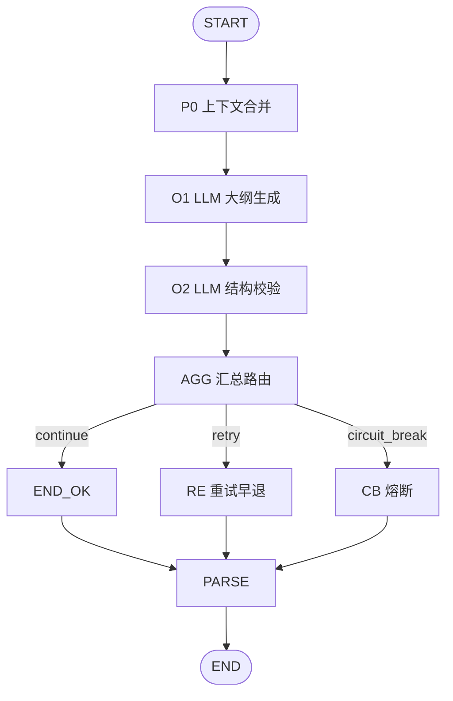

# Dify 大纲生成工作流 — 设计文档

> 工作流 ID：**`novel-outline-generation-v1`**  
> MCP Tool：**`novels_outline_generate`**  
> 关联：[DIFY-WORKFLOWS-INDEX.md](../DIFY-WORKFLOWS-INDEX.md) · [OUTLINE-PROMPT-DESIGN.md](./OUTLINE-PROMPT-DESIGN.md)

---

## 1. 设计目标与边界

### 1.1 目标

| 目标 | 说明 |
|------|------|
| **结构化大纲** | 输出符合 `OutlineDocument` 的分卷分章 + 节拍 |
| **知识库一致** | 与世界观/人物/地图设定对齐 |
| **可校验可重试** | O2 结构审读 + 方案 B 客户端重试 |
| **衔接章节生成** | 大纲 beats 作为章节工作流 `outline_beats` 输入 |

### 1.2 边界

- 不生成章节正文（章节工作流负责）
- 不修改知识库文件（客户端落盘 `outline/outline.json`）
- 不生成地图（世界观工作流负责）

### 1.3 部署形态

```
OutlineTreePanel（规划）
    → outline:generate IPC（待实现）
    → POST /workflows/run
    → outline.json 写入项目
```

> **状态**：Dify 资产与文档已就绪；Electron IPC `outline:generate` 为下一迭代对接项。

---

## 2. MCP 映射

| 原语 | 映射 | 资产 |
|------|------|------|
| Tool | `novels_outline_generate` | `dify/outline/mcp/tools/novels_outline_generate.json` |
| Input | outline-generate.input | `dify/outline/mcp/schemas/outline-generate.input.json` |
| Output | outline-generate.output | `dify/outline/mcp/schemas/outline-generate.output.json` |

---

## 3. 工作流拓扑



与章节工作流共用 **方案 B 重试**：Dify **不回连 O1**。

---

## 4. START 输入

| 变量 | 类型 | 必填 | 说明 |
|------|------|------|------|
| project_id | text | ✓ | 项目 UUID |
| knowledge_snapshot | text | ✓ | world/characters/factions/map/locations JSON |
| plot_memory | text | | 已有剧情记忆 |
| outline_brief | text | | 用户补充说明 |
| target_volumes | text | ✓ | 目标卷数，默认 1 |
| target_chapters | text | ✓ | 目标章数，默认 12 |
| genre | text | | 类型 |
| tone | text | | 基调 |
| max_retry | text | ✓ | 默认 3 |
| retry_count | text | | 默认 0 |
| retry_issues_formatted | text | | 重试注入 |

---

## 5. END 输出

| 字段 | 说明 |
|------|------|
| status | success / retry / circuit_break / error |
| outline_summary | 总纲文字 |
| outline_json | `OutlineDocument` JSON 字符串 |
| validation_report | O2 校验报告 JSON |
| retry_count | 当前重试次数 |
| retry_issues_formatted | 供 O1 下一轮注入 |

---

## 6. outline_json 结构

与 [`OutlineDocument`](../src/types/project.ts) 一致：

```typescript
{
  volumes: [{
    id: "vol-01",
    title: string,
    chapters: [{
      id: "ch-001",
      title: string,
      status: "draft",
      beats: [{ order: number, text: string }]
    }]
  }]
}
```

落盘路径：`{projectRoot}/outline/outline.json`

---

## 7. 与章节工作流关系


1. **世界观** → 填充 knowledge/map/locations  
2. **大纲** → 生成 outline beats  
3. **章节** → 消费 beats 写正文

---

## 8. 版本

| 版本 | 说明 |
|------|------|
| v1 | O1+O2+AGG+重试；MCP 契约 |
| v1.1（规划） | P0 合并现有 outline 增量修订模式 |
