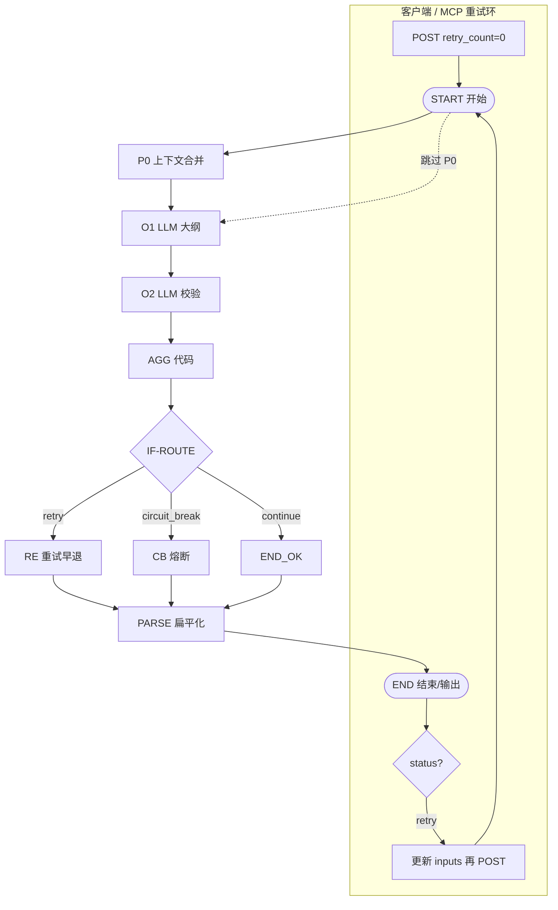

# Dify 大纲生成工作流 — 节点设计与流程

> 工作流：`novel-outline-generation-v1`  
> 应用类型：**Workflow（工作流）** · 非 Chatflow  
> **重试策略**：**方案 B — 客户端 Orchestration**（Dify **不回连 O1**；`route=retry` 早退 END，客户端再次 `POST`）  
> 详述：[DIFY-OUTLINE-WORKFLOW-MODULES-AND-PROCESS.md](./DIFY-OUTLINE-WORKFLOW-MODULES-AND-PROCESS.md) · 实现：[DIFY-OUTLINE-WORKFLOW-IMPLEMENTATION.md](./DIFY-OUTLINE-WORKFLOW-IMPLEMENTATION.md) · Prompt：[OUTLINE-PROMPT-DESIGN.md](./OUTLINE-PROMPT-DESIGN.md)

---

## 〇、画布重构要点（方案 B）

与章节工作流相同：Dify **禁止**条件分支连回已执行过的 O1。重试环在 **NovelsCreator / MCP** 实现。

```text
客户端 loop:
  POST workflow(inputs: retry_count=0, retry_issues_formatted="")
    → status=retry → 带上 outputs.retry_count / retry_issues_formatted 再 POST
    → status=success → 写入 outline/outline.json
    → status=circuit_break → Modal 人工介入
```

**画布上必须满足：**

1. **删除** `IF → O1` 回连线（若存在）。
2. **新增** Code 节点 `**RE`（Retry Handoff）**，粘贴 `dify/outline/code/outline_retry_end.py`。
3. **新增** Code 节点 `**CB`（Circuit Break）**，粘贴 `dify/outline/code/outline_cb_circuit_break.py`。
4. **新增** Code 节点 `**PARSE`**，粘贴 `dify/outline/code/outline_parse_end_outputs.py`；**RE / CB / END_OK** 均连 **PARSE → END**（勿直连 END）。
5. **条件分支** 三路：`retry` → **RE → PARSE → END**；`circuit_break` → **CB → PARSE → END**；`continue` → **END_OK → PARSE → END**。

**不需要** Dify「工作流变量」存 `retry_count`（改为 **开始节点输入**）。

---

## 一、节点总览

### 1.1 节点清单（11 个画布元素 · P0 可选）


| 序号  | 节点 ID    | Dify 节点类型 | 名称              | 是否 LLM |
| --- | -------- | --------- | --------------- | ------ |
| 0   | START    | 开始        | 工作流输入           | 否      |
| 1   | P0       | 代码        | 上下文合并（**可选**）   | 否      |
| 2   | O1       | LLM       | 全书大纲生成          | 是      |
| 3   | O2       | LLM       | 大纲结构校验          | 是      |
| 4   | AGG      | 代码        | 校验汇总与路由         | 否      |
| 5   | IF-ROUTE | 条件分支      | 通过/重试/熔断        | 否      |
| 6   | RE       | 代码        | 重试早退输出          | 否      |
| 7   | CB       | 代码        | 熔断输出            | 否      |
| 8   | END_OK   | 代码        | 成功输出组装          | 否      |
| 9   | PARSE    | 代码        | end_outputs 扁平化 | 否      |
| 10  | END      | 结束 / 输出   | 工作流输出           | 否      |


> 简化拓扑可 **跳过 P0**：`START → O1`，O1 直接读 `knowledge_snapshot`。

### 1.2 画布连线表


| 从        | 到        | 条件/说明                       |
| -------- | -------- | --------------------------- |
| START    | P0       | 使用 P0 时                     |
| START    | O1       | 跳过 P0 时                     |
| P0       | O1       | 始终                          |
| O1       | O2       | 始终                          |
| O2       | AGG      | 始终                          |
| AGG      | IF-ROUTE | 始终                          |
| IF-ROUTE | RE       | `route == retry`（**不回 O1**） |
| IF-ROUTE | CB       | `route == circuit_break`    |
| IF-ROUTE | END_OK   | `route == continue`         |
| RE       | PARSE    | 始终                          |
| CB       | PARSE    | 始终                          |
| END_OK   | PARSE    | 始终                          |
| PARSE    | END      | 始终                          |


### 1.3 拓扑图




---

## 二、节点详细设计

### START — 开始


| 项          | 内容                    |
| ---------- | --------------------- |
| **职责**     | 接收客户端 / MCP 传入的全部业务参数 |
| **类型**     | Dify「开始」              |
| **Prompt** | 无                     |


**输入变量（Dify 中建议全部设为「文本」；数字以 string 传入）**


| 变量名                    | 类型  | 必填  | 默认   | 说明                                                     |
| ---------------------- | --- | --- | ---- | ------------------------------------------------------ |
| project_id             | 文本  | ✓   |      | 项目 UUID                                                |
| knowledge_snapshot     | 文本  | ✓   |      | JSON 串：world / characters / factions / map / locations |
| plot_memory            | 文本  |     | `[]` | 已有剧情记忆 JSON                                            |
| outline_brief          | 文本  |     |      | 用户补充说明（类型偏好、禁忌、卷章结构 hint）                              |
| target_volumes         | 文本  | ✓   | `1`  | 目标卷数                                                   |
| target_chapters        | 文本  | ✓   | `12` | 目标章数（单章模式客户端传 `1`）                                      |
| volume_id              | 文本  |     | `vol-01` | 单章模式：目标卷 id                                           |
| next_chapter_id        | 文本  |     |      | 单章模式：待生成章 id，如 `ch-003`                                |
| generation_mode        | 文本  |     | `single_chapter` | `single_chapter` \| `full`                          |
| existing_volume_outline | 文本  |     | `{}` | 单章模式：本卷已有章节 JSON（canonical）                            |
| genre                  | 文本  |     |      | 类型，如「玄幻」「科幻」                                           |
| tone                   | 文本  |     |      | 基调，如「热血」「暗黑」                                           |
| max_retry              | 文本  | ✓   | `3`  | 最大重试次数                                                 |
| max_retry              | 文本  |     | `0`  | 客户端重试轮次；收到 `status=retry` 后传入上轮 `outputs.retry_count`  |
| retry_issues_formatted | 文本  |     | 空    | 客户端传入上轮 `outputs.retry_issues_formatted`，供 O1 修订       |


**Schema 权威来源**：`[dify/outline/mcp/schemas/outline-generate.input.json](../../dify/outline/mcp/schemas/outline-generate.input.json)`

**输出**：无（下游引用 `开始.xxx`）

---

### P0 — 上下文合并（可选）


| 项      | 内容                                                                                                         |
| ------ | ---------------------------------------------------------------------------------------------------------- |
| **职责** | 合并 knowledge + brief；检测是否已有 outline 增量修订                                                                   |
| **类型** | 代码（Python3）                                                                                                |
| **源码** | 可复用 `[dify/chapter/code/p0_context_merge.py](../../dify/chapter/code/p0_context_merge.py)` 简化版，或 **跳过 P0** |


| 输入                 | 来源    |
| ------------------ | ----- |
| knowledge_snapshot | START |
| outline_brief      | START |
| plot_memory        | START |


| 输出                   | 下游                                |
| -------------------- | --------------------------------- |
| merged_context       | O1（替代裸 knowledge_snapshot）        |
| has_existing_outline | O1（`true`/`false` 字符串，v1.1 增量模式用） |


> v1 可 **不建 P0**，O1 User Prompt 直接绑定 `开始 → knowledge_snapshot`。

---

### O1 — 全书大纲生成


| 项               | 内容                                                                                                 |
| --------------- | -------------------------------------------------------------------------------------------------- |
| **职责**          | 根据知识库与 brief 生成 `OutlineDocument` 结构 JSON                                                          |
| **类型**          | LLM                                                                                                |
| **Prompt**      | `[dify/outline/prompts/o1-outline-generate.md](../../dify/outline/prompts/o1-outline-generate.md)` |
| **模型**          | 强创作 + 结构 · GPT-4o / Claude Sonnet / DeepSeek-V3                                                    |
| **temperature** | **0.75**                                                                                           |
| **结构化输出**       | **开**（JSON）或 Prompt 要求仅 JSON                                                                       |
| **Jinja**       | **开**（USER）                                                                                        |
| **对话记忆**        | **关**                                                                                              |
| **上下文**         | **空**（勿开 RAG 除非 P0 已合并）                                                                            |


| 输入                     | 来源                                         |
| ---------------------- | ------------------------------------------ |
| project_id             | START                                      |
| knowledge_snapshot     | START（或 P0 → merged_context）               |
| plot_memory            | START                                      |
| outline_brief          | START                                      |
| target_volumes         | START                                      |
| target_chapters        | START                                      |
| genre                  | START                                      |
| tone                   | START                                      |
| retry_issues_formatted | **开始 → retry_issues_formatted**            |
| retry_count            | **开始 → retry_count**（可选，用于 Prompt 提示第几轮修订） |


| 输出                   | 下游                  |
| -------------------- | ------------------- |
| text → **o1_result** | O2、AGG、END_OK、RE、CB |


**输出 JSON 结构（O1 须严格遵守）**

```json
{
  "outline_summary": "200–500 字总纲",
  "outline": {
    "volumes": [{
      "id": "vol-01",
      "title": "第一卷 · 卷名",
      "chapters": [{
        "id": "ch-001",
        "title": "第一章 标题",
        "status": "draft",
        "beats": [
          { "order": 1, "text": "节拍：主角在港城发现密信…" }
        ]
      }]
    }]
  }
}
```

**约束摘要**


| 规则    | 说明                                            |
| ----- | --------------------------------------------- |
| id    | 卷 `vol-01`…；章 `ch-001`…（三位数字）                 |
| beats | 每章 **3–8** 条，每条 20–80 字                       |
| 章数    | 约等于 `target_chapters`（±2）                     |
| 一致性   | 与 `knowledge_snapshot.world.rules` 不冲突        |
| 重试    | 有 `retry_issues_formatted` 时 User 顶部注入「编辑驳回」块 |


**USER Prompt 模板（Jinja）**

```jinja2

## 编辑驳回（须修复）
{{ retry_issues_formatted }}


## 知识库
{{ knowledge_snapshot }}

## 剧情记忆
{{ plot_memory }}

## 要求
目标 {{ target_volumes }} 卷、约 {{ target_chapters }} 章
类型：{{ genre }} · 基调：{{ tone }}
补充：{{ outline_brief }}
```

**重试时**：单章模式只重写 `next_chapter_id` 一章；全书模式全大纲重写，优先修复 O2 驳回项。

---

### O2 — 大纲结构校验


| 项          | 内容                                                                                                 |
| ---------- | -------------------------------------------------------------------------------------------------- |
| **职责**     | 审读 O1 输出的结构、节拍质量、与知识库一致性                                                                           |
| **类型**     | LLM                                                                                                |
| **Prompt** | `[dify/outline/prompts/o2-outline-validate.md](../../dify/outline/prompts/o2-outline-validate.md)` |
| **模型**     | 强推理 · temperature **0.2**                                                                          |
| **结构化输出**  | **开**（JSON）                                                                                        |
| **Jinja**  | **开**（须绑定 generation_mode / existing_volume_outline 等） |
| **对话记忆**   | **关**                                                                                              |


| 输入                 | 来源                              |
| ------------------ | ------------------------------- |
| outline_json       | **O1X → outline_json**          |
| knowledge_snapshot | START                           |
| plot_memory        | START                           |
| target_chapters    | START                           |
| target_volumes     | START                           |
| generation_mode    | START                           |
| volume_id          | START                           |
| next_chapter_id    | START                           |
| existing_volume_outline | START                      |


| 输出                         | 下游  |
| -------------------------- | --- |
| text → **validate_result** | AGG |


**输出 JSON 字段**


| 字段                     | 类型      | 说明                                  |
| ---------------------- | ------- | ----------------------------------- |
| outline_valid          | boolean | 是否通过                                |
| outline_issues         | array   | `{ severity, location, message }[]` |
| structure_score        | number  | 0–100                               |
| beat_quality_score     | number  | 0–100                               |
| lore_consistency_score | number  | 0–100                               |
| chapter_count_ok       | boolean | 章数是否在 target±50% 内                  |
| volume_balance_ok      | boolean | 卷章分布是否合理                            |


**Hard Fail（outline_valid=false）**

- 详见 Prompt [`o2-outline-validate.md`](../../dify/outline/prompts/o2-outline-validate.md)：**单章模式**与**全书模式**规则不同  
- 全书模式：章数偏离 target ±50%、空泛 beats >30% 等  
- 单章模式：**不得**因 plot_memory 与 existing_volume_outline 不一致而熔断（以 existing_volume_outline 为准）

---

### AGG — 校验汇总


| 项      | 内容                                                                                                 |
| ------ | -------------------------------------------------------------------------------------------------- |
| **职责** | 解析 O2 JSON；计算 route；格式化 retry_issues                                                               |
| **类型** | 代码                                                                                                 |
| **源码** | `[dify/outline/code/outline_agg_validation.py](../../dify/outline/code/outline_agg_validation.py)` |


| 输入              | 来源                   | Dify 变量名          |
| --------------- | -------------------- | ----------------- |
| validate_result | O2 → text            | `validate_result` |
| retry_count     | **开始 → retry_count** | 转 int             |
| max_retry       | START                | 转 int             |
| outline_json    | O1 → text            | `outline_json`    |


> 输入变量名须与 `main()` 签名一致。代码会自动剥离 `` 再解析 JSON。


| 输出                     | 说明                                     |
| ---------------------- | -------------------------------------- |
| route                  | `continue` / `retry` / `circuit_break` |
| retry_count            | retry 时 +1                             |
| retry_issues_formatted | Markdown 列表，供 **下轮 START** / O1 注入     |
| outline_valid          | boolean                                |
| validation_report      | O2 完整 JSON 串                           |


**路由规则**

```
若 outline_valid → route = continue
否则若 retry_count < max_retry → route = retry, retry_count++
否则 → route = circuit_break
```

---

### IF-ROUTE — 条件分支


| 项      | 内容                            |
| ------ | ----------------------------- |
| **职责** | 按 AGG.route 三路分流（**禁止**连回 O1） |
| **类型** | 条件分支（IF/ELSE）                 |


| 条件        | 运算符           | 值               | 目标节点       |
| --------- | ------------- | --------------- | ---------- |
| AGG.route | **等于**        | `retry`         | **RE**     |
| AGG.route | **等于**        | `circuit_break` | **CB**     |
| AGG.route | **等于** / ELSE | `continue`      | **END_OK** |


---

### RE — 重试早退输出


| 项      | 内容                                                                                       |
| ------ | ---------------------------------------------------------------------------------------- |
| **职责** | 校验未通过且仍可重试；组装 `status=retry`                                                             |
| **类型** | 代码                                                                                       |
| **源码** | `[dify/outline/code/outline_retry_end.py](../../dify/outline/code/outline_retry_end.py)` |


| 输入                     | 来源                                      |
| ---------------------- | --------------------------------------- |
| outline_json           | O1 → text                               |
| outline_summary        | 从 O1 JSON 解析（可选 Code 中间节点，或 END_OK 前提取） |
| retry_count            | AGG                                     |
| outline_valid          | AGG                                     |
| retry_issues_formatted | AGG                                     |
| validation_report      | AGG                                     |


| 输出                  | 下游        |
| ------------------- | --------- |
| end_outputs（JSON 串） | **PARSE** |


**end_outputs.status** = `retry`；含 `retry_issues_formatted` 供客户端下轮 POST。

> **勿**使用章节版 `retry_end.py`（字段为 draft_text / lore_valid，与大纲契约不符）。

---

### CB — 熔断输出


| 项      | 内容                                                                                                     |
| ------ | ------------------------------------------------------------------------------------------------------ |
| **职责** | 重试达上限，输出可人工介入的结构                                                                                       |
| **类型** | 代码                                                                                                     |
| **源码** | `[dify/outline/code/outline_cb_circuit_break.py](../../dify/outline/code/outline_cb_circuit_break.py)` |


| 输入                | 来源        |
| ----------------- | --------- |
| outline_json      | O1        |
| outline_summary   | O1 解析（可选） |
| retry_count       | AGG       |
| outline_valid     | AGG       |
| validation_report | AGG       |


| 输出                  | 下游        |
| ------------------- | --------- |
| end_outputs（JSON 串） | **PARSE** |


**end_outputs.status** = `circuit_break`；`human_action_required` = true。

---

### END_OK — 成功输出组装


| 项      | 内容                                                                                           |
| ------ | -------------------------------------------------------------------------------------------- |
| **职责** | 组装 success 态 end_outputs                                                                     |
| **类型** | 代码                                                                                           |
| **源码** | `[dify/outline/code/outline_end_success.py](../../dify/outline/code/outline_end_success.py)` |


| 输入                | 来源                      |
| ----------------- | ----------------------- |
| outline_summary   | O1 JSON 字段（或中间 Code 提取） |
| outline_json      | O1 → text               |
| validation_report | AGG                     |
| retry_count       | **开始 → retry_count**    |


| 输出                  | 下游        |
| ------------------- | --------- |
| end_outputs（JSON 串） | **PARSE** |


---

### PARSE — end_outputs 扁平化


| 项      | 内容                                                                                                       |
| ------ | -------------------------------------------------------------------------------------------------------- |
| **职责** | 将 RE / CB / END_OK 的 `end_outputs` 拆为 END 可绑定的扁平变量                                                       |
| **类型** | 代码                                                                                                       |
| **源码** | `[dify/outline/code/outline_parse_end_outputs.py](../../dify/outline/code/outline_parse_end_outputs.py)` |


| 输入             | 来源                   |
| -------------- | -------------------- |
| re_end_outputs | RE → end_outputs     |
| cb_end_outputs | CB → end_outputs     |
| ok_end_outputs | END_OK → end_outputs |


**Dify 配置要点**

1. 三输入 **取消必填**，默认值 `""`
2. 单次 run 仅一路有值，另两路为空属正常
3. 若 Dify 强制非空，在 PARSE 前加 **变量聚合**（见 §五）


| 输出                                                        | 下游  |
| --------------------------------------------------------- | --- |
| status, circuit_break, human_action_required, retry_count | END |
| outline_summary, outline_json, validation_report          | END |
| retry_issues_formatted, workflow_version                  | END |


---

### END — 结束 / 输出


| 项      | 内容                        |
| ------ | ------------------------- |
| **职责** | 暴露给 API / MCP 的最终 outputs |
| **类型** | Dify「结束」                  |


**输出变量绑定（均 ← PARSE）**


| END 输出变量               | PARSE 字段               | 类型建议       |
| ---------------------- | ---------------------- | ---------- |
| status                 | status                 | 文本         |
| circuit_break          | circuit_break          | 文本 / 布尔    |
| human_action_required  | human_action_required  | 文本 / 布尔    |
| retry_count            | retry_count            | 数字         |
| outline_summary        | outline_summary        | 文本         |
| outline_json           | outline_json           | 文本（JSON 串） |
| validation_report      | validation_report      | 文本（JSON 串） |
| retry_issues_formatted | retry_issues_formatted | 文本         |
| workflow_version       | workflow_version       | 文本         |


**各路径字段有无**


| 字段                     | success | retry   | circuit_break |
| ---------------------- | ------- | ------- | ------------- |
| status                 | success | retry   | circuit_break |
| outline_json           | ✓       | ✓（上轮草稿） | ✓             |
| outline_summary        | ✓       | ✓       | ✓             |
| retry_issues_formatted | —       | ✓       | —             |
| validation_report      | ✓       | ✓       | ✓             |
| circuit_break          | false   | false   | true          |
| human_action_required  | false   | false   | true          |


> **勿**将 END 字段直连 O1 / O2 / AGG；**统一**从 **PARSE** 绑定。

**Schema 权威来源**：`[dify/outline/mcp/schemas/outline-generate.output.json](../../dify/outline/mcp/schemas/outline-generate.output.json)`

---

## 三、节点配置速查


| 节点  | 温度   | System                               | User                       | 结构化 JSON | Jinja |
| --- | ---- | ------------------------------------ | -------------------------- | -------- | ----- |
| O1  | 0.75 | `o1-outline-generate.md` → System 正文 | `o1-outline-user.jinja.md` | **开**    | **开** |
| O2  | 0.2  | `o2-outline-validate.md` → System 正文 | `o2-outline-user.jinja.md` | **开**    | 关     |


---

## 四、O1 中间提取（可选）

若 O1 输出整段 JSON，下游节点需要拆分字段，可在 O1 与 O2 之间加 Code 节点 **O1X**：


| 输出              | 用途            |
| --------------- | ------------- |
| outline_summary | END_OK        |
| outline_json    | O2、AGG、END_OK |
| outline 对象      | 仅内部           |


逻辑：解析 O1 text → 提取 `outline_summary` 与 `outline` 子对象序列化。

---

## 五、出口层（PARSE + END）


| 步   | 操作                                                               |
| --- | ---------------------------------------------------------------- |
| 1   | 添加 Code **PARSE**，粘贴 `outline_parse_end_outputs.py`              |
| 2   | **删除** RE/CB/END_OK 直连 END 的旧线                                   |
| 3   | **RE → PARSE**、**CB → PARSE**、**END_OK → PARSE**、**PARSE → END** |
| 4   | PARSE 三输入 **非必填** + 默认 `""`                                      |
| 5   | END 全部字段绑 **PARSE**                                              |
| 6   | 发布 → 调试 run → 确认 `status` 非空                                     |


### 5.1 变量聚合（Dify 报空时用）

```
RE.end_outputs ──┐
CB.end_outputs ──┼→ 【变量聚合】→ end_outputs → PARSE（单输入）
END_OK.end_outputs ─┘
```

`outline_parse_end_outputs.py` 的 `main(end_outputs=...)` 已支持单输入 fallback。

---

## 六、搭建顺序建议

1. **START** — 添加全部输入变量
2. **O1** — 粘贴 Prompt，开 Jinja + Structured Output
3. **O2** — 粘贴 Prompt，temperature 0.2
4. **AGG** — 粘贴 `outline_agg_validation.py`，核对四输入
5. **IF-ROUTE** — 三路条件
6. **RE / CB** — 粘贴 outline 专用 Code（**非**章节 shared 版）
7. **END_OK** — 粘贴 `outline_end_success.py`
8. **PARSE → END** — 按 §五 绑定
9. **发布** → curl / 客户端联调

---

## 七、与章节 N2a 的区别


| 维度   | O2 大纲校验         | N2a 章节校验         |
| ---- | --------------- | ---------------- |
| 对象   | 全书 outline JSON | 单章 draft 对 beats |
| 时机   | 大纲生成后           | 章节初稿后            |
| 输出产物 | outline_json    | novel_body       |
| 并行   | 无（O1→O2 串行）     | 与 N2b 并行         |


---

## 八、相关文件


| 类型            | 路径                                                      |
| ------------- | ------------------------------------------------------- |
| Code          | `dify/outline/code/*.py`                                |
| Prompt        | `dify/outline/prompts/o1-*.md`, `o2-*.md`               |
| MCP 输入 Schema | `dify/outline/mcp/schemas/outline-generate.input.json`  |
| MCP 输出 Schema | `dify/outline/mcp/schemas/outline-generate.output.json` |
| 客户端类型         | `src/types/project.ts` → `OutlineDocument`              |


---

*文档版本：v1.0 · 方案 B · 与 novel-outline-generation-v1 对齐*