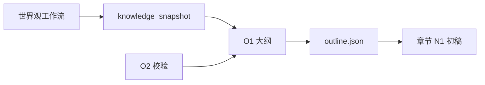

# 大纲生成 Prompt 设计

> O1/O2 节点 Prompt  
> 模板：[`dify/outline/prompts/o1-outline-generate.md`](../../dify/outline/prompts/o1-outline-generate.md) · [`o2-outline-validate.md`](../../dify/outline/prompts/o2-outline-validate.md)

---

## 1. 体系位置



---

## 2. O1 — 大纲生成

| 项 | 说明 |
|----|------|
| 文件 | `o1-outline-generate.md` |
| 温度 | 0.75 |
| 输出 | JSON：outline_summary + outline |
| 重试注入 | `retry_issues_formatted` 块 |

**节拍规则**：每章 3–8 条；写事件不写正文；id 固定格式。

---

## 3. O2 — 结构校验

| 项 | 说明 |
|----|------|
| 文件 | `o2-outline-validate.md` |
| 温度 | 0.2 |
| Structured Output | 开 |

**Hard Fail**：beats 过少/过多、id 重复、与 world.rules 冲突、空泛节拍超 30%

---

## 4. 输入变量与 knowledge_snapshot

客户端组装 snapshot 应含：

```json
{
  "world": { "title", "rules", "era" },
  "characters": [...],
  "factions": [...],
  "map": { "name", "regions" },
  "locations": [...]
}
```

与章节工作流 `buildGenerationPayload` 同源。

---

## 5. 重试 Prompt 注入

O1 User 顶部：

```markdown
## 编辑驳回（必须修复）
{{ retry_issues_formatted }}
```

格式由 AGG 生成，与章节 N1 相同。

---

## 6. 示例 beats

**合格：**

```json
{ "order": 1, "text": "林渊在港城码头截获密信，发现商会与驻军暗中通款" }
```

**不合格：**

```json
{ "order": 1, "text": "推进主线" }
```

---

## 7. 维护

| 变更 | 更新 |
|------|------|
| OutlineDocument 字段 | o1 + project.ts |
| 校验 Rubric | o2 + outline_agg_validation.py |
