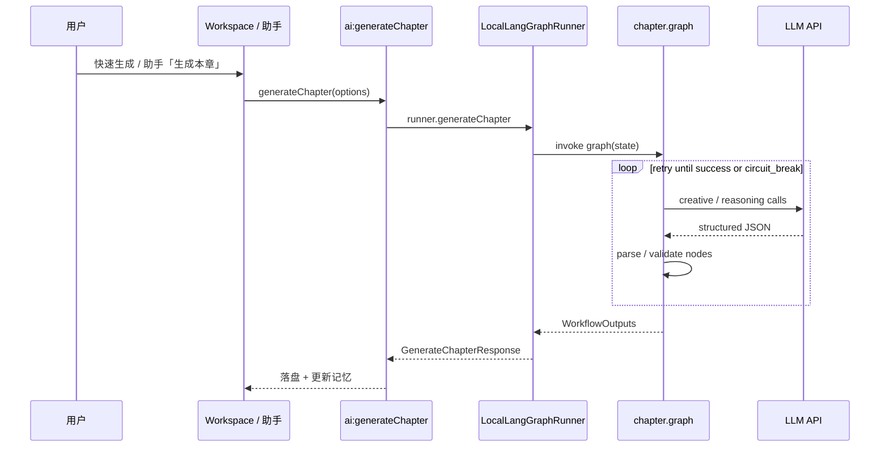

# v1.0 目标架构

## 1. 模块划分（相对 v0.x）

| 模块 ID | v0.x | v1.0 |
|---------|------|------|
| M08 AI 生成编排 | 调 Dify HTTP + 客户端 retry | 调 **WorkflowRunner** + 客户端 retry（可内聚进 Graph） |
| M09 工作流 | **Dify 服务端** | **Main 进程 LangGraph**（默认） |
| **M13** | — | **小说助手**（**Deep Agents Harness**） |
| M12 配置 | Dify BaseURL + 4 Key | **LLM 单 Key + 双模型**；Dify 折叠为高级 |

其余 M01～M07、M10～M11 **基本保留**。

## 2. WorkflowRunner 接口（核心抽象）

建议在 `electron/main/workflows/workflow-runner.types.ts` 定义：

```typescript
export type WorkflowKind = 'chapter' | 'outline' | 'knowledge' | 'society'

export interface WorkflowRunner {
  readonly engineId: 'local' | 'dify'
  generateChapter(options: GenerateChapterOptions): Promise<GenerateChapterResponse>
  generateOutline(
    options: GenerateOutlineOptions,
    onProgress?: (p: OutlineGenerationProgress) => void
  ): Promise<GenerateOutlineResponse>
  generateKnowledge(options: GenerateKnowledgeOptions): Promise<GenerateKnowledgeResponse>
  generateSociety(req: WorldSocietyGenerateRequest): Promise<WorldSocietyGenerateResponse>
  testConnection(slot?: WorkflowKind): Promise<HealthCheckResponse>
}
```

- `LocalLangGraphRunner` — v1.0 默认  
- `DifyWorkflowRunner` — 从现有 `dify.service.ts` 抽出  

IPC 层 `ai:generateChapter` 等 **委托给 runner 工厂**，而非直接 `dify:*`。

## 3. 目录结构（新增规划）

```text
electron/main/
├── workflows/
│   ├── workflow-runner.types.ts
│   ├── workflow-runner.factory.ts      # 读 config.ai.engine
│   ├── local/
│   │   ├── llm-provider.ts             # baseURL + key + model
│   │   ├── prompt-loader.ts            # 读 dify prompts
│   │   ├── graphs/
│   │   │   ├── chapter.graph.ts
│   │   │   ├── outline.graph.ts
│   │   │   ├── knowledge.graph.ts
│   │   │   └── society.graph.ts
│   │   └── nodes/                      # 移植 dify code
│   │       ├── chapter/
│   │       ├── outline/
│   │       └── ...
│   └── dify/
│       └── dify-workflow-runner.ts     # 原 dify.service 薄封装
├── agent/                              # Deep Agents Harness
│   ├── novel-assistant.service.ts      # createDeepAgent 工厂
│   ├── checkpointer.ts                 # 会话持久化
│   ├── tools/                          # LangChain tool() 定义
│   │   ├── read-knowledge.tool.ts
│   │   ├── read-outline.tool.ts
│   │   ├── read-memory.tool.ts
│   │   ├── generate-chapter.tool.ts    # → WorkflowRunner
│   │   └── ...
│   └── prompts/
│       └── assistant-system.md
├── services/
│   ├── dify.service.ts                 # @deprecated → 迁入 dify runner
│   └── ...
```

Renderer 新增（规划）：

```text
src/
├── components/agent/
│   ├── NovelAssistantPanel.vue         # 助手对话 / 快捷指令
│   └── AssistantSuggestionChip.vue
├── stores/
│   └── assistant.store.ts
```

## 4. 数据流（章节生成示例）



## 5. 配置模型

`AppConfig` 扩展（规划）：

```typescript
interface AiConfig {
  engine: 'local' | 'dify'
  local?: {
    baseUrl: string
    creativeModel: string
    reasoningModel: string
  }
  dify?: {
    baseUrl: string
    // 四槽 key 保留
  }
}
```

密钥存储：`llm-secrets.bin`（与 `dify-secrets.bin` 并列或合并为 `ai-secrets.bin`）。

## 6. IPC / Preload 演进

| v0.x | v1.0 建议 |
|------|-----------|
| `dify:generateChapter` | `ai:generateChapter`（内部路由） |
| `dify:generateOutline` | `ai:generateOutline` |
| `config:setDify` | `config:setAi`（含 engine 切换） |
| — | `agent:chat` / `agent:runTool` |

过渡期 **保留 `dify:*` alias** 一版，标记 deprecated。

## 7. 小说助手在架构中的位置

助手由 **`createDeepAgent`（deepagents Harness）** 驱动，底层为 LangGraph 编译图。

- **不**使用 Harness 默认磁盘 FS / shell Tools  
- 只读 / 生成：经 **自定义 LangChain Tools** → `project-files.service` / `WorkflowRunner`  
- **菜单直出**的生成 **不经过** Harness  

详见 [06-NOVEL-ASSISTANT-AGENT.md](./06-NOVEL-ASSISTANT-AGENT.md)。

## 8. 安全边界

- API Key 仅 Main 进程；Renderer 经 IPC  
- Harness **禁用**对项目目录外的文件访问；generate_* 走 **HITL**  
- 助手 thread 存 `userData/assistant-sessions/`，不进项目 Git  
- 工作流图与助手图 **分离**，避免助手误改 retry 拓扑
