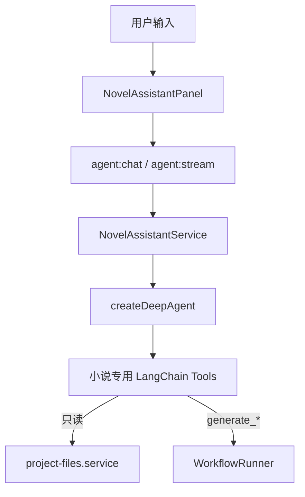

# 小说助手智能体（Deep Agents Harness）

> v1.0 **已定案**：助手层采用 **[Deep Agents](https://docs.langchain.com/oss/javascript/deepagents/overview)**（`deepagents` npm），  
> 而非自写 LangGraph ReAct。四条生成管线仍由 **WorkflowRunner + LangGraph 工作流图** 执行。

---

## 1. 定位

| 不是 | 是 |
|------|-----|
| 替代 Monaco 的正文编辑器 | 创作 **副驾驶**（Copilot） |
| 无限制自动写全书 | 在用户 **明确指令** 下调用生成 Tool |
| 第二个 ChatGPT 网页 | **绑定当前项目** 的设定 / 大纲 / 记忆 |
| 另一条 Dify 工作流 | **Harness 智能体** + 专用 Tools |

**产品句**：「懂你这本书的助手，帮你决定下一步写什么、并一键生成。」

---

## 2. 为何选 Harness

| 能力 | 自写 ReAct | Deep Agents Harness |
|------|------------|---------------------|
| Tool 调用循环 | 需自研 | 内置 |
| 任务规划 / todos | 需自研 | 内置 `write_todos` 等 |
| 长对话压缩 | 需自研 | 内置 middleware |
| 子任务委派 | 需自研 | 可选 subagent / `task` tool |
| Human-in-the-loop | 需自研 | `interrupt_on` 等 |
| 与 LangGraph 生态 | 手写 graph | `createDeepAgent` 返回 **可 stream 的 LangGraph** |

---

## 3. 用户可见能力（v1.0 MVP）

### 3.1 问答（只读 Tools）

- 「主角目前性格设定是什么？」→ `get_knowledge_snapshot`  
- 「上一章发生了什么？」→ `get_plot_memory`  
- 「大纲里第三章节拍有哪些？」→ `get_outline_excerpt`  

### 3.2 建议（Harness 推理 + 只读 Tools）

- 「下一章建议写什么冲突？」  
- 「有哪些未回收伏笔？」  

### 3.3 动作（generate_* Tools + HITL）

| 用户说法 | Tool | 后续 |
|----------|------|------|
| 「根据大纲生成第三章」 | `generate_chapter` | HITL 确认 → `WorkflowRunner` |
| 「帮我扩写知识库里的势力」 | `generate_knowledge` | 确认 → runner → 合并设定 |
| 「生成本卷剩余大纲」 | `generate_outline` | 确认 → runner |
| 「根据领土生成国家设定」 | `generate_society` | 确认 → runner |

**原则**：`generate_*` 默认 **interrupt 等待用户确认**（Harness HITL + 客户端弹窗）。

### 3.4 UI

- Activity Bar **助手** 入口 → `NovelAssistantPanel`  
- 快捷 chips：「检查伏笔」「生成本章」「大纲建议」  
- 可选展示 Harness **todo / plan** 步骤（来自 agent 状态）

---

## 4. 架构



```text
createDeepAgent(...)  ──returns──►  Compiled LangGraph
                                      │
                    ┌─────────────────┼─────────────────┐
                    ▼                 ▼                 ▼
              内置 planning      自定义 Tools      checkpointer
              (可选用/限制)     (小说域)         (按 projectId)
```

---

## 5. 实例化（实现参考）

文件：`electron/main/agent/novel-assistant.service.ts`

```typescript
import { ChatOpenAI } from '@langchain/openai'
import { createDeepAgent } from 'deepagents'
import { buildNovelAssistantTools } from './tools'
import { loadAssistantSystemPrompt } from './prompts/assistant-system'
import { createAssistantCheckpointer } from './checkpointer'

export function createNovelAssistant(deps: {
  baseUrl: string
  apiKey: string
  model: string
  projectId: string
  workflowRunner: WorkflowRunner
}) {
  const model = new ChatOpenAI({
    model: deps.model,
    apiKey: deps.apiKey,
    configuration: { baseURL: deps.baseUrl }
  })

  const tools = buildNovelAssistantTools({
    projectId: deps.projectId,
    runner: deps.workflowRunner
  })

  return createDeepAgent({
    model,
    tools,
    systemPrompt: loadAssistantSystemPrompt(deps.projectId),
    // 禁用对真实磁盘的默认 FS；见 §6
    backend: /* StateBackend 或自定义 */,
    interruptOn: {
      generate_chapter: true,
      generate_outline: true,
      generate_knowledge: true,
      generate_society: true
    }
  })
}
```

> 具体 API 字段以 spike 时 `deepagents@1.x` 文档为准（`interruptOn` / `backend` 命名可能随版本调整）。

---

## 6. 安全：禁用 Harness 默认文件系统

Deep Agents 默认可能提供 `read_file` / `write_file` / `execute` 等。**桌面小说 IDE 必须限制**：

| 策略 | 说明 |
|------|------|
| **不用 FilesystemBackend** | 勿让助手任意读写用户磁盘 |
| **StateBackend** | 助手「虚拟 FS」仅存于会话 state（若需要 scratchpad） |
| **仅注册小说 Tools** | 项目数据只经 `project-files.service` 与明确 rootPath |
| **generate_* 必 HITL** | 防止误触高成本生成 |
| **write_* / patch_* / update_* 必 HITL** | 防止误改项目文件 |
| **写后 syncProjectAfterAssistantEdit** | 刷新 knowledge 约束、beats→memory，降低 retry/熔断 |
| **路径校验** | Tool 内 assert `rootPath === currentProject.rootPath` |

Harness **不提供**「读整本小说任意路径」的通用 shell；能力白名单由 `buildNovelAssistantTools` 控制。

---

## 7. Tool 清单

使用 LangChain `tool()` + Zod schema 定义，注册到 `createDeepAgent({ tools })`：

| Tool 名 | 类型 | 实现 |
|---------|------|------|
| `get_project_summary` | 读 | 当前项目 meta + 选中章 |
| `get_knowledge_snapshot` | 读 | 同章节生成 snapshot |
| `get_outline_excerpt` | 读 | volume / chapter 片段 |
| `get_plot_memory` | 读 | 过滤后 memory JSON |
| `get_chapter_preview` | 读 | novel.txt 前 N 字 |
| `read_chapter_text` | 读 | 章节正文/视频稿 |
| `read_character` | 读 | 单个人物 JSON |
| `write_chapter_text` | 写 | 覆盖/追加正文（HITL + 同步） |
| `patch_outline_chapter` | 写 | 改标题/节拍（HITL + 同步） |
| `update_character` | 写 | 改人物字段（HITL + 同步） |
| `update_plot_memory` | 写 | 改摘要/伏笔（HITL + 同步） |
| `generate_outline` | 写 | → `workflowRunner.generateOutline` |
| `generate_knowledge` | 写 | → `generateKnowledge` |
| `generate_chapter` | 写 | → `generateChapter` |
| `generate_society` | 写 | → `generateSociety` |
| `list_open_foreshadowing` | 读 | 解析 memory.foreshadowing |

**不注册**：Harness 默认 web search、真实 shell、任意路径文件 Tool（除非后续显式加 MCP 且白名单）。

---

## 8. System Prompt

文件：`electron/main/agent/prompts/assistant-system.md`

```markdown
你是 NovelsCreator 小说助手，服务于长篇创作。

规则：
1. 仅基于工具返回的项目数据回答；无数据时说明「请先完善设定/大纲」。
2. 调用 generate_* 前，用一句话说明将要做什么；系统会要求用户确认。
3. 不编造已生成章节正文；不泄露 API Key。
4. 不要使用未提供的工具访问文件系统或网络。
5. 回答使用用户语言（默认中文），简洁、对创作有用。
```

动态注入：`project.name`、`chapterId`、`ai.engine`。

---

## 9. 与 LangGraph 工作流的关系

```text
  用户 ──► Harness (助手 LangGraph)
              │
              │ generate_chapter tool
              ▼
         WorkflowRunner
              │
              ▼
         chapter.graph (另一条 LangGraph)
```

- **菜单 / 快捷键 / 向导** → 直接 `WorkflowRunner`（**不经过** Harness）  
- **助手** → Harness 决策 → Tool → **同一** Runner  
- 两条 LangGraph **嵌套协作**，不是合并成一张图  

---

## 10. 状态与存储

| 数据 | 存储 |
|------|------|
| 助手 thread | LangGraph checkpointer → `userData/assistant-sessions/{projectId}/{threadId}.json` |
| 用户偏好 | `AppConfig.assistant`（是否展示 plan、是否自动打开助手） |

流式：`agent.stream` → IPC `agent:token` → `NovelAssistantPanel` 逐字渲染（v1.0 建议实现）。

---

## 11. IPC

```typescript
agent: {
  chat: (req: { message: string; projectId: string; threadId?: string }) =>
    Promise<AssistantChatResponse>
  stream: (req: ..., onToken) => () => void  // 取消订阅
  resume: (req: { threadId: string; approved: boolean }) => Promise<...>  // HITL 确认 generate
  clearThread: (projectId: string, threadId: string) => Promise<void>
  listSuggestedActions: (projectId: string) => Promise<AssistantSuggestion[]>
}
```

---

## 12. UI 线框

```text
┌─ 助手 ─────────────────────────────┐
│ [检查伏笔] [生成本章] [大纲建议]      │
├────────────────────────────────────┤
│ 📋 计划：1.读大纲 2.读记忆 3.建议   │  ← 可选，Harness todos
├────────────────────────────────────┤
│ 用户：第三章可以怎么开场？            │
│ 助手：根据大纲节拍 1…                │
│ [输入消息…              ] [发送]    │
└────────────────────────────────────┘
```

---

## 13. v1.0 MVP 与后续

| v1.0 MVP | v1.1+ |
|----------|-------|
| `createDeepAgent` + 10 个小说 Tools | 专用 subagent（「伏笔审查员」） |
| HITL 确认 generate_* | 细粒度 interrupt 配置 |
| 文本 / 流式 UI | 点击引用跳转大纲节 |
| StateBackend | 可选本地 RAG（设定向量检索） |

---

## 14. 验收（助手专项）

- [x] Harness 实例化成功，无默认 FS 越权读写  
- [x] 只读问答正确引用 knowledge / memory / outline  
- [x] `generate_chapter` 触发 HITL，确认后与菜单生成结果一致  
- [x] 未配置 API Key 时友好提示  
- [x] 对话 thread 可清空、可跨会话恢复（checkpointer + transcript 落盘）  
