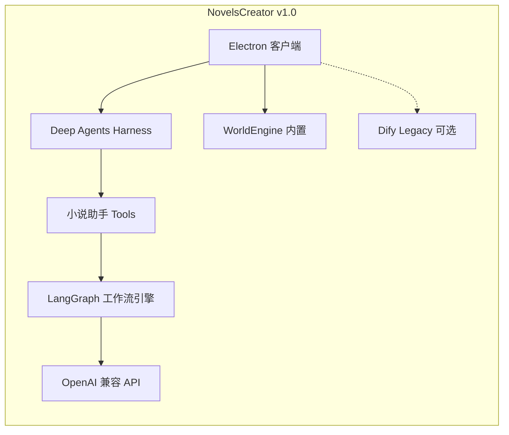

# NovelsCreator v1.0 正式版

> **状态**：**v1.0.0 已发布**（发行说明见 [RELEASE-NOTES-v1.0.0.md](./RELEASE-NOTES-v1.0.0.md)）  
> **主题**：内置 **LangGraph** 工作流 + **Deep Agents Harness** 小说助手；Dify 为 **Legacy 高级模式**

---

## 文档索引

| 文档 | 说明 |
|------|------|
| [01-VISION.md](./01-VISION.md) | v1.0 产品愿景、与 v0.x 差异、非目标 |
| [02-TECH-ROUTE.md](./02-TECH-ROUTE.md) | 技术路线：LangGraph 工作流 + deepagents 助手 |
| [03-ARCHITECTURE.md](./03-ARCHITECTURE.md) | 目标架构：WorkflowRunner、Harness、IPC |
| [04-IMPLEMENTATION-PHASES.md](./04-IMPLEMENTATION-PHASES.md) | 分阶段实现（Phase 0～3 已完成） |
| [05-REPLACEMENT-MATRIX.md](./05-REPLACEMENT-MATRIX.md) | v0.x → v1.0 文件与模块对照表 |
| [06-NOVEL-ASSISTANT-AGENT.md](./06-NOVEL-ASSISTANT-AGENT.md) | 小说助手：Tools、HITL、会话持久化 |
| [07-MIGRATION-USER-GUIDE.md](./07-MIGRATION-USER-GUIDE.md) | v0.x → v1.0 迁移 |
| [08-ACCEPTANCE-CRITERIA.md](./08-ACCEPTANCE-CRITERIA.md) | 验收标准与 E2E 清单 |
| [FULL-FLOW-TEST.md](./FULL-FLOW-TEST.md) | 全流程测试手册 |
| [LANGGRAPH-STUDIO.md](./LANGGRAPH-STUDIO.md) | LangGraph Studio 调试 |
| [RELEASE-NOTES-v1.0.0.md](./RELEASE-NOTES-v1.0.0.md) | **v1.0.0 发行说明** |

---

## 架构简图（v1.0 正式）

---

## 相关文档

- [DEVELOPMENT.md](../app/DEVELOPMENT.md) — 客户端开发文档
- [USER-GUIDE.md](../app/USER-GUIDE.md) — 用户手册
- [deploy/dify/README.md](../../deploy/dify/README.md) — Dify Legacy DSL 导入
- [DIFY-WORKFLOWS-INDEX.md](../DIFY-WORKFLOWS-INDEX.md) — 四条工作流契约

---

## 维护约定

- **契约基准**：`dify/mcp/schemas` 与 `fixtures`；Local 与 Legacy 输出字段须对齐。
- **版本号**：`package.json` / `APP_VERSION` / 关于页统一为 **1.0.0**；Git tag **`v1.0.0`**。
- 实现变更请同步更新本目录与 [RELEASE-NOTES-v1.0.0.md](./RELEASE-NOTES-v1.0.0.md)。
