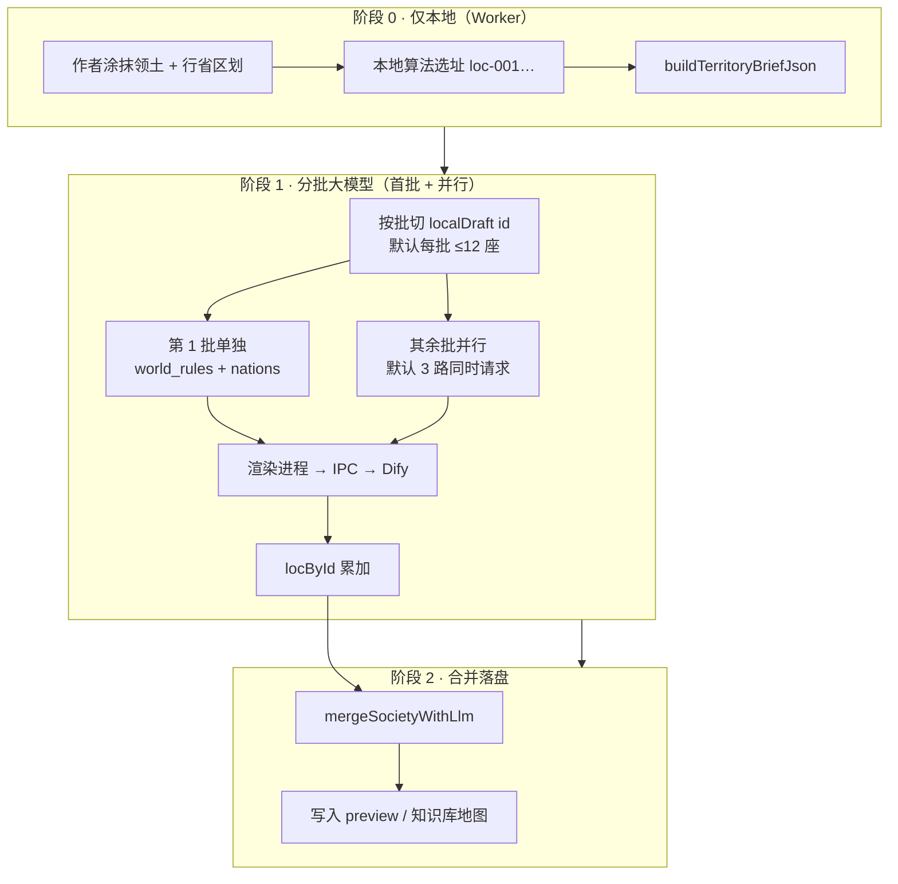

# 社会层润色 · 分批全流程（客户端 + Dify）

> 目标：在**世界规则**与**地图坐标已定**的前提下，为大模型只分配「取名 + 写设定」，按批请求 Dify，批批累加，直到全部城市润色完成。

---

## 1. 总览

| 步骤 | 谁执行 | 输入 | 输出 |
|------|--------|------|------|
| 本地选址 | Worker | 世界规则、hex 领土、气候/发展 | `locations[]`（id、x、y、type、本地简介） |
| 领土摘要 | 主线程/Worker | 上一步 + 地图 | `territoryBriefJson`（含 `localDraftLocations`） |
| **第 N 批** | 主进程调 Dify | 本批 brief（`local_location_count`=本批城数） | `society_json` / `locations_json` |
| 对齐累加 | 渲染进程 | 本批 LLM + 本批 chunk id | 更新 `locById`（**不改坐标**） |
| 最终合并 | 渲染进程 | 全部批次的 `locById` + 首批 `nations`/`world_rules` | 更新国名、城市名、description |

**「返回后端」** 在本项目指：每一批由 **Electron 主进程** 调用 `POST /workflows/run`，把 Dify END 的 JSON 经 IPC 还给渲染进程；**不是**每批写数据库。全部批完成后一次性 `applySocietyToPreview`。

---

## 2. 单批 Dify 输入（与画布变量一致）

| 变量 | 来源 |
|------|------|
| `territory_json` | `buildTerritoryBriefForLocationIds` 裁切后的 JSON |
| `local_location_count` | **本批**城市数（如 8），不是全图总数 |
| `creative_brief` | `world-society.service.ts` → `buildLlmBrief` |
| `nations_outline_json` | 各国 id/name |
| `projectConfig.societyBatch` | `{ batchIndex, batchCount, totalCount }` |

Prompt 要求（须同步到 Dify USER 节点）：

- 本批 `locations` 条数 **= local_location_count**
- 每条 **保留** `localDraftLocations` 的 `id/x/y/type/terrain/nationId`
- **只润色** `name`、`description`（及首批的 `nations`、`world_rules`）

模板文件：`dify/world/prompts/w2-territory-society.md`（System）、`w2s-user.jinja.md`（User）。

---

## 3. 单批 Dify 输出（END 必须接 PARSE）

推荐链路：`W2S → W2SX → END_OK → PARSE → END`

END 应输出（客户端兼容 `*String` 后缀）：

- `society_json`：含 `world_rules`、`nations`、`locations`
- 或分拆的 `nations_json`、`locations_json`、`world_rules`

**无效批（你截图中的情况）**：

- `society_json` 仅几十字、`nations_json`/`locations_json` 为 `[]`（2 字）→ 主进程判 `ok: false`
- 客户端：**记录该批失败，继续下一批**；若全部失败则保留本地简介并提示检查 END

排查：`dify/world/DIFY-END-NODE-CHECKLIST.md`

---

## 4. 客户端实现索引

| 文件 | 职责 |
|------|------|
| `src/workers/world-society.worker.ts` | 本地选址 + 全量 `territoryBriefJson` |
| `src/views/WorldGeneratorView.vue` | `fetchSocietyLlmPayload` 分批串行、累加、合并 |
| `src/utils/world-territory-society.ts` | `fetchSocietyLlmPayloadBatched`、默认每批 12 座、并行 3 路、`alignLlmPatchesToLocalChunk` |
| `electron/main/services/world-society.service.ts` | 组装 inputs、调 Dify、解析 END |
| `electron/main/utils/world-dify-parse.ts` | 从 END/PARSE 多种形状提取 JSON |

模拟自检：`npm run test:society-flow`

---

## 5. 与「重新生成」的关系

- 每次点击会 **重新跑本地选址**（Worker），再 **从头分批** 调 Dify。
- 已成功批次的文案在当次运行中累加在 `locById`；Dify 某批失败不会中断后续批次（除非单批模式且该批完全失败）。
- 全部完成后状态行显示：`润色 X/Y 座`、`对齐 N 条`、失败/缺条批次数。
