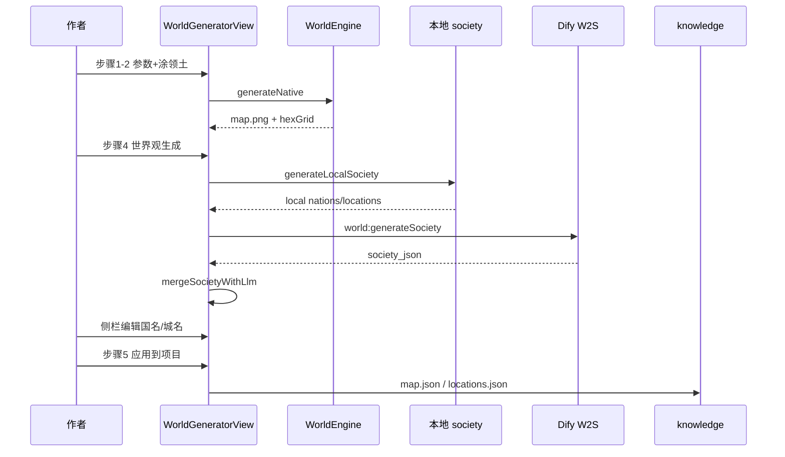

# NovelsCreator — 世界观生成工作流模块与流程设计

> 面向 Dify 画布搭建的 **模块划分、数据流、流程实现、MCP 契约** 总文档。  
> 地图由 **WorldEngine** 本地完成；本工作流仅负责 **领土已绘后的社会层**。  
> 关联：[DIFY-WORKFLOW-DESIGN.md](./DIFY-WORKFLOW-DESIGN.md) · [DIFY-WORKFLOW-IMPLEMENTATION.md](./DIFY-WORKFLOW-IMPLEMENTATION.md) · [PROMPT-DESIGN.md](./PROMPT-DESIGN.md)

---

## 目录

1. [文档说明与阅读路径](#1-文档说明与阅读路径)
2. [应用类型说明](#2-应用类型说明)
3. [工作流总览](#3-工作流总览)
4. [模块体系（6 模块）](#4-模块体系6-模块)
5. [模块详细设计](#5-模块详细设计)
6. [端到端流程设计](#6-端到端流程设计)
7. [数据流与变量字典](#7-数据流与变量字典)
8. [Dify 画布搭建顺序](#8-dify-画布搭建顺序)
9. [MCP 协议映射（模块级）](#9-mcp-协议映射模块级)
10. [与 NovelsCreator 客户端对接](#10-与-novelscreator-客户端对接)
11. [验收与测试流程](#11-验收与测试流程)

---

## 1. 文档说明与阅读路径

| 读者目标 | 阅读章节 |
|----------|----------|
| 在 Dify 搭节点 | §4、§5、§8 |
| 理解完整链路 | §6 |
| 对接 Electron / MCP | §7、§9、§10 |
| 联调验收 | §11 |

| 项 | 值 |
|----|-----|
| workflow_id | `novel-world-society-v1` |
| MCP Tool | `novels_world_society_generate` |
| generation_mode | `territory_society` |
| Schema | JSON Schema 2020-12 |

---

## 2. 应用类型说明

须使用 **Workflow**，不是 Chatflow：

| 维度 | Chatflow（勿用） | 目标 Workflow |
|------|------------------|---------------|
| 入口 | 用户输入 query | **开始**（14 个 inputs） |
| 出口 | 直接回复 text | **结束**（society_json 等） |
| 调用 | 对话 API | `POST /workflows/run` |
| 编排 | 单 LLM | W2S + 3 个 Code 节点 |

---

## 3. 工作流总览

### 3.1 逻辑架构

```
┌────────────────────────────────────────────────────────┐
│  M0 接入层     START ← HTTP / world:generateSociety    │
├────────────────────────────────────────────────────────┤
│  M1 生成层     W2S LLM（社会层 JSON）                    │
├────────────────────────────────────────────────────────┤
│  M2 解析层     W2SX 剥思考链 / 拆 society_json           │
├────────────────────────────────────────────────────────┤
│  M3 组装层     END_OK → end_outputs                      │
├────────────────────────────────────────────────────────┤
│  M4 出口层     PARSE → END outputs                       │
└────────────────────────────────────────────────────────┘
         ▲
         │ territory_json + creative_brief
         │
┌────────┴───────────────────────────────────────────────┐
│  客户端（Workflow 外）                                    │
│  WorldEngine 地图 → 六边形涂领土 → generateLocalSociety  │
│  → mergeSocietyWithLlm → 作者编辑 → knowledge 落盘       │
└────────────────────────────────────────────────────────┘
```

---

## 4. 模块体系（6 模块）

| 模块 | 节点 | 职责 |
|------|------|------|
| **M0 接入** | START | 接收 string inputs |
| **M1 生成** | W2S | LLM 社会层 JSON |
| **M2 解析** | W2SX | 规范化 JSON 字符串 |
| **M3 组装** | END_OK | end_outputs 打包 |
| **M4 出口** | PARSE → END | API outputs |
| **M5 客户端** | （Workflow 外） | 本地生成、合并、编辑、持久化 |

---

## 5. 模块详细设计

### M0 · START

- 14 个 String 入参，见 [NODES § START](./DIFY-WORKFLOW-NODES-AND-FLOW.md#start--开始)
- `generation_mode` 必须为 `territory_society`

### M1 · W2S

- 唯一 LLM 节点
- Prompt：[PROMPT-DESIGN.md](./PROMPT-DESIGN.md)
- 输出根 JSON：`world_rules`, `nations`, `locations`

### M2 · W2SX

- 输入：W2S 整段 text
- 输出：4 个 String 字段供 END_OK

### M3 · END_OK

- 合并 W2SX + `workflow_version`
- 输出单一 `end_outputs` JSON 串

### M4 · PARSE → END

- 扁平化供 Electron `data.outputs` 读取
- 客户端优先读 `society_json`

### M5 · 客户端（Workflow 外）

| 函数 | 文件 |
|------|------|
| `buildTerritoryBriefJson` | `world-territory-society.ts` |
| `generateLocalSociety` | 同上 |
| `runTerritorySocietyLlm` | `world-society.service.ts` |
| `mergeSocietyWithLlm` | `world-territory-society.ts` |
| `WorldGeneratorView` | 五步向导 UI |

---

## 6. 端到端流程设计



**合并规则**

| 数据 | LLM 覆盖 |
|------|----------|
| nation 文案字段 | 是（按 id） |
| locations | 条件（≥40% 合法则采用） |
| hexGrid / 地形 | 否 |

---

## 7. 数据流与变量字典

### 7.1 territory_json（客户端 → START）

由 `buildTerritoryBriefJson()` 生成，含：

- `projectConfig`：worldName, era, atmosphere, scale, climate, cityCount, seed, …
- `nations[]`：landHexCount, avgHeat, avgWet, avgDevelopment, developmentTier, environmentalProfile, traits, …

### 7.2 creative_brief

`world-society.service.ts` 的 `buildLlmBrief()` 拼接任务约束 + 嵌入 territory_json。

### 7.3 society_json（Dify → 客户端）

解析后合并进 `WorldGenResult`；见 [DESIGN §6](./DIFY-WORKFLOW-DESIGN.md#6-输入输出契约)。

---

## 8. Dify 画布搭建顺序

1. 新建 Workflow 应用  
2. START 14 变量  
3. W2S（复制 Prompt，绑 START）  
4. W2SX / END_OK / PARSE（粘贴 .py）  
5. END 绑 PARSE  
6. 连线 → 样例试运行 → 发布  

详见 [IMPLEMENTATION.md](./DIFY-WORKFLOW-IMPLEMENTATION.md)

---

## 9. MCP 协议映射（模块级）

| 模块 | MCP 暴露 |
|------|----------|
| M0–M4 | `novels_world_society_generate` Tool inputs/outputs |
| Prompt | Resource → `w2-territory-society.md` |
| Schema | Resource → input/output json |

Manifest：[`world-society-generate-manifest.json`](../../../dify/world/mcp/resources/world-society-generate-manifest.json)

---

## 10. 与 NovelsCreator 客户端对接

| IPC | 说明 |
|-----|------|
| `world:generateNative` | WorldEngine 地图（Workflow 外） |
| `world:generateSociety` | 本 Workflow |

| 设置 | 说明 |
|------|------|
| Dify Base URL | 与章节共用 |
| API Key | **须为本应用 Key** |

向导：[WORLD-GENERATOR-WIZARD.md](./WORLD-GENERATOR-WIZARD.md)

---

## 11. 验收与测试流程

1. Dify：[`society-run.sample.json`](../../../dify/world/fixtures/society-run.sample.json)  
2. 脚本：`scripts/test-dify-world-society.ps1`  
3. 客户端：涂领土 → 生成 → 编辑 → 应用项目  
4. 检查清单：[IMPLEMENTATION §9](./DIFY-WORKFLOW-IMPLEMENTATION.md#9-测试清单)
