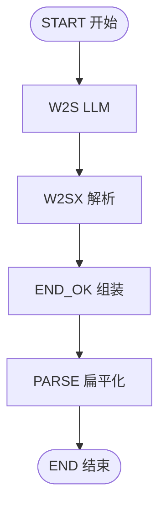

# Dify 工作流 — 节点设计与流程

> 工作流：`novel-world-society-v1`  
> 应用类型：**Workflow（工作流）**  
> **重试策略**：v1 **无 Dify 内重试**（失败由客户端回退本地 `generateLocalSociety`）  
> 详述：[DIFY-WORKFLOW-MODULES-AND-PROCESS.md](./DIFY-WORKFLOW-MODULES-AND-PROCESS.md) · 实现：[DIFY-WORKFLOW-IMPLEMENTATION.md](./DIFY-WORKFLOW-IMPLEMENTATION.md)

---

## 〇、画布要点

**标准拓扑（6 节点，无图像）**

```text
START → W2S → W2SX → END_OK → PARSE → END
```

**禁止**：W2S → END 直连；万相 / ComfyUI；`W2 → END_OK` 旧地图流。

变量类型约定：Dify UI **文本 = String**；JSON 内容以 **JSON 字符串** 传递。

---

## 一、节点总览

### 1.1 节点清单（6 个）

| 序号 | 节点 ID | Dify 类型 | 名称 | LLM |
|------|---------|-----------|------|-----|
| 0 | START | 开始 | 工作流输入 | 否 |
| 1 | W2S | LLM | 国家与城市 JSON | **是** |
| 2 | W2SX | 代码 | 解析 W2S JSON | 否 |
| 3 | END_OK | 代码 | 成功输出组装 | 否 |
| 4 | PARSE | 代码 | end_outputs 扁平化 | 否 |
| 5 | END | 结束 | 工作流输出 | 否 |

### 1.2 画布连线表

| 从 | 到 | 说明 |
|----|-----|------|
| START | W2S | 始终 |
| W2S | W2SX | 始终 |
| W2SX | END_OK | 始终 |
| END_OK | PARSE | 始终 |
| PARSE | END | 始终 |

### 1.3 拓扑图



### 1.4 全链路变量速查

| 节点 | 方向 | 变量 | Dify 类型 | 绑定 |
|------|------|------|-----------|------|
| START | 入 | 14 字段 | String | API inputs |
| W2S | 出 | text / w2s_json | String | → W2SX.w2s_json |
| W2SX | 出 | society_json 等 4 项 | String | → END_OK |
| END_OK | 出 | end_outputs | String | → PARSE |
| PARSE | 出 | society_json 等 | String | → END |

---

## 二、节点详细设计

### START — 开始

| 项 | 内容 |
|----|------|
| **职责** | 接收 `world:generateSociety` / MCP Tool inputs |
| **类型** | Dify「开始」 |

**输入变量（均为 String / 文本）**

| 变量名 | 必填 | 说明 |
|--------|------|------|
| project_id | ✓ | 项目 id |
| generation_mode | ✓ | `territory_society` |
| world_name, era, atmosphere | ✓ | 项目设定 |
| scale, climate, city_count | ✓ | 见 WORLD-GENERATOR-WIZARD |
| include_landmarks, seed | ✓ | 字符串 |
| geological_years_ma | | 默认 80 |
| territory_json | ✓ | 领土统计 JSON 串 |
| nations_outline_json | ✓ | `{id,name}[]` 串 |
| creative_brief | ✓ | 主进程组装的任务说明 |

Schema：[`world-society-generate.input.json`](../../../dify/world/mcp/schemas/world-society-generate.input.json)

---

### W2S — LLM 国家与城市 JSON

| 项 | 内容 |
|----|------|
| **职责** | 输出 `world_rules` + `nations` + `locations` |
| **类型** | LLM |
| **Prompt** | [PROMPT-DESIGN.md §3](./PROMPT-DESIGN.md#3-节点-w2s国家与城市-json) |
| **temperature** | **0.7** |
| **结构化输出** | **开** |
| **Jinja** | **开** |

**输入（来源 → 类型）**

| 变量 | Dify 类型 | 变量来源类型 | 来源 |
|------|-----------|--------------|------|
| creative_brief … geological_years_ma | String | 开始节点变量 | START 同名 |

**输出**

| 变量 | Dify 类型 | 下游 |
|------|-----------|------|
| text（建议 **w2s_json**） | String | W2SX.w2s_json |

**模型 UI 开关**

| 开关 | 值 |
|------|-----|
| 记忆 / RAG / 视觉 / 深度思考 | 关 |
| Max tokens | ≥ 8192 |

---

### W2SX — 解析 W2S JSON

| 项 | 内容 |
|----|------|
| **源码** | [`world_s2_extract.py`](../../../dify/world/code/world_s2_extract.py) |

| 入参 | Dify 类型 | 来源 |
|------|-----------|------|
| w2s_json 或 text | String | **W2S → text**（整段 JSON 字符串） |
| structured_output | Object/String（可选） | **W2S → structured_output**（结构化输出开启时优先绑此项） |

若 END_OK 输入全是 `[]`，见 [`DIFY-END_OK-EMPTY-INPUT.md`](../../../dify/world/DIFY-END_OK-EMPTY-INPUT.md)。

| 出参 | Dify 类型 | 下游 |
|------|-----------|------|
| society_json | String | END_OK |
| world_rules | String | END_OK |
| nations_json | String | END_OK |
| locations_json | String | END_OK |

---

### END_OK — 成功输出组装

| 项 | 内容 |
|----|------|
| **源码** | [`world_society_end_success.py`](../../../dify/world/code/world_society_end_success.py) |

| 入参 | 来源 |
|------|------|
| society_json, world_rules, nations_json, locations_json | W2SX |
| workflow_version | 常量 `world-society-v1` |

| 出参 | 下游 |
|------|------|
| end_outputs (String) | PARSE |

---

### PARSE — end_outputs 扁平化

| 项 | 内容 |
|----|------|
| **源码** | [`world_society_parse_end_outputs.py`](../../../dify/world/code/world_society_parse_end_outputs.py) |

| 入参 | 来源 |
|------|------|
| end_outputs | END_OK |

| 出参 | END 绑定 |
|------|----------|
| status, society_json, world_rules, nations_json, locations_json, workflow_version, error_message | 同名 |

---

### END — 结束 / 输出

| END 输出 | PARSE 字段 | Dify 类型 | 必填 |
|----------|------------|-----------|------|
| society_json | society_json | String | ✓* |
| nations_json | nations_json | String | ✓* |
| locations_json | locations_json | String | |
| world_rules | world_rules | String | |
| status | status | String | |

\* `society_json` 与 `nations_json` 至少其一可解析。

---

## 三、节点配置速查

| 节点 | 温度 | 结构化 JSON | Jinja | 记忆 | 视觉 |
|------|------|-------------|-------|------|------|
| W2S | 0.7 | **开** | **开** | 关 | 关 |
| W2SX / END_OK / PARSE | — | — | — | — | — |

---

## 四、常见错误

| 现象 | 原因 | 处理 |
|------|------|------|
| W2SX 空 | 未开 JSON / 绑错 | W2S 结构化输出；w2s_json ← W2S.text |
| END 无 society_json | 未绑 PARSE | END ← PARSE.society_json |
| 含思考链 | Reasoning 模型 | 关深度思考；W2SX 会 strip |
| 国家 id 变了 | 模型幻觉 | 加强 System；略降温度 |
| USER 变量空 | 未开 Jinja | 开 Jinja；绑 START |

---

## 五、Dify 搭建顺序（与 IMPLEMENTATION 一致）

1. START（14 变量）  
2. W2S（Prompt + 绑定）  
3. W2SX → END_OK → PARSE  
4. END 输出绑定  
5. 连线 → 发布  

*文档版本：v1 · 对齐 novel-world-society-v1*
