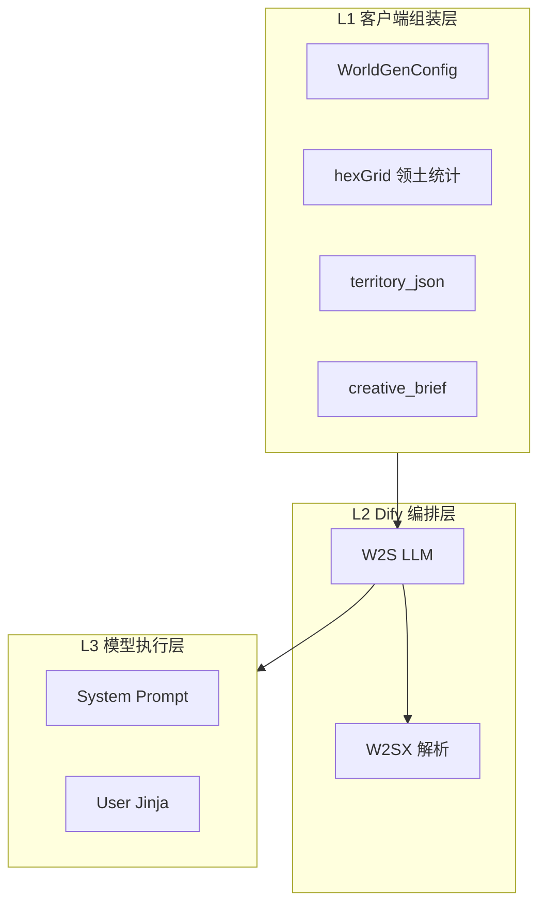
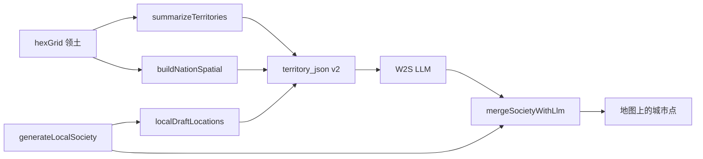

# NovelsCreator — Prompt 设计文档（世界观社会层）

> 定义 **客户端领土统计** → **Dify W2S** 的 Prompt 体系：变量约定、System/User 模板、输出 JSON、环境差异化规则。  
> 关联：[WORLD-GENERATOR-WIZARD.md](./WORLD-GENERATOR-WIZARD.md) · 模板：[`dify/world/prompts/`](../../../dify/world/prompts/)

---

## 目录

1. [Prompt 体系总览](#1-prompt-体系总览)
2. [输入变量与上下文分层](#2-输入变量与上下文分层)
3. [客户端：creative_brief 与 territory_json](#3-客户端creative_brief-与-territory_json)
4. [Dify 工作流全局约定](#4-dify-工作流全局约定)
5. [节点 W2S：国家与城市 JSON](#5-节点-w2s国家与城市-json)
6. [输出 JSON Schema](#6-输出-json-schema)
7. [环境差异化规则](#7-环境差异化规则)
8. [端到端示例](#8-端到端示例)
9. [版本与维护](#9-版本与维护)

---

## 1. Prompt 体系总览

### 1.1 三层结构



| 层级 | 职责 | 维护位置 |
|------|------|----------|
| **L1 客户端** | 向导参数 + 六边形统计 → JSON | `world-territory-society.ts` · `world-society.service.ts` |
| **L2 Dify** | W2S 调用 + Code 解析 | Dify 画布 |
| **L3 节点 Prompt** | System + User | `dify/world/prompts/w2-*.md` |

### 1.2 设计原则

| 原则 | 说明 |
|------|------|
| **领土驱动** | 各国设定须读 `territory_json` 环境字段，禁止千篇一律 |
| **项目参数一致** | era / atmosphere / scale / climate 来自向导，写入 projectConfig |
| **不改地图** | 禁止输出 map、terrainCells、hexGrid |
| **保留 id** | nations[].id 与 nations_outline_json 一致 |
| **结构化输出** | W2S 仅输出 JSON 根对象 |
| **本地兜底** | Prompt 失败时本地 `deriveNationTraits` 仍可用 |

---

## 2. 输入变量与上下文分层

| 变量 | 层级 | 类型 | 说明 |
|------|------|------|------|
| `territory_json` | L1 | String（内为 JSON） | 领土 + projectConfig + traits |
| `nations_outline_json` | L1 | String | 国家 id/name 列表 |
| `creative_brief` | L1 | String | 任务说明 + 约束（含 territory 摘要） |
| `world_name` … `seed` | L1 | String | 与向导字段 1:1 |
| `generation_mode` | L1 | String | 固定 `territory_society` |

W2S **不**接收地图 PNG；环境信息已在 `territory_json` 数值化。

---

## 3. 客户端：creative_brief 与 territory_json

### 3.1 buildTerritoryBriefJson

实现：`src/utils/world-territory-society.ts`

```json
{
  "projectConfig": {
    "worldName": "新世界",
    "era": "架空",
    "atmosphere": ["史诗"],
    "scale": "continent",
    "climate": "mixed",
    "climateHint": "项目气候倾向：混合气候带",
    "cityCount": 8,
    "includeLandmarks": true,
    "seed": 42,
    "numPlates": 10
  },
  "nations": [
    {
      "nationId": "nation-001",
      "name": "青王国",
      "landHexCount": 95,
      "avgHeat": 55,
      "avgWet": 62,
      "avgDevelopment": 48,
      "coastPct": 22,
      "desertPct": 5,
      "developmentTier": "成长",
      "environmentalProfile": "…",
      "traits": {
        "government": "议会共和",
        "culture": "农耕",
        "developmentNote": "…"
      }
    }
  ]
}
```

### 3.2 buildLlmBrief（creative_brief）

实现：`electron/main/services/world-society.service.ts`

要点：

- 任务：仅社会层 JSON，不要 map  
- **schemaVersion=2**：说明 spatial 与 localDraftLocations 用法  
- 差异化：必须读 environmentProfile / developmentTier / borderNeighbors  
- 城市：**有 localDraftLocations 时只改 name/description，不改坐标**  
- 末尾嵌入完整 `territory_json`

### 3.3 territory_json schemaVersion 2（空间增强）

实现：`buildTerritoryBriefJson(map, nations, config, { localDraft })`  
客户端在 `generateLocalSociety()` **之后**调用，将本地选址写入 `spatial.localDraftLocations`。

#### 根对象

| 字段 | 说明 |
|------|------|
| `schemaVersion` | 固定 `2` |
| `projectConfig` | 同 v1 |
| `mapContext` | `hexCols` / `hexRows` / `riverCount` / `lakeCount` |
| `nations[]` | v1 统计字段 + `traits` + **`spatial`** |

#### 各国 `spatial` 块

| 字段 | 说明 | LLM 用途 |
|------|------|----------|
| `bounds` | 领土 AABB（0–100） | 判断国家跨度、边陲方向 |
| `extremes` | north/south/west/east 代表点 | 寒带边关、南向出海口等叙述 |
| `terrainCentroids` | 各地形类型质心 + hexCount | 「都城在平原中心」「港口靠海岸区」 |
| `settlementCandidates` | 按 suitability 排序的候选格（rank、x、y、terrain、development、suggestedRole） | 无 localDraft 时的选址依据 |
| `borderNeighbors` | 接壤国 + sharedBorderHexes + nearestPoint | 边关、外交、冲突叙述 |
| `riverHints` | 领土内距河最近格 + distance | 河谷城、漕运枢纽 |
| `localDraftLocations` | 本地算法已选 id/type/x/y/terrain/name | **保留坐标，LLM 仅润色文案** |

#### 数据流



#### 合并策略（客户端）

| 场景 | locations 处理 |
|------|----------------|
| 有 `local.locations` + LLM 返回 | **保留本地 x/y/terrain**，按 `id` 匹配润色 name/description |
| 无本地选址 + LLM 返回足够条数 | 吸附到最近陆格（`snapLocationToNationHex`） |

#### v1 兼容

旧样例无 `schemaVersion` / `spatial` 时，W2S 仍可按 centroid + terrainBreakdown 推断坐标；新客户端一律输出 v2。

#### 示例片段

```json
{
  "schemaVersion": 2,
  "mapContext": { "hexCols": 48, "hexRows": 32, "riverCount": 3, "lakeCount": 1 },
  "nations": [{
    "nationId": "nation-001",
    "centroid": { "x": 38.2, "y": 44.1 },
    "spatial": {
      "bounds": { "minX": 22, "minY": 30, "maxX": 52, "maxY": 58 },
      "settlementCandidates": [
        { "rank": 1, "x": 38.2, "y": 44.1, "terrain": "plain", "suggestedRole": "capital", "suitability": 92 }
      ],
      "borderNeighbors": [
        { "nationId": "nation-002", "name": "北境公国", "sharedBorderHexes": 14, "nearestPoint": { "x": 50, "y": 42 } }
      ],
      "localDraftLocations": [
        { "id": "loc-001", "type": "capital", "x": 38.2, "y": 44.1, "terrain": "plain", "name": "临宁城", "candidateRank": 1 }
      ]
    }
  }]
}
```


## 4. Dify 工作流全局约定

| 项 | 约定 |
|----|------|
| W2S 温度 | 0.7 |
| JSON 模式 | 开 |
| Jinja | 仅 USER |
| Max tokens | ≥ 8192 |
| 记忆 / RAG / Vision | 关 |

---

## 5. 节点 W2S：国家与城市 JSON

### 5.1 System Prompt

**文件（SSOT）**：[`dify/world/prompts/w2-territory-society.md`](../../../dify/world/prompts/w2-territory-society.md)

粘贴到 Dify W2S **系统提示词** 全文。

核心约束摘要：

1. 根对象仅 `world_rules`、`nations`、`locations`  
2. 读 projectConfig + 各国环境统计，**显著差异化**  
3. 保留 nations id  
4. locations：0–100 陆格内；密度约束  
5. world_rules：300–600 字  
6. 只输出 JSON  

### 5.2 User Prompt（Jinja2）

**文件**：[`dify/world/prompts/w2s-user.jinja.md`](../../../dify/world/prompts/w2s-user.jinja.md)

```jinja2
{{ creative_brief }}

---
generation_mode={{ generation_mode }}
world_name={{ world_name }}
era={{ era }}
atmosphere={{ atmosphere }}
scale={{ scale }}
climate={{ climate }}
city_count={{ city_count }}
include_landmarks={{ include_landmarks }}
seed={{ seed }}
geological_years_ma={{ geological_years_ma }}

【国家轮廓 nations_outline_json】
{{ nations_outline_json }}

【领土与环境统计 territory_json】
{{ territory_json }}
```

### 5.3 W2S 输入绑定

13 个占位符 ← START 同名（String）。详见 [NODES § W2S](./DIFY-WORKFLOW-NODES-AND-FLOW.md#w2s--llm-国家与城市-json)。

### 5.4 W2S 模型参数表

| 配置项 | 值 |
|--------|-----|
| temperature | 0.7 |
| 结构化输出 | 开 |
| 深度思考 | 关 |
| 输出变量 | text → w2s_json |

---

## 6. 输出 JSON Schema

### 6.1 根对象

| 字段 | 类型 | 必填 |
|------|------|------|
| world_rules | string | ✓ |
| nations | array | ✓ |
| locations | array | ✓ |

### 6.2 nations[]

| 字段 | 必填 |
|------|------|
| id | ✓ |
| government, culture, description | ✓ |
| name, authorSettings | |

### 6.3 locations[]

| 字段 | 必填 |
|------|------|
| id, name, type, x, y, nationId, terrain, climate, description | ✓ |

type：`capital` | `city` | `town` | `village` | `fortress` | `landmark`

### 6.4 Dify 结构化 Schema（可选）

见 [DESIGN §6](./DIFY-WORKFLOW-DESIGN.md#6-输入输出契约) 或 W2S 节点 JSON Schema 粘贴框。

---

## 7. 环境差异化规则

模型与本地 `deriveNationTraits()` 共用逻辑（Prompt 中须体现）：

| 信号 | 倾向 |
|------|------|
| coastPct 高 | 航海 / 港口 |
| desertPct / aridity 高 | 游牧 / 稀疏 |
| mountainPct 高 | 尚武 / 关隘 |
| avgDevelopment 高 | 重商 / 集权 / 大城 |
| developmentTier = 边缘 | 边陲叙述、低人口 |
| era + atmosphere | 仙侠 / 赛博 / 史诗语气 |

---

## 8. 端到端示例

**试运行 inputs**：[`dify/world/fixtures/society-run.sample.json`](../../../dify/world/fixtures/society-run.sample.json)

**期望 W2S 输出片段**：

- `nation-001`：温湿、成长级 → 农耕/重商类描述  
- `nation-002`：寒带、停滞级 → 边陲/军事类描述  
- 两国 government/culture **不同**

---

## 9. 版本与维护

| 项 | 值 |
|----|-----|
| Prompt 版本 | v1.0（2026-06） |
| workflow_id | novel-world-society-v1 |
| 变更时 | 同步 `w2-territory-society.md` 与 Dify 画布 W2S |

与章节 Prompt 对照：章节用 N1–N5 多节点；社会层**仅 W2S 一个 LLM**。
