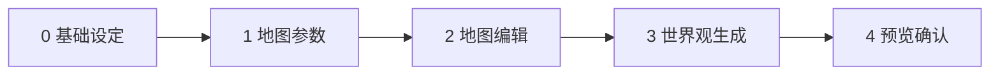

# 世界观生成器 — 五步向导与客户端组装

> 对应章节文档 [GENERATION-WIZARD.md](../../chapter/GENERATION-WIZARD.md)（三要素向导）。  
> 入口：`工具 → 世界观生成器` · 路由 `/workspace/world-generator`  
> 实现：`src/views/WorldGeneratorView.vue`

---

## 目录

1. [向导步骤总览](#1-向导步骤总览)
2. [步骤 0：基础设定](#2-步骤-0基础设定)
3. [步骤 1：地图参数（WorldEngine）](#3-步骤-1地图参数worldengine)
4. [步骤 2：地图编辑（领土）](#4-步骤-2地图编辑领土)
5. [步骤 3：世界观生成（Dify 可选）](#5-步骤-3世界观生成dify-可选)
6. [步骤 4：预览与确认](#6-步骤-4预览与确认)
7. [与 Dify START 字段映射](#7-与-dify-start-字段映射)
8. [作者编辑与落盘](#8-作者编辑与落盘)

---

## 1. 向导步骤总览

| 步骤 | 名称 | 技术 | Dify |
|------|------|------|------|
| 0 | 基础设定 | `WorldGenConfig` | — |
| 1 | 地图参数 | `world:generateNative` | — |
| 2 | 地图编辑 | 六边形涂领土 | — |
| 3 | 世界观生成 | 本地 + 可选 LLM | **novel-world-society-v1** |
| 4 | 预览与确认 | 写入 knowledge | — |

---

## 2. 步骤 0：基础设定

| UI 字段 | config 键 | 示例 |
|---------|-----------|------|
| 世界名称 | worldName | 新世界 |
| 时代 | era | 架空 |
| 氛围 | atmosphere[] | 史诗 |
| 尺度 | scale | continent |
| 气候 | climate | mixed |
| 目标城市数 | cityCount | 8 |
| 含地标 | includeLandmarks | true |
| 种子 | seed | 42 |

---

## 3. 步骤 1：地图参数（WorldEngine）

- IPC：`world:generateNative`
- 产出：satellite PNG + `terrainCells` + `hexGrid`
- **不调用 Dify**

板块数 `numPlates` 与 scale 联动，见 [WORLDENGINE.md](../WORLDENGINE.md)。

---

## 4. 步骤 2：地图编辑（领土）

| 操作 | 说明 |
|------|------|
| 创建国家 | 侧栏 + 国 |
| 涂抹领土 | 画笔 / 填充 / 选区 |
| 格发展度 | 选中格 slider（影响步骤 3 差异化） |
| 国名 | 侧栏文本框（可预先命名） |

**进入步骤 3 条件**：`hasPaintedTerritory()` — 至少一国有陆格领土。

---

## 5. 步骤 3：世界观生成（Dify 可选）

### 5.1 客户端流程

1. `generateLocalSociety(preview, config)` — **必执行**（本地 hex 选址）  
2. 若配置 Dify Key：`buildTerritoryBriefJson(..., { localDraft: local })` → `world:generateSociety`  
3. `mergeSocietyWithLlm(local, llm, map)` — **保留本地坐标，LLM 润色国名/城名/描述**  
4. 显示 `WorldMapEditor`（`nationListMode=edit`）供改国名/城名  

### 5.2 组装给 Dify 的字段

| 字段 | 来源 |
|------|------|
| territory_json | `buildTerritoryBriefJson(map, nations, config, { localDraft: local })` — **schemaVersion 2**，含 `spatial` + `localDraftLocations` |
| nations_outline_json | `nations.map({id,name})` |
| creative_brief | `buildLlmBrief()` — 含 v2 空间约束 |
| 其余 | `config` 字符串化 |

详见 [PROMPT-DESIGN.md §3.3](./PROMPT-DESIGN.md#33-territory_json-schemaversion-2空间增强)。

### 5.3 无 Dify 时

仍完成本地生成；`societySource` 显示「本地规则」。

---

## 6. 步骤 4：预览与确认

- 平面 / 球面预览地图与城市点  
- **应用到项目** → `knowledge.store.applyGeneratedWorld`  
- 写入：`world.json`、`map.json`、`map.png`、`locations.json`

---

## 7. 与 Dify START 字段映射

| Dify START | 客户端来源 |
|------------|------------|
| project_id | 当前项目 id |
| generation_mode | `"territory_society"` |
| world_name | config.worldName |
| era | config.era |
| atmosphere | config.atmosphere.join('、') |
| scale | config.scale |
| climate | config.climate |
| city_count | String(config.cityCount) |
| include_landmarks | config.includeLandmarks ? 'true' : 'false' |
| seed | String(config.seed) |
| geological_years_ma | String(config.geologicalYearsMa ?? 80) |
| territory_json | buildTerritoryBriefJson |
| nations_outline_json | JSON.stringify outline |
| creative_brief | buildLlmBrief |

Schema：[`world-society-generate.input.json`](../../../dify/world/mcp/schemas/world-society-generate.input.json)

---

## 8. 作者编辑与落盘

生成后**均可改**（步骤 3 侧栏）：

| 对象 | 可编辑字段 |
|------|------------|
| 国家 | 国名、政体、文化、设定 |
| 城市 | 名称、发展度、设定 |

点击国家列表 → 下方文本框修改；点击地图城市圆点 → 城市列表编辑。

落盘后可在知识库继续改 JSON（与章节向导独立）。

---

相关：[PROMPT-DESIGN.md](./PROMPT-DESIGN.md) · [DIFY-WORKFLOW-MODULES-AND-PROCESS.md §6](./DIFY-WORKFLOW-MODULES-AND-PROCESS.md#6-端到端流程设计)
